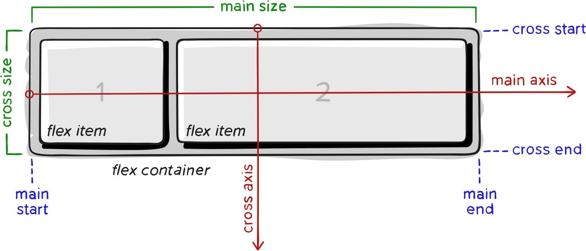

# Flexbox 弹性布局

Flexbox 用于一维布局，布局沿着单一的水平或垂直轴。理解弹性框关键是理解主轴和横轴的概念。主轴由 flex-direction 属性设置。为 row 则主轴沿行方向分布，为 column 则主轴沿列方向分布。相对于主轴，横轴沿另一个方向分布。



```css
.container {
    display: flex; /* 或 inline-flex */
}
```

## 弹性容器属性

### flex-direction

<div class="select-wapper">
flex-direction: 
<select v-model="flexDirection">
    <option v-bind:value="i" 
    v-for="i in ['row', 'row-reverse', 'column', 'column-reverse']">{{ i }}</option>
</select>
&nbsp; direction: 
<select v-model="direction">
    <option v-bind:value="i" v-for="i in ['rtl', 'ltr']">{{ i }}</option>
</select>
&nbsp; writing-mode: 
<select v-model="writingMode">
    <option v-bind:value="i" 
        v-for="i in ['horizontal-tb', 'vertical-rl', 'vertical-lr']">{{ i }}</option>
</select>
</div>

<div class="container" 
    :style="`flex-direction:${flexDirection};direction:${direction};writing-mode:${writingMode}`">
    <div v-for="i in 4" class="item center">{{ i }}</div>
</div>

重新排序只影响视觉顺序，而不影响逻辑顺序(逻辑顺序是屏幕阅读器读取内容的顺序)。还要注意书写模式的影响（如 direction:rtl 或 writing-mode:vertical-rl）

### flex-wrap

<div class="select-wapper">
flex-wrap: 
<select v-model="flexWrap">
    <option v-bind:value="i" v-for="i in ['nowrap','wrap','wrap-reverse']">{{ i }}</option>
</select>
</div>
<div class="container" 
    :style="`flex-wrap:${flexWrap}`">
    <div v-for="i in 15" class="item center">
        {{ i }}
    </div>
</div>

弹性容器在换行后会创建多个弹性行。在空间分布方面，每一行就像一个新的弹性容器。

### flex-flow

`flex-direction` `flex-wrap` 的缩写形式。

```css
.container {
    /* 第一个值表示 flex-direction */
    flex-flow: column wrap;
}
```

### align-content

<div class="select-wapper">
align-content: 
<select v-model="alignContent">
    <option v-bind:value="i" 
    v-for="i in ['normal', 'flex-start','flex-end','center','space-between','space-around','space-evenly','stretch']">{{ i }}</option>
</select>
</div>
<div class="container" 
    style="flex-wrap:wrap;height: 300px;"
    :style="`align-content:${alignContent}`">
    <div v-for="i in 10" class="item center">{{ i }}</div>
</div>

沿横轴分配空间。

### justify-content

<div class="select-wapper">
justify-content: 
<select v-model="justify">
    <option v-bind:value="i" 
    v-for="i in ['flex-start','flex-end','center','space-between','space-around','space-evenly']">{{ i }}</option>
</select>
</div>
<div class="container" 
    :style="`justify-content:${justify}`">
    <div v-for="i in 4" class="item center">{{ i }}</div>
</div>

沿主轴分配空间。


### place-content

`align-content` `justify-content` 的缩写形式。

```css
.container {
  place-content: space-between;  /* 该值同时作用于两个轴 */
}
.container {
  /* 第一个值将作用于 align, 第二个值将作用于 justify */
  place-content: center flex-end; 
}
```

### align-items

<div class="select-wapper">
align-items: 
<select v-model="alignItems">
    <option v-bind:value="i" 
    v-for="i in ['stretch','flex-start','flex-end','center','baseline']">{{ i }}</option>
</select>
</div>
<div class="container" 
    :style="`align-items:${alignItems}`">
    <div class="item align-item" 
        :style="alignItems!=='stretch'?'height:50px':''" 
        style="padding-top:20px;">text</div>
    <div class="item align-item" 
        :style="alignItems!=='stretch'?'height:100px':''" 
        style="padding-top:40px">text</div>
    <div class="item align-item" 
        :style="alignItems!=='stretch'?'height:80px':''" 
        style="padding-top:10px">text</div>
    <div class="item align-item" :style="alignItems!=='stretch'?'height:40px':''" >text</div>
</div>

将所有项目作为一个组沿横轴对齐。

### gap, row-gap, column-gap

<div class="select-wapper">
row-gap: <input v-model="rowGap" style="width:30px"/> px &nbsp;&nbsp;
column-gap:  <input v-model="columnGap" style="width:30px"/> px
</div>
<div class="container" 
    style="flex-wrap:wrap;gap:unset"
    :style="`row-gap:${rowGap}px;column-gap:${columnGap}px`">
    <div v-for="i in 10" class="item center">{{ i }}</div>
</div>

## 弹性项目属性

### order

<div class="select-wapper">
order: <input v-model="order" style="width:30px"/>
</div>
<div class="container">
    <div class="item center current"
        :style="`order:${order}`">{{ order }}</div>
    <div v-for="i in 5" class="item center" :style="`order:${i}`">{{ i }}</div>
</div>

直接指定某弹性项目的顺序。尽量不要使用 order，如果项目在逻辑上需要不同的顺序排列则更改 HTML！

### flex-grow

<div class="select-wapper">
flex-grow: <input v-model="flexGrow" style="width:30px"/>(红)&nbsp;&nbsp;&nbsp;
flex-grow: <input v-model="flexGrow2" style="width:30px"/>(蓝)
</div>
<div class="container">
    <div class="item center current"
        :style="`flex-grow:${flexGrow}`">{{ flexGrow }}</div>
    <div v-for="i in 3" class="item center">0</div>
    <div class="item center"
        style="background-color: blue;"
        :style="`flex-grow:${flexGrow2}`">{{ flexGrow2 }}</div>
</div>

定义了弹性项目的增长能力，它表示项目如何分配弹性容器内的可用空间。

### flex-shrink

<div class="select-wapper">
flex-shrink: <input v-model="flexShrink" style="width:30px"/>
</div>
<div class="container" style="width:600px;">
    <div class="item center current"
        :style="`flex-shrink:${flexShrink}`">{{ flexShrink }}</div>
    <div v-for="i in 3" class="item center" style="width:200px;">200px</div>
</div>

定义弹性项目的缩减。

### flex-basis

<div class="select-wapper">
flex-basis: <input v-model="flexBasis"/>
</div>
<div class="container" style="width:600px;">
    <div class="item center current"
        :style="`flex-basis:${flexBasis}`">{{ flexBasis }}</div>
    <div v-for="i in 3" class="item center"></div>
</div>

指定弹性项目在主轴方向上的初始大小，即弹性项目 content-box 的尺寸。可以为长度值、百分比或 auto content 关键字。

### flex

`flex-grow` `flex-shrink` `flex-basis` 的缩写形式。

```css
.item {
  flex: 0 1 auto; /* 默认值 */
}
.item {
  flex: 5; /* 相当于 flex-grow: 5; flex-shrink: 1; flex-basis: 0%; */
}
```

常用设置：

* `flex: 1` 所有项目的大小一致并忽略内容的大小
* `flex: auto` 每个项目被设为最大内容之后均分剩余空间，因此大项目会获得更多空间
* `flex: none` 用于只是使用弹性框来对齐但不需要任何弹性行为

### align-self

<div class="select-wapper">
align-self:
<select v-model="alignSelf">
    <option v-bind:value="i" 
    v-for="i in ['stretch','flex-start','flex-end','center','baseline']">{{ i }}</option>
</select>
align-items: 
<select v-model="alignItems2">
    <option v-bind:value="i" 
    v-for="i in ['stretch','flex-start','flex-end','center','baseline']">{{ i }}</option>
</select>
</div>
<div class="container" 
    :style="`align-items:${alignItems2}`">
    <div class="item align-item" 
        :style="alignItems2!=='stretch'?'height:50px':''" 
        style="padding-top:20px;">text</div>
    <div class="item align-item" 
        :style="alignItems2!=='stretch'?'height:100px':''" 
        style="padding-top:40px">text</div>
    <div class="item center current"
        :style="`align-self:${alignSelf}`">{{ alignSelf }}</div>
    <div class="item align-item" 
        :style="alignItems2!=='stretch'?'height:80px':''" 
        style="padding-top:10px">text</div>
    <div class="item align-item" :style="alignItems2!=='stretch'?'height:40px':''" >text</div>
</div>

沿横轴对齐单个项目，覆盖 align-items

## 其它

对齐属性中：

* `justify-*` 表示使用主轴
* `align-*` 表示使用横轴

<script>
export default {
    data() {
        return {
            flexDirection: 'row',
            direction: 'ltr',
            writingMode: 'horizontal-tb',
            flexWrap: 'nowrap',
            justify: 'flex-start',
            alignItems: 'stretch',
            alignContent: 'normal',
            rowGap: 10,
            columnGap: 10,
            order: 0,
            flexGrow: 0,
            flexGrow2: 0,
            flexShrink: 0,
            flexBasis: 'auto',
            alignSelf: 'stretch',
            alignItems2: 'stretch',
            
        }
    }
}
</script>

<style scoped>
.select-wapper {
    margin: 10px 0;
    display: inline-block;
}
.container {
    display: flex;
    background-color: #EEE;
    align-items: center;
    gap: 20px;
}
.item {
    background-color: var(--c-text-accent);
    display: flex;
    color: #FFF;
}
.item.center {
    width: 100px;
    height: 100px;
    align-items: center;
    justify-content: center;
}
.item.align-item {
    width: 100px;
    min-height: 50px;
}
.item.current {
    background-color: red;
}
</style>