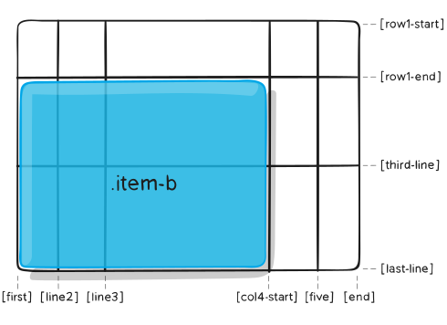

# Grid 网格布局

Grid 用于二维布局，是 CSS 第一个真正意义上的布局系统。

<CodeGroup>
<CodeGroupItem title="CSS" active>

```css
.container {
  /*  
    grid: 把容器当作 block 再按 grid 布局其项目。
    inline-grid: 把容器当作 inline 再按 grid 布局其项目。
  */
  display: grid | inline-grid;
}
```

</CodeGroupItem>
<CodeGroupItem title="HTML" active>

```html
<div class="container">
  <div class="item item-1"> </div>
  <div class="item item-2"> </div>
  <div class="item item-3"> </div>
</div>
```

</CodeGroupItem>
</CodeGroup>

## 术语

### grid line


网格线 line 的编号从 1 开始，和书写模式有关（rtl 时最右边的是 1）。

### grid track


track 指两条 line 之间的空间。row track 就是 row line 间，column track 就是 column line 间的空间。

### grid cell


单元格 cell 是最小单元，是行和列的交叉区域。

### grid area


area 是一组 cell 在一起。

### grid gap


gap 是 track 间的空隙。

## 容器属性

### grid-template-columns，grid-template-rows

<div class="wapper">
<span class="label" style="width:190px">grid-template-columns:</span>
<input v-model="columns" style="width:200px"/><br/>
<span style="display:inline-block;width:190px">grid-template-rows: </span>
<input v-model="rows" style="width:200px"/>
</div>

<div class="container"
  :style="`grid-template-columns:${columns};grid-template-rows:${rows}`">
  <div class="item item-1">text</div>
  <div class="item item-2">text</div>
  <div class="item item-3">a loooooooong text</div>
  <div class="item item-4">你们中大多数人都熟悉程序员的美德，有三种：那就是懒惰、急躁和傲慢。</div>
  <div class="item item-5">5</div>
</div>

定义网格的列、行。其值表示 track 的大小，分隔各值用的空格相当于 line 。包含:

* track 大小 – 可以为长度、百分比、fr 等
* 网格线命名 – 自动生成或用户指定的名字

#### 网格线命名

网格线将从 1 开始被自动赋值（或从最后一条线开始从 -1 开始赋值）。


但也可以为网格线指定明确的名字：

```css
.container {
  grid-template-columns: [first] 40px [line2] 50px [line3] auto [col4-start] 50px [five] 40px [end];
  grid-template-rows: [row1-start] 25% [row1-end] 100px [third-line] auto [last-line];
}
```


网格线可以同时有多个名字：

```css
.container {
  grid-template-rows: [row1-start] 25% [row1-end row2-start] 25% [row2-end];
}
```

重名的网格线可以通过其名字和序号引用到：

```css
.item {
  grid-column-start: col-start 2;
}
```

### grid-template-areas

依据 `grid-area` 所定义的区域名来定义整个网格的区域。可选值有三种：

* 与 grid-area 所对应的区域名
* `.` 表示空的单元格
* `none` 表示区域未定义

示例：

<CodeGroup>
<CodeGroupItem title="页面效果">

<div class="container area">
  <div class="item item-a">header</div>
  <div class="item item-b">main</div>
  <div class="item item-c">sidebar</div>
  <div class="item item-d">footer</div>
</div>

</CodeGroupItem>
<CodeGroupItem title="CSS" active>

```css{18-21}
.item-a {
  grid-area: header;
}
.item-b {
  grid-area: main;
}
.item-c {
  grid-area: sidebar;
}
.item-d {
  grid-area: footer;
}

.container {
  display: grid;
  height: 200px;
  grid-template-columns: 50px 1fr 50px 50px;
  grid-template-rows: 40px auto 20px;
  grid-template-areas: 
    "header header header header"
    "main main . sidebar"
    "footer footer footer footer";
}
```

</CodeGroupItem>
<CodeGroupItem title="HTML">

```html
<div class="container">
  <div class="item-a">header</div>
  <div class="item-b">main</div>
  <div class="item-c">sidebar</div>
  <div class="item-d">footer</div>
</div>
```

</CodeGroupItem>
</CodeGroup>

区域的命名会影响到网格线。每个区域的起始网格线，会自动命名为 `区域名-start`，终止网格线自动命名为 `区域名-end`。正因此，某些网格线可能有多个名字，如上例最左侧网格线可用的命名为：header-start, main-start 及 footer-start

### grid-template

`grid-template-rows` `grid-template-columns` `grid-template-areas` 的缩写形式。

综合使用示例：

```css
.container {
  grid-template:
    [row1-start] "header header header" 25px [row1-end]
    [row2-start] "footer footer footer" 25px [row2-end]
    / auto 50px auto;
}
/* 等价于：*/
.container {
  grid-template-rows: [row1-start] 25px [row1-end row2-start] 25px [row2-end];
  grid-template-columns: auto 50px auto;
  grid-template-areas: 
    "header header header" 
    "footer footer footer";
}
```

通常最好使用 `grid` 代替 `grid-template` 。

### column-gap，row-gap

<div class="wapper">
column-gap: <input v-model="columnGap"/>&nbsp;
row-gap: <input v-model="rowGap"/>
</div>

<div class="container"
  style="grid-template-columns: repeat(3, 100px);grid-template-rows: 100px 100px;"
  :style="`column-gap:${columnGap};row-gap:${rowGap}`">
  <div class="item" v-for="i in 6">&nbsp;</div>
</div>

定义网格线的大小，可理解为行列间隙的宽度。

注：`grid-column-gap` `grid-row-gap` 为废弃属性。

### gap

`row-gap` `column-gap` 的缩写形式。

注：`grid-gap` 为废弃属性。

### justify-items

<div class="wapper">
justify-items: 
<select v-model="justifyItems">
    <option v-bind:value="i" 
    v-for="i in ['start', 'end', 'center', 'stretch']">{{ i }}</option>
</select>
</div>
<div class="container gridline"
    :style="`justify-items:${justifyItems}`">
    <div v-for="i in 6" class="item center">{{ justifyItems }}</div>
</div>

设置容器内所有 row 轴上的对齐方式。

### align-items

<div class="wapper">
align-items: 
<select v-model="alignItems">
    <option v-bind:value="i" 
    v-for="i in ['start', 'end', 'center', 'baseline', 'stretch']">{{ i }}</option>
</select>
</div>
<div class="container gridline"
    :style="`align-items:${alignItems}`">
    <div v-for="i in 6" class="item center" :style="`padding-top:${i*10}px`">{{ alignItems }}</div>
</div>

设置容器内所有 column 轴上的对齐方式。

可以使用修饰符关键字:

* `safe` 安全对齐方式会避免数据丢失的出现，将溢出转移到一边
* `unsafe` 不安全的对齐方式导致的对齐结果可能会发生数据丢失

```css
align-items: safe end
```

### place-items

`align-items` `justify-items` 的缩写形式。

### justify-content

<div class="wapper">
justify-content: 
<select v-model="justifyContent">
    <option v-bind:value="i" 
    v-for="i in ['start', 'end', 'center', 'stretch', 'space-around', 'space-between', 'space-evenly']">{{ i }}</option>
</select>
</div>
<div class="container c3r2"
    :style="`justify-content:${justifyContent}`">
    <div v-for="i in 6" class="item center">{{ i }}</div>
</div>

用于网格整体内容的尺寸小于网格容器时，用来对齐整个网格在 row 轴上的内容。


### align-content

<div class="wapper">
align-content: 
<select v-model="alignContent">
    <option v-bind:value="i" 
    v-for="i in ['start', 'end', 'center', 'stretch', 'space-around', 'space-between', 'space-evenly']">{{ i }}</option>
</select>
</div>
<div class="container c3r2"
    style="height: 250px;"
    :style="`align-content:${alignContent}`">
    <div v-for="i in 6" class="item center">{{ i }}</div>
</div>

用于网格整体内容的尺寸小于网格容器时，用来对齐整个网格在 column 轴上的内容。

### place-content

`align-content` `justify-content` 的缩写形式。


### grid-auto-columns，grid-auto-rows

<div class="wapper">
<span class="label" style="width:190px">grid-auto-columns:</span>
<input v-model="autoColumns" style="width:200px"/><br/>
<span style="display:inline-block;width:190px">grid-auto-rows:</span>
<input v-model="autoRows" style="width:200px"/>
</div>
<div class="container gridline2"
  :style="`grid-auto-columns:${autoColumns};grid-auto-rows:${autoRows}`">
    <div class="item item-auto-a">A</div>
    <div class="item item-auto-b">B</div>
</div>

用来给自增的 track 设置尺寸。如上例中创建了两个区域：

<CodeGroup>
<CodeGroupItem title="页面效果">
<div style="background-color:#EEE;">


</div>
</CodeGroupItem>
<CodeGroupItem title="CSS" active>

```css{10}
.container {
  grid-template-columns: 60px 60px;
  grid-template-rows: 90px 90px;
}
.item-a {
  grid-column: 1 / 2;
  grid-row: 2 / 3;
}
.item-b {
  grid-column: 5 / 6;
  grid-row: 2 / 3;
}
```

</CodeGroupItem>
</CodeGroup>

区域 B 设置为 `grid-column: 5 / 6`，但事实上并未定义这些网格线。由于引用了不存在的网格线，将会创建宽度为 0 的 track 来填补这些空隙。而 `grid-auto-columns` 正是用来定义这些 track 的宽度的。row 方向上同理。

### grid-auto-flow


当网格中存在未明确指定位置的项目元素时，该属性用来指定其 _自动摆放算法_ 采用的方式。可选值：

* `row` – 指示自动摆放算法按行的顺序按需增加新项目元素 (默认)
* `column` – 指示自动摆放算法按列的顺序按需增加新项目元素
* `dense` - 指示自动摆放算法尽量优先使用更小的项目元素摆放

例如，只指定区域 a、e 时：

<CodeGroup>
<CodeGroupItem title="CSS" active>

```css
.item-a {
  grid-column: 1;
  grid-row: 1 / 3;
}
.item-e {
  grid-column: 5;
  grid-row: 1 / 3;
}
```

</CodeGroupItem>
<CodeGroupItem title="HTML">

```html
<section class="container">
  <div class="item-a">item-a</div>
  <div class="item-b">item-b</div>
  <div class="item-c">item-c</div>
  <div class="item-d">item-d</div>
  <div class="item-e">item-e</div>
</section>
```

</CodeGroupItem>
</CodeGroup>

如果使用 `row` 则效果为：

<CodeGroup>
<CodeGroupItem title="页面效果" active>
<div style="background-color:#EEE;">


</div>
</CodeGroupItem>
<CodeGroupItem title="CSS">

```css{5}
.container {
  display: grid;
  grid-template-columns: 60px 60px 60px 60px 60px;
  grid-template-rows: 30px 30px;
  grid-auto-flow: row;
}
```

</CodeGroupItem>
</CodeGroup>

如果使用 `column` 则效果为：

<CodeGroup>
<CodeGroupItem title="页面效果" active>
<div style="background-color:#EEE;">


</div>
</CodeGroupItem>
<CodeGroupItem title="CSS">

```css{5}
.container {
  display: grid;
  grid-template-columns: 60px 60px 60px 60px 60px;
  grid-template-rows: 30px 30px;
  grid-auto-flow: column;
}
```

</CodeGroupItem>
</CodeGroup>


### grid

以下属性的简写形式：

* grid-template-rows
* grid-template-columns
* grid-template-areas
* grid-auto-rows
* grid-auto-columns
* grid-auto-flow

<CodeGroup>
<CodeGroupItem title="等价写法 1" active>

```css
.container {
  grid: 100px 300px / 3fr 1fr;
}

.container {
  grid-template-rows: 100px 300px;
  grid-template-columns: 3fr 1fr;
}
```

</CodeGroupItem>
<CodeGroupItem title="等价写法 2">

```css
.container {
  grid: auto-flow / 200px 1fr;
}

.container {
  grid-auto-flow: row;
  grid-template-columns: 200px 1fr;
}
```

</CodeGroupItem>
<CodeGroupItem title="等价写法 3">

```css
.container {
  grid: auto-flow dense 100px / 1fr 2fr;
}

.container {
  grid-auto-flow: row dense;
  grid-auto-rows: 100px;
  grid-template-columns: 1fr 2fr;
}
```

</CodeGroupItem>
<CodeGroupItem title="等价写法 4">

```css
.container {
  grid: 100px 300px / auto-flow 200px;
}

.container {
  grid-template-rows: 100px 300px;
  grid-auto-flow: column;
  grid-auto-columns: 200px;
}
```

</CodeGroupItem>
<CodeGroupItem title="等价写法 5">

```css
.container {
  grid: [row1-start] "header header header" 1fr [row1-end]
        [row2-start] "footer footer footer" 25px [row2-end]
        / auto 50px auto;
}

.container {
  grid-template-areas: 
    "header header header"
    "footer footer footer";
  grid-template-rows: [row1-start] 1fr [row1-end row2-start] 25px [row2-end];
  grid-template-columns: auto 50px auto;    
}
```

</CodeGroupItem>
</CodeGroup>


## 项目元素属性

> <Badge type="danger" text="注意"/> 设为 grid 布局以后，容器项目的 float、display: inline-block、display: table-cell、vertical-align 和 column-* 等设置都将失效。

### grid-column-start，grid-column-end，grid-row-start，grid-row-end

依据网格线来定义网格元素在网格中的位置。可选值为：

* {grid line} – 网格线的数字序号或名字
* span {number} – 合并指定 number 数量的网格 track
* span {name} – 合并至指定的 name 网格线处
* auto – 浏览器自动计算

<CodeGroup>
<CodeGroupItem title="CSS" active>

```css
.item {
  grid-column-start: 2;
  grid-column-end: five;
  grid-row-start: row1-start;
  grid-row-end: 3;
}
```

</CodeGroupItem>
<CodeGroupItem title="效果" active>
<div style="background-color:#EEE">


</div>
</CodeGroupItem>
</CodeGroup>

<CodeGroup>
<CodeGroupItem title="CSS" active>

```css
.item {
  grid-column-start: 1;
  grid-column-end: span col4-start;
  grid-row-start: 2;
  grid-row-end: span 2;
}
```

</CodeGroupItem>
<CodeGroupItem title="效果" active>
<div style="background-color:#EEE">



</div>
</CodeGroupItem>
</CodeGroup>

如果未指定 end 值，项目只会穿过 1 个 track 。


### grid-column，grid-row

`grid-column` 是 `grid-column-start` `grid-column-end` 的简写形式，
`grid-row` 是 `grid-row-start` `grid-row-end` 的简写形式。


```css
.item {
  grid-column: 3 / span 2;
  grid-row: third-line / 4;
}
```

### grid-area

共有两个用法，一是配合 `grid-template-areas` 使用，用来指定区域名：

```css
.item {
  grid-area: header;
}
```

另外，还可以作为 `grid-row-start` `grid-column-start` `grid-row-end` `grid-column-end` 的简写形式：

```css
.item {
  grid-area: 1 / col4-start / last-line / 6;
}
```

### justify-self

<div class="wapper">
justify-self: 
<select v-model="justifySelf">
    <option v-bind:value="i" 
    v-for="i in ['start', 'end', 'center', 'stretch']">{{ i }}</option>
</select>
justify-items: 
<select v-model="justifyItems2">
    <option v-bind:value="i" 
    v-for="i in ['start', 'end', 'center', 'stretch']">{{ i }}</option>
</select>
</div>
<div class="container gridline"
    :style="`justify-items:${justifyItems2}`">
    <div class="item center current" :style="`justify-self:${justifySelf}`">{{ justifySelf }}</div>
    <div v-for="i in 5" class="item center">{{ justifyItems2 }}</div>
</div>

其效果同 `justify-items` ，但只针对指定的项目生效。

### align-self

<div class="wapper">
align-self: 
<select v-model="alignSelf">
    <option v-bind:value="i" 
    v-for="i in ['start', 'end', 'center', 'stretch']">{{ i }}</option>
</select>
align-items: 
<select v-model="alignItems2">
    <option v-bind:value="i" 
    v-for="i in ['start', 'end', 'center', 'baseline', 'stretch']">{{ i }}</option>
</select>
</div>
<div class="container gridline"
    :style="`align-items:${alignItems2}`">
    <div class="item center current" :style="`align-self:${alignSelf}`">{{ alignSelf }}</div>
    <div v-for="i in 5" class="item center">{{ alignItems2 }}</div>
</div>

其效果同 `align-items` ，但只针对指定的项目生效。

### place-self

`align-self` `justify-self` 的简写形式：

## 特殊单位和函数

### fr

`fr` 表示剩余空间中的一部分，如下例表示 2 列分别占 25%、75% 。

```css
grid-template-columns: 1fr 3fr;
```

其与百分比的区别在于：如果存在 padding（如下例中的 padding:50px），`%` 将会导致宽度不再是 100%；而 `fr` 不会造成该问题。

<div class="container" style="grid-template-columns:1fr 3fr">
  <div class="item" style="padding:50px">1fr</div>
  <div class="item" style="padding:50px">3fr</div>
</div>

<div class="container" style="grid-template-columns:25% 75%">
  <div class="item" style="padding:50px">25%</div>
  <div class="item" style="padding:50px">75%</div>
</div>

单位 `fr` 计算的是去除所有非弹性项目后的空间，如：

```css
.container {
  grid-template-columns: 1fr 50px 1fr 1fr;
}
```
会用总宽度减去 50px 后再将剩余空间三等分给 1、3、4 列。显然，单位 `fr` 在与其它单位联合使用时更为友好：

```css
grid-template-columns: 50px min-content 1fr;
```

### min-content

依据其内容的最小尺寸显示：

<CodeGroup>
<CodeGroupItem title="页面效果">
<div class="container" style="grid-template-columns:min-content 1fr 1fr;padding:30px 0;">
  <div class="item">The very long hotdog.</div>
  <div class="item"></div>
  <div class="item"></div>
</div>
</CodeGroupItem>
<CodeGroupItem title="CSS" active>

```css{3}
.container {
  display: grid;
  grid-template-columns: min-content 1fr 1fr;
  gap: 10px;
}
``` 

</CodeGroupItem>
<CodeGroupItem title="HTML">

```html{2}
<div class="container">
  <div class="item">The very long hotdog.</div>
  <div class="item"></div>
  <div class="item"></div>
</div>
``` 

</CodeGroupItem>
</CodeGroup>

### max-content

依据其内容的最大尺寸显示：

<CodeGroup>
<CodeGroupItem title="页面效果">
<div class="container" style="grid-template-columns:max-content 1fr 1fr;padding:30px 0;">
  <div class="item">The very long hotdog.</div>
  <div class="item"></div>
  <div class="item"></div>
</div>
</CodeGroupItem>
<CodeGroupItem title="CSS" active>

```css{3}
.container {
  display: grid;
  grid-template-columns: max-content 1fr 1fr;
  gap: 10px;
}
``` 

</CodeGroupItem>
<CodeGroupItem title="HTML">

```html{2}
<div class="container">
  <div class="item">The very long hotdog.</div>
  <div class="item"></div>
  <div class="item"></div>
</div>
``` 

</CodeGroupItem>
</CodeGroup>

### fit-content

在 `min-content` 与 `max-content` 之间调整可用空间：

<CodeGroup>
<CodeGroupItem title="页面效果">
<div class="container" 
  style="grid-template-columns:fit-content 1fr 1fr;grid-template-rows:20px;padding:30px 0;">
  <div class="item">The very long hotdog.</div>
  <div class="item">&nbsp;</div>
  <div class="item">&nbsp;</div>
</div>
</CodeGroupItem>
<CodeGroupItem title="CSS" active>

```css{3}
.container {
  display: grid;
  grid-template-columns: fit-content 1fr 1fr;
  gap: 10px;
}
``` 

</CodeGroupItem>
<CodeGroupItem title="HTML">

```html{2}
<div class="container">
  <div class="item">The very long hotdog.</div>
  <div class="item"></div>
  <div class="item"></div>
</div>
``` 

</CodeGroupItem>
</CodeGroup>

PS: 当前 Chrome (97.0.4692.99) 不支持该关键字。

### minmax()


<div class="wapper">
<span class="label">container 的 width: </span>&nbsp;
<input v-model="minmaxWidth" style="text-align:center;width:100px"/>px
</div>

<div class="container" 
  :style="`width:${minmaxWidth}px;grid-template-columns:minmax(200px, 1fr) 3fr;padding:10px 0`">
  <div class="item">minmax(200px, 1fr)</div>
  <div class="item">3fr</div>
</div>

即长度所允许的最小、最大值，因此它限定了一个长度范围。通常配合其它相对单位使用时非常方便。

### repeat()

网格很多时，可简化重复的值。`repeat()` 接受两个参数：1）重复的次数； 2）所要重复的值。

```css
grid-template-columns: 1fr 1fr 1fr 1fr 1fr 1fr 1fr 1fr;
/* 简写为: */
grid-template-columns: repeat(8, 1fr);
```

有时单元格的大小是固定的，但是容器的大小不确定。如果希望一行（或列）容纳尽可能多的单元格，可以配合 auto-fill 关键字自动填充。

```css
grid-template-columns: repeat(auto-fit, minmax(100px, 1fr))
```

<div class="container" 
  style="grid-template-columns:repeat(auto-fit, minmax(100px, 1fr))">
  <div class="item" v-for="i in 20">{{ i }}</div>
</div>

<script>
export default {
  data() {
    return {
        columns: '100px auto min-content',
        rows: '5em 50%',
        minmaxWidth: 800,
        columnGap: '20px',
        rowGap: '10px',
        justifyItems: 'stretch',
        alignItems: 'stretch',
        justifyContent: 'stretch',
        alignContent: 'stretch',
        justifySelf: 'stretch',
        justifyItems2: 'stretch',
        alignSelf: 'stretch',
        alignItems2: 'stretch',
        autoColumns: '30px',
        autoRows: '30px',
    }
  }
}
</script>

<style scoped>
.wapper {
  margin: 10px 0;
  display: inline-block;
}
.label {
  display:inline-block;
  min-width: 70px;
  margin: 10px 0;
}
.container {
  margin-top: 10px;
  display: grid;
  gap: 10px;
  background-color: #EEE;
}
.item {
  color: white;
  background-color: var(--c-brand);
}
.item.center {
  display: flex;
  justify-content: center;
  align-content: center;
}
.item.current {
  background-color: red;
}
.container.area {
  height: 200px;
  grid-template-columns: 50px 1fr 50px 50px;
  grid-template-rows: 40px auto 20px;
  grid-template-areas: 
    "header header header header"
    "main main . sidebar"
    "footer footer footer footer";
}
.container.c3r2 {
  grid-template-columns: repeat(3, 100px);
  grid-template-rows: 100px 100px;
}
.container.gridline {
  gap: 0;
  grid-template-columns: repeat(3, 200px);
  grid-template-rows: 100px 100px;
  background-image: linear-gradient(90deg,rgb(245 140 10 /.9) 1px, transparent 0),
              linear-gradient(rgb(245 140 10) 1px, transparent 0);
  background-size: 200px 100px;
  height: 201px;
  width: 601px;
  box-sizing: border-box;
}
.container.gridline2 {
  gap: 0;
  grid-template-columns: 60px 60px;
  grid-template-rows: 90px 90px;
  background-image: linear-gradient(90deg,rgb(245 140 10 /.9) 1px, transparent 0),
              linear-gradient(rgb(245 140 10) 1px, transparent 0);
  background-size: 10px 10px;
  box-sizing: border-box;
  height: 201px;
  width: 601px;
  background-color: transparent;
}
.container.gridline .item {
  opacity: .9;
}
.item-a {
  grid-area: header;
}
.item-b {
  grid-area: main;
}
.item-c {
  grid-area: sidebar;
}
.item-d {
  grid-area: footer;
}
.item-auto-a {
  grid-column: 1 / 2;
  grid-row: 2 / 3;
}
.item-auto-b {
  grid-column: 5 / 6;
  grid-row: 2 / 3;
}

input {
  border: none;
  border-bottom: 1px solid #999;
  outline: none;
}
img {
  width: 70%;
  min-width: 400px;
}
</style>