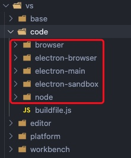

# VSCode 源代码组织方式

源码结构主要由内核及插件组成 ：

* core
* extensions


## 内核

主要分为以下几层：

* `base` ： 提供通用方法及 UI 相关内容
* `platform` ：定义注入服务的机制及相关 service 实现
* `editor` ：编辑器相关
* `workbench` ：框架相关，如状态栏、菜单等


## 目标环境

内核中的每一层，都按目标运行环境划分：

* common ：只需要纯 JavaScript API
* browser ：需要浏览器 API 如 DOM
* node ：需要 nodejs API
* electron-main： 需要 Electron 主进程 API
* electron-browser：需要 Electron 渲染进程 API
* electron-sandbox：需要浏览器 API 并有一小部分与 Electron 主进程通信的 API



## 依赖注入

`platform` 里的代码是按“服务”的形式组织的，服务通过构造器注入来暴露给客户端。

服务的定义由两部分组成：
1. 接口部分
2. 标识符（装饰器，与接口同名）

```ts
class Client {
  constructor(
    @IModelService modelService: IModelService, 
    @optional(IEditorService) editorService: IEditorService
  ) {
    // use services
  }
}
```

使用 instantiation 服务创建服务消费者的实例：`instantiationService.createInstance(Client)`

## Contrib

约束:

* Contrib 目录下的所有代码不允许依赖任何本文件夹之外的文件
* Contrib 主要是使用 Core 暴露的一些扩展点来做事情
* 每一个 Contrib 如果要对外暴露，将API 在一个出口文件里面导出 eg: contrib/search/common/search.ts
* 一个 Contrib 如果要和另一个 Contrib 发生调用，不允许使用除了出口 API 文件之外的其它文件
* 接上一条，即使 Contrib 可以调用另一个 Contrib 的出口 API，也要审慎的考虑，应尽量避免两个 Contrib 互相依赖