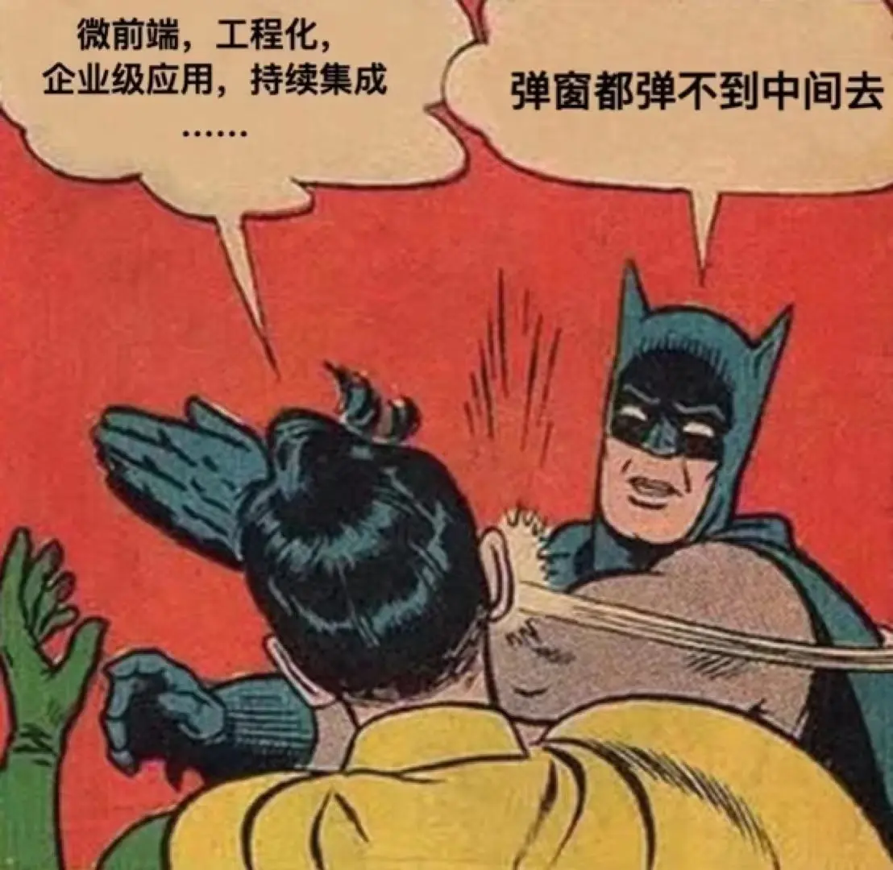

# CSS 实现居中的方式



## 水平

### 行内元素

如果是 `inline`、 `inline-block`、 `inline-table`、 `inline-flex` 的元素（如文本或链接），可以为其增加一个块级父元素，并设置为：

```css
.center {
  text-align: center;
}
```

### 单个块级元素

如果是单个块级元素，可将 `margin-left` 和 `margin-right` 都设置为 `auto` （此时该元素有 `width` 属性，否则它将撑满整行而不需要居中）。通常简写为：

```css
.center-me {
  margin: 0 auto;
}
```

不管 `width` 为多少都会生效，但不要使用 `float` 来居中。

### 多个块级元素

如果是多个块级元素在**水平方向上**的一行居中，可以先把其设置为 `inline-block`。


<CodeGroup>
<CodeGroupItem title="CSS" active>

```css{2,6}
.inline-block-center {
  text-align: center;
  background-color: #EEE;
}
.inline-block-center div {
  display: inline-block;
  text-align: left;
  background-color: var(--c-brand);
  margin: 20px;
  max-width: 150px;
  color: #FFF;
}
```

</CodeGroupItem>
<CodeGroupItem title="HTML">

```html
<div class="inline-block-center">
  <div>轻轻的我走了， 正如我轻轻的来； 我轻轻的招手， 作别西天的云彩。</div>
  <div>那河畔的金柳， 是夕阳中的新娘； 波光里的艳影， 在我的心头荡漾。</div>
</div>
```

</CodeGroupItem>
</CodeGroup>

<div class="inline-block-center">
	<div>轻轻的我走了， 正如我轻轻的来； 我轻轻的招手， 作别西天的云彩。</div>
	<div>那河畔的金柳， 是夕阳中的新娘； 波光里的艳影， 在我的心头荡漾。</div>
</div>

也可以使用 [flexbox 布局](http://zhangqiang.work/lab/css_layout_flexbox) 

```css
.flex-center {
  display: flex;
  justify-content: center;
}
```

如果是在**垂直方向上**的一列居中，auto margin 的方式仍然有效。

## 垂直

### 单行的行内元素

有些情况下，行内垂直居中仅仅需要将其上下 padding 设为相同的值：

```css
.link {
  padding-top: 30px;
  padding-bottom: 30px;
}
```

无法使用 padding 的时候，如果是不换行的文本，可以将其 `line-height` 和 `height` 设置为同高：

```css
.center-text {
  height: 100px;
  line-height: 100px;
  white-space: nowrap;
}
```

### 多行的行内元素

对于多行文本，上下同 padding 的方法仍然可用。如果不失效，那可能当前文本正处在 \<table\> 或类似表格的单元格中，此时使用 `vertical-align` 属性即可：


<CodeGroup>
<CodeGroupItem title="CSS" active>

```css{8,20}
table {
  width: 240px;
  height: 250px;
}
table td {
  padding: 20px;
  border: 10px solid white;
  vertical-align: middle; /* 默认值 */
}

.center-table {
  display: table;
  height: 250px;
  width: 240px;
}
.center-table p {
  display: table-cell;
  padding: 20px;
  border: 10px solid white;
  vertical-align: middle;
}
```

</CodeGroupItem>
<CodeGroupItem title="HTML">

```html
<table>
  <tr>
    <td>some looooooong text</td>
  </tr>
</table>

<div class="center-table">
  <p>我是需要垂直居中显示的文本！</p>
</div>
```

</CodeGroupItem>
</CodeGroup>

也可以针对单个项目使用 flexbox 布局，此时记得给容器设置高度：

```css
.flex-center {
  display: flex;
  justify-content: center;
  flex-direction: column;
  height: 400px;
}
```

如果以上都不行，还可以使用一个占满高度的伪元素实现：

```css{7}
.ghost-center {
  position: relative;
}
.ghost-center::before {
  content: " ";
  display: inline-block;
  height: 100%;
  width: 1%;
  vertical-align: middle;
}
.ghost-center p {
  display: inline-block;
  vertical-align: middle;
}
```

### 块级元素

## 两者


<style scoped>
.inline-block-center {
  text-align: center;
  background-color: #EEE;
}
.inline-block-center div {
  display: inline-block;
  text-align: left;
  background-color: var(--c-brand);
  margin: 20px;
  max-width: 150px;
  color: #FFF;
}
</style>
