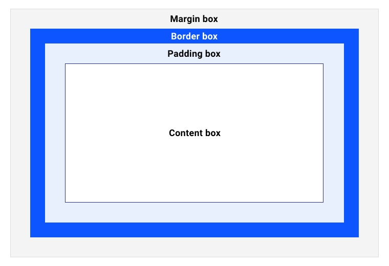
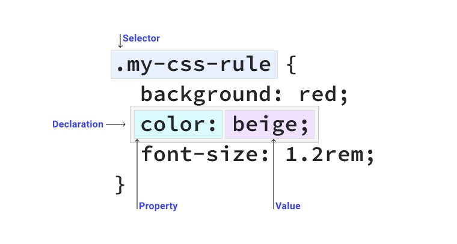
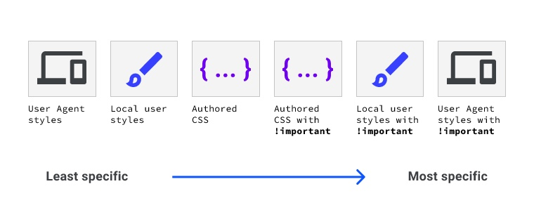
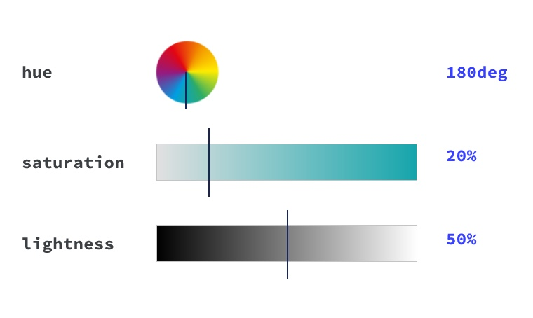
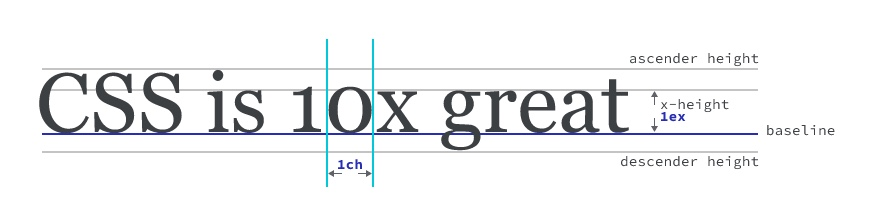
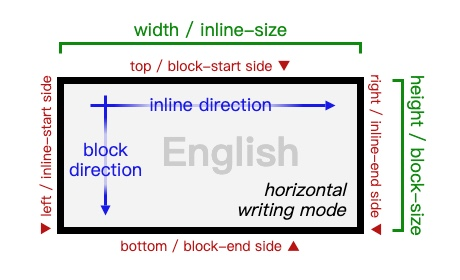
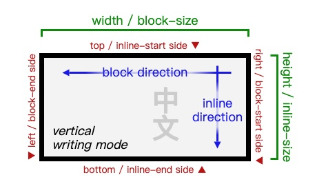
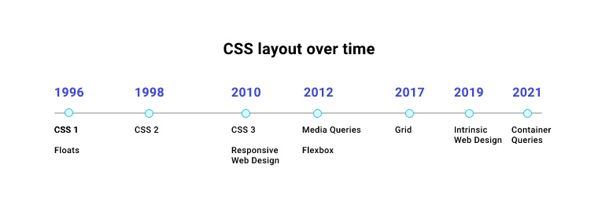

# CSS 全面总结之 2022

上一次系统地学习 CSS 还是 IE5 - IE6 的时代了，从 2022 年初开始，陆续总结学习一下 CSS 相关知识。

## 1. 盒子模型

CSS 显示的所有对象都是盒子。



Padding box : 
1. 背景在此空间可见
2. 溢出时滚动条占据该空间

Border box :
1. 空间被 border 值占据
2. 以边框的边缘为界限

Margin box :
1. outline 和 box-shadow 属性占据该空间，不会影响方框的大小

box-sizing 设置为 `content-box` 时（默认），padding 和 border 会在内容框基础上增加大小；设置为 `border-box` 时则可将二者的值推入。


## 2. 选择器


 CSS 规则的组成：一段代码，包含一个或多个选择器和一个或多个声明。
 


### 简单的选择器

* 通用选择器（通配符 `*` ）
* 类型选择器（直接匹配 HTML 元素）
* 类选择器（匹配 class）
* ID 选择器
* 属性选择器
  * `[data-type='primary']` 
  * `[data-type]` 查找具有该属性的元素而不管其值如何
  * `[data-type='primary' s]` 使用 s 运算符来区分大小写，i 不区分
  * `[href^='https']` `[href*='example.com']` 等字符串匹配运算符
* 分组选择器（用逗号分隔多个选择器）

### 伪类和伪元素

伪类表示 HTML 元素所处的状态：
* 互动（如悬停 `:hover` ）
* 子元素处于某种状态（如 `p:nth-child(even)` ）

伪元素表现为使用 CSS 插入新元素

> 双冒号 ( :: ) 是伪元素与伪类的区别，但由于旧版本的 CSS 规范中不存在这种区别，因此浏览器支持原始伪元素使用单个冒号，例如 :before 和 :after 以帮助向后兼容旧浏览器，如 IE8。

```css
/* 为列表中的每个项目符号设置样式 */
li::marker {
  color: red;
}
/* 为用户突出显示的内容设置样式 */
::selection {
  background: black;
  color: white;
}
```

### 复杂的选择器

连结符

1. 后代连结符（空格）
2. 下一个同级连结符（ `+` ）
3. 后续同级连结符（ `~` ）
4. 子级连结符（ `>` ）

复合选择器

```css
a.my-class {
  color: red;
}
```


## 3. 级联

级联是解决多个 CSS 规则应用于一个 HTML 元素所产生冲突的算法。分为 4 个不同的阶段：


### 出现的位置和顺序

* 位置：
  1.  有两条规则的选择器具有相同的特异性，最后一个规则生效；
  2.  `<link>` 和嵌入的 `<style>` 相同，内联 style 属性将覆盖所有其他 CSS 除非 `!important` 。

* 顺序：后面的属性覆盖前面的。
  
```css
/* 
这种将同一属性声明两次的方法有效，因为浏览器会忽略它们不理解的值。与其他一些编程语言不同，CSS 在检测到无法解析的行时不会引发错误或中断您的程序，它无法解析的值是无效的，因此会被忽略。然后浏览器继续处理其余的 CSS，而不会中断它已经理解的内容。 
*/
.my-element {
  font-size: 1.5rem;
  font-size: clamp(1.5rem, calc(1rem + 3vw), 2rem);
}
```

### 特异性

特异性使用加权或评分系统计算确定哪个 CSS 选择器最具体。

* ID 选择器 > 类选择器 > 类型选择器
* 特异性是累积的：每种类型的选择器都会获得分数以表示其具体程度，且所有选择器的分数都会加在一起（如 `a.my-class.another-class[href]:hover` ）

（TODO 详细的评分规则总结）

### 来源



* User Agent ：浏览器默认的样式
* Local user ：可能来自操作系统级别（例如基本字体大小）或浏览器扩展
* Authored : 用户自己编写的 CSS

### 重要性

从最不重要到最重要序：
1. 普通规则类型（例如 font-size、background）
2. animation 规则类型
3. !important 规则类型
4. transition 规则类型


## 4. 继承

不指定值时，CSS 属性会自动继承。**继承流**：由父至子元素自上而下的继承，不会反向至父级。

目前可继承的属性有：

azimuth border-collapse border-spacing caption-side color cursor direction empty-cells font-family font-size font-style font-variant font-weight font letter-spacing line-height list-style-image list-style-position list-style-type list-style orphans quotes text-align text-indent text-transform visibility white-space widows word-spacing

关键字：
* inherit（明确指定继承）
* initial（重置为初始值）
* unset（可继承属性等同于 inherit ，不可继承属性等同于 initial）


## 5. 颜色

### 数值型色值

```css
h1 {
  color: #b71540;
}
```

Hex 是 RGB 的简写形式。每两位分别为红、绿、蓝、透明。`#a4e` 是 `#aa44ee` 的简写，`#a4e8` 是 `#aa44ee88` 的简写。

```css
h1 {
  color: rgb(183, 21, 64);
}
```

RGB 使用 rgb() 函数来定义。透明通道使用 `rgb(0 0 0 / 50%)` 或 `rgb(0 0 0 / 0.5)` 的形式，更佳的方式是使用 rgba() 函数，如 `rgba(0, 0, 0, 0.5)`

> 新的颜色函数如 lab()、lch() 使用空格来分隔，所以为了更一致，应该去除逗号。但如果是为了更好的向后兼容，在使用 rgb() 或 hsl() 时还是应用使用逗号。

```css
h1 {
  color: hsl(344, 79%, 40%);
}
```

HSL 使用颜色（色盘中的度数）、饱和度、亮度来表示颜色。hsl() 函数中透明度同 rgb() 一样，使用 `/` 分隔，或直接使用 hsla() 函数。


### 颜色关键字

目前有 [148个颜色关键字](https://developer.mozilla.org/zh-CN/docs/Web/CSS/color_value#%E9%A2%9C%E8%89%B2%E5%85%B3%E9%94%AE%E5%AD%97)，如 `red`、`blue` 等。另外：
* `transparent` 是一个透明色，是 background-color 的初始值，技术上讲它是 rgba(0 0 0 0) 的简写；
* `currentColor` 根据上下文中 color 的值动态计算其值。如当前元素 color:red 则 border-color:currentColor 会将边框设置为 red ；如果当前元素未设置 color 则按照级联规则计算。


### 用到颜色的地方

* color, text-shadow, text-decoration-color
* background-color
* linear-gradient
* border-color, outline-color
* box-shadow


## 6. 尺寸单位

### 数字

CSS 里的数字是无单位的整数（1, 2）或小数（.1, .2）。根据不同的上下文有不同的含义，如：
```css
p {
  font-size: 24px;
  line-height: 1.5; /* 其中 1.5 表示 150%，此处为 36px */
}
```

> 在 line-height 中使用无单位的数字是种好方式，因为 font-size 的值有可能是继承来的，这样一来，比直接指定单位要更容易适配。

数字还有一些使用场景：
* `filter: sepia(0.5)`
* `opacity: 0.5`
* `rgb(50, 50, 50)`
* `transform: scale(1.2)`

### 百分比

使用百分比时要特别注意其计算规则。width 是针对其父元素的宽度计算；不论哪个方向的 margin 或 padding 都是其父元素宽度的一部分。transform 则是依据当前元素的宽度计算的，如：
```css
div {
	width: 300px;
	height: 100px;
}
div p {
	width: 50%; /* 计算结果: 150px（300px的50%） */
	transform: translateX(10%); /* 计算结果: 15px（150px的10%） */
}
```

### 尺寸及长度

数字加上单位便是 **尺寸（Dimension）** ，而 **长度（Length）** 是表示距离的尺寸，分为：

#### 1）绝对长度

CSS 除用于数字内容，还用于出版物，此时绝对长度非常有用。


| 单位 | 名称 | 等价于 |
| ---- | ---- | ------ |
| cm   | 厘米 | 1cm = 96px/2.54 |
| mm   | 毫米 | 1mm = 1cm 的 1/10 |
| Q    | 四分之一毫米 | 1Q = 1cm 的 1/40 |
| in   | 英寸 | 1in = 2.54cm = 96px |
| pc   | 派卡 | 1pc = 1in 的 1/6 |
| pt   | 磅 | 1pt = 1in 的 1/72 |
| px   | 像素 | 1px = 1in 的 1/96 |

#### 2）相对长度

相对长度类似百分比，它基于一个基准值计算得出。

相对于字体大小的单位：

| 单位 | 规则 |
| ---- | ---- |
| em   | 相对于父元素的字体大小计算得出。如 1.5em 会比父元素大出 50% |
| ex   | 字母 x 的高度（通常即字体高度的一半）或 .5em |
| cap  | 大写字母的高度 |
| ch   | 字符 "0" 的宽度（即窄字符的平均宽度） |
| ic   | 字符 "水" 的宽度（即宽字符的平均宽度）|
| rem  | 根元素的字体大小（默认为 16px） |
| lh   | 当前元素的行高 |
| rlh  | 根元素的行高 |



相对于视窗大小的单位：

| 单位 | 规则 |
| ---- | ---- |
| vw   | 视窗宽度的 1% 。使用它可以实现文本的自适应 |
| vh   | 视窗高度的 1% |
| vi   | 视窗根元素的 inline axis 尺寸的 1% 。水平书写模式时 inline axis 是水平的，垂直书写模式时 inline axis 则是垂直的。 |
| vb   | 视窗根元素的 block axis 尺寸的 1% 。 |
| vmin | 视窗宽或高中较小的那个的 1% |
| vmax | 视窗宽或高中较在的那个的 1% |




### 角度单位

```css
div {
  width: 150px;
  height: 150px;
  transform: rotate(60deg);
}
```

其它角度单位还有 rad、grad、turn，1turn = 360deg


## 7. 布局



### display 属性

`display` 有两个作用：
1. 决定自身盒子是 inline 还是 block 的
2. 决定其子元素的表现行为

如 `display: flex` 将本元素设置为 block 并将子元素设定为 flex 的。

### 弹性框布局模型（Flexbox）

内容较多，参见单独的[总结](http://zhangqiang.work/lab/css_layout_flexbox)

### 网格布局模型（Grid）

内容较多，参见单独的[总结](http://zhangqiang.work/lab/css_layout_grid)


## 8. 逻辑属性
## 9. 间隔、空白
## 10. 伪元素
## 11. 伪类
## 12. 边框
## 13. 阴影
## 14. 溢出（overflow）
## 15. 背景
## 16. 文本排版
## 17. 焦点
## 18. z-index
## 19. 函数
## 20. 渐变
## 21. 动画
## 22. 滤镜
## 23. 合成模式
## 24. transition
## 25. 列表

---
@ssbunny 2022年1月
<br/>注：资源来源于 Google 开发者文档及网络。