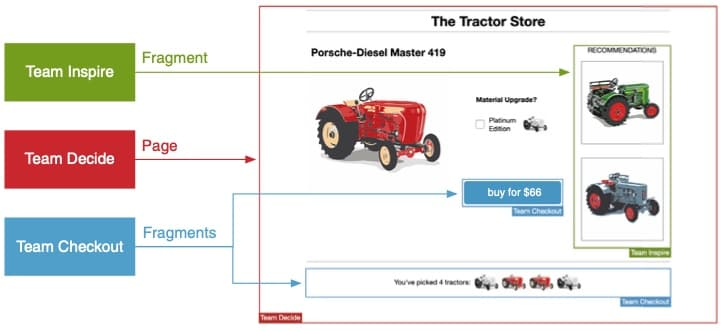
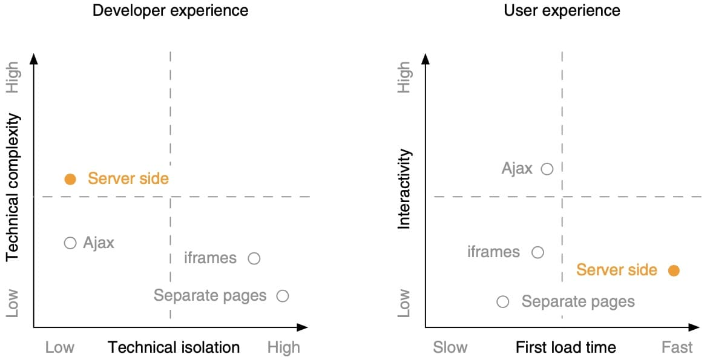
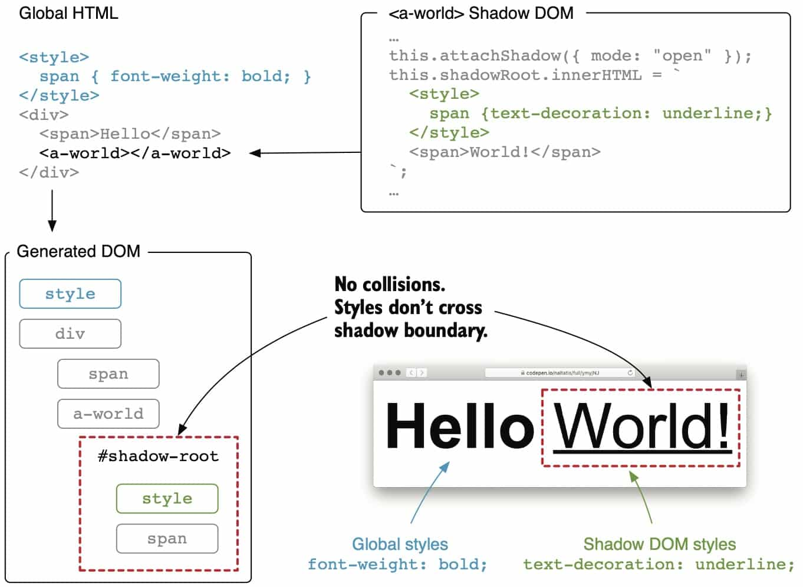
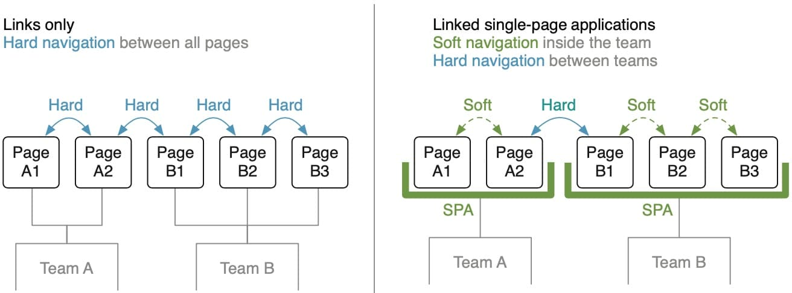
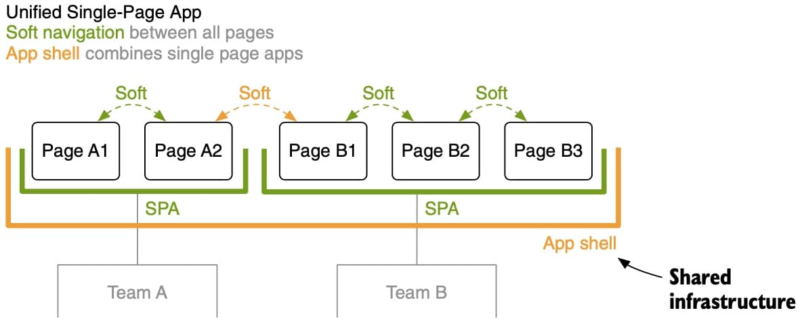
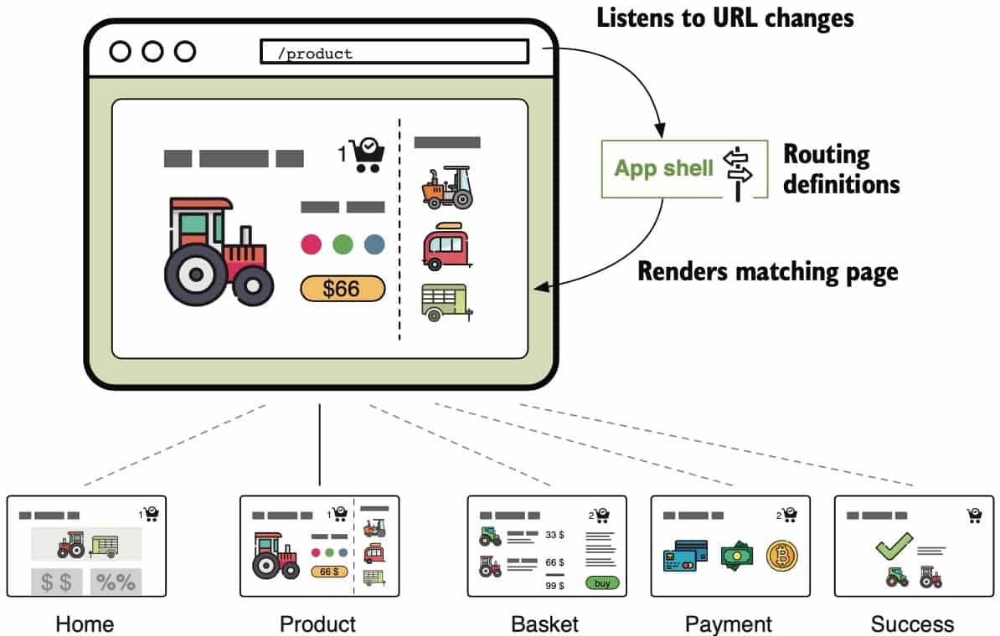

# Micro Frontends In Action

## 1. 什么是微前端

### 1.1 The Big Picture


前端融合(Frontend Integration)


#### Cross-Functional Teams


* 微服务型的架构，聚焦于技术或专业技能
* 微前端的架构，聚焦于用例或客户需求

#### The frontend


各团队创建自己的页面文件或片段

##### 片段


片段使用自己的状态或从页面中获取上下文信息。页面不需要知道片段的状态信息。

#### Frontend integration


1）路由和页面变化：
* 两种形式——HTML链接跳转、客户端路由
* 两种实现——Application shell，a meta-framework(single-spa)

2）整合
* 服务端整合: SSI、ESI、Tailor、Podium
* 客户端整合: iframes、Ajax、Web components

3）应用间通讯

#### 公共话题


### 1.2 微前端解决的问题

* 快速开发
  > Reducing waiting time between teams is micro frontends' primary goal.

* 消除前端巨石

  * 独立部署
  * 将失败的风险控制在更小的范围
  * 更容易理解
  * 代码更少，便于重构或重写
  * 不共享状态，更可控

* 持续更新
  * 遗留应用升级改造
  * 更换应用技术框架（快速决策）

* 独立应用的好处
  * 自容（各片段亦可独立地版本升级）
  * 无共享架构（shared nothing architecture）


### 1.3 微前端的负面作用

* __冗余。__ 无共享带来代码、团队等冗余，如：
  * 无法统一修复某类库的BUG
  * 某团队提升了应用构建效率，其他团队无法直接获益
* __一致性差。__ 该架构需要数据独立性，因而需要使用event bus或其它反馈机制保持数据副本
* __不匀称性(Heterogeneity)。__ 技术栈不一致，跨团队困难。可约定技术清单。
* __更多前端代码。__ 微前端带来更多的前端代码，因此从一开始就需要考虑**性能**问题。

### 1.4 微前端的适用场景

* 中大型项目(两个批萨原则，10人内)
* 基于 web 或 webview
* 权衡效率提升和管理费用
* 不适用：人少沟通无障碍，业务不清或交叉，原生应用
* 谁在用：电商(欧图集团、亚马逊、宜家、Zalando)，工业(Spotify、SAP)

## 2.第一个微前端项目

* 通过链接进行页面跳转
* 通过 iframe 进行页面整合

## 3. Ajax整合及服务端路由

### 3.1 通过Ajax整合

实现方式：团队 A 提供 HTML 片段，团队 B 加载片段并插入到 DOM 中。

1）命名空间：
* 使用约定的CSS前缀实现项目间的样式隔离。
* JavaScript隔离：使用IIFE（立即执行函数表达式）。全局对象则声明为：

```js
<script data-inspire-state type="application/json">
{"name": "Porsche"}
</script>
```

使用时

```javascript
(function () {
  const stateContainer = fragment.querySelector("[data-inspire-state]"); 
  const MY_STATE = JSON.parse(stateContainer.innerHTML);
})();
```

仍有些命名空间问题要注意：Cookies，storage，CustomEvent等，可以使用前缀约定。

2）优点：
* 常规的文档流
* 搜索友好
* 渐进式增强
* 弹性错误处理

3）缺点：
* 异步加载：页面抖动等问题（可通过服务端整合解决）
* 缺少隔离
* 必须产生服务端请求
* 缺少脚本生命周期（如，页面里的客户端JS执行时机）

4）何时使用Ajax整合
简单粗暴地实现方式，尤其适合标签在服务端生成的情况。不适合处理交互复杂和本地状态过多的场景。

### 3.2 使用Nginx实现服务端路由


实现方式：配置Nginx

1）命名空间：基于URL（按Team分组命名或在路由代理表中备注URL所属团队）
2）只在无可替代时才引入中心组件（单点故障等问题）。其所有权要明确，一般由专门团队维护，而该水平团队通常是沟通障碍点。所以可以采用责任分工的方式：


3）适用：需要在同一个域下显示。额外的好处：
  *  避免 CORS
  *  通过 cookies 共享数据
  *  更好的性能(只有一次DNS查找，SSL握手等)

## 4. 服务端整合


服务端整合一般会通过在浏览器和实际的应用服务器间增加一层服务来实现。好处是首次加载即可生成完整页面。

### 4.1 基于 Nginx 的整合及服务器端包含

> 服务器端包含: Server-Side Includes (SSI)
> SSI 是一门古老的技术，可追溯到 19 世纪 90 年代。 当时人们用它来在静态页面中嵌入系统当前时间。该规范已很稳定，近年来并没有什么发展，其在各类主流服务器中的实现也很稳定。

**SSI 工作原理**

SSI `include` 指令形如：

```html
<!--#include virtual="/url/to/include" -->
```

web 服务器将标签发给客户端以前，通过 URL 指定的内容替换该指令。

例如：

```html
<aside class="decide_recos">
  <!--#include virtual="/inspire/fragment/recommendations/porsche" -->
</aside>
```


1. 客户端请求 `/product/porsche`
2. Nginx 根据 URL 前缀将请求转发至 Team Decide
3. Team Decide 生成产品页面，并用 SSI 指令包含待替换的推荐页面片段，发送至 Nginx
4. Nginx 解析响应体，找到 SSI，获取其中 URL 的内容
5. Nginx 向 Team Inspire 请求 URL 内容
6. Team Inspire 提供页面片段并返回
7. Nginx 用这些片段替换产品页面中的 SSI 注释
8. Nginx 将整合后的内容发送至浏览器

Nginx 中打开 SSI 功能：

```sh
server {
  listen 3000;
  ssi on;
  ...
}
```

更优的加载时间：
* 节省了页面绑定的时间(网络因素)
* 节省了JS执行时间(终端配置性能因素)


### 4.2 处理不可靠的页面片段

页面中某个片段可能加载时间过长甚至崩溃。服务端整合不可避免的问题是要等待所有片段加载完毕。

Nginx 可以配置超时时间：

```sh
# 注意是配置 upstream 超时时间，而不是请求超时
location /inspire/ {
  proxy_pass  http://team_inspire;
  proxy_read_timeout 500ms;
}
```

SSI 命令包含 `stub` 参数用以配置失效时的回退方案：

```html
<aside class="decide_recos">
  <!--# block name="reco_fallback" -->
    <a href="/recommendations/eicher">Show Recommendations</a>
  <!--# endblock -->
  <!--#include
    virtual="/inspire/fragment/recommendations/eicher"
    stub="reco_fallback" -->
</aside>
```

**使用服务端整合时，一定要注意考虑 fallbacks 及 timeouts**

### 4.3 性能问题

1）并行加载


> The response time for the complete markup, also called **time to first byte (TTFB)**, is defined by the time it takes to generate the page markup and the time of the slowest fragment

2）页面片段嵌套


3）延迟加载

合理选择 SSI 或 Ajax 。另外，两者很便于切换。


4）TTFB

三种方法：


### 4.4 其它解决方案

1）ESI

> Edge-Side Includes, or ESI, is a [specification](https://www.w3.org/TR/esi-lang/) that defines a unified way of markup assembly. 

支持ESI的：Akamai（CDN）、Varnish、Squid、Mongrel

指令形如：

```xml
<esi:include 
  src="https://tractor.example/fragment" 
  alt="https://fallback.example/sorry" 
  maxwait="500" />
```

2）Zalando Tailor

> Tailor is a Node.js library that parses the page’s HTML for special fragment tags, fetches the ref- erenced content, and puts it into the page’s markup.

指令形如：

```xml
<fragment
  src="http://localhost:3002/recos"
  timeout="500" 
  fallback-src="http://localhost:3002/recos/fallback" />
```

3）Podium

* layout library
* podlet library

4）适用性


没有银弹。SSI 和 ESI 均是很古老的技术，但这也正是其优点：极其稳定。

### 4.5 服务端整合的优劣

优点：
* 提升首次加载性能
* 渐进式微前端，仍可用 Ajax
* SSI/ESI 技术很成熟稳定
* 搜索引擎友好

缺点：
* 首字节加载时机晚
* 没有在浏览器中实现隔离，需要解决命名冲突等问题
* 本地开发变复杂，每个开发人员均需要web服务器提供 SSI 等功能




## 5. 客户端整合

### 5.1 使用 Web Components 包装微前端

Web Components：
* Custom Elements
* Shadow DOM
* HTML Templates

自定义元素：

```js
const prices = {
  porsche: 66,
  fendt: 54,
  eicher: 58,
};
class CheckoutBuy extends HTMLElement {
  connectedCallback() {
    const sku = this.getAttribute("sku");
    this.innerHTML = `
      <button type="button">buy for $${prices[sku]}</button>
    `;
    ...
  }
  disconnectedCallback() {...}
}
window.customElements.define("checkout-buy", CheckoutBuy);
```

```html
<checkout-buy sku="fendt"></checkout-buy>
````

使用 Web Component 包装框架，如 Vuejs
https://github.com/vuejs/vue-web-component-wrapper


### 5.2 使用 Shadow DOM 进行样式隔离

在 HTML 元素上调用 `attachShadow()` ：

```js
class CheckoutBuy extends HTMLElement {
  connectedCallback() {
    const sku = this.getAttribute("sku");
    this.attachShadow({ mode: "open" });
    // 在 shadowRoot 上插入内容
    this.shadowRoot.innerHTML = `
      <style>
        button {}
        button:hover {}
      </style>
      <button type="button">
        buy for $${prices[sku]}
      </button>
    `;
  }
}
```



**利弊分析**

  * 利：
    * 强隔离，不需要命名空间
    * 阻止全局样式污染，特别适合处理遗留项目
    * 减少对 css 工具的使用依赖
    * 页面片段自容，不需额外的 css 文件
  * 弊：
    * 低版本浏览器不支持
    * 需要启用 JavaScript
    * 不支持渐进增强或服务端渲染
    * 不同 Shadow DOM 间难以共享样式
    * 无法使用基于全局样式的库(Bootstrap等)

### 5.3 使用 Web Component 进行整合的优缺点

优点：

* 标准化。API 相对稳定。
* 隔离性。自定义元素、影子DOM等。
* 标准化的生命周期方法，便于团队统一。

缺点：

* 需要启用 JavaScript
* 不支持服务端渲染
* 低版本浏览器不支持，Polyfill 困难

适用性：交互性强的、app-like 的应用


## 6. 通信模式


### 6.1 UI 通信

页面与页面间，通过 URL 和 Query String 。

**页面内，通常有三种：**


父到子通信通过属性更新：


子到父通信通过自定义事件：


子与子通信方式：

* 直接通信（不建议）
* 通过父页面通信（联合使用父到子、子到父）
* Event-Bus 或广播

**Broadcast Channel API**

同源跨 window ，可在 iframe 和 tab 间传递消息。

**UI 通信适合于**：

* 轻量级数据交互
* 强烈的UI交互需求往往是边界不清的信号
* 使用事件时要注意微前端的异步加载问题

### 6.2 其它通信机制

1）提供全局上下文信息：

* 提供全局 JavaScript API, application shell）
* 一般由公共小组完成

验证：OAuth 或 JWT 等


2）状态管理

微前端间状态共享，会导致各前端健壮性降低及组内通信的滥用。


3）前后端通信


4）数据复本

可以保证各团队的依赖独立性及系统健壮性


## 7. 客户端路由及应用壳

* Hard navigation，完整的页面加载，服务端跳转
* Soft navigation，客户端渲染，客户端路由



通过应用壳提供一个共享层，完成统一的SPA。它类似前端代理层：



### 7.1 应用壳——平级路由



app shell 的职责：

1. 提供共享 HTML 文档
2. 映射 URL 到相应微前端团队
3. 渲染匹配到的页面
4. 初始化或销毁导航页面

各微前端把页面通过组件的形式暴露给应用壳：


### 7.2 应用壳——二级路由

应用壳负责一级路由分发，二级路由则 交由各微前端处理：


---
@ssbunny 2021-10