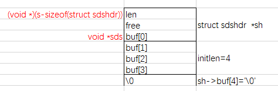
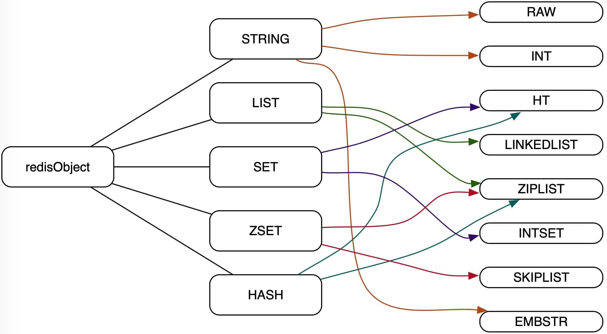

# 源码阅读: Redis 中的数据结构

## 简单动态字符串（SDS）

Redis 底层使用 **SDS** (Simple Dynamic Strings) 作为字符串类型的存储方式之一，其结构非常简单，直接看源码即可了解个大概：

```c
typedef char *sds;

struct sdshdr {
    unsigned int len;
    unsigned int free;
    char buf[];
};
```

其中，结构体 sdshdr 中的 len 用来存储字符串的实际长度，free 用来存储预留空间的长度，buf 用来存储字符串内容。

与一般动态字符串直接使用结构体表示字符串的实现方式不同，sds 仍使用 `char*` 表示字符串，只是其指向的位置略微特殊而已。通过创建 sds 的函数，可以看出这种特殊性：

```c
sds sdsnewlen(const void *init, size_t initlen) {
    struct sdshdr *sh;

    if (init) {
        sh = zmalloc(sizeof(struct sdshdr)+initlen+1);
    } else {
        sh = zcalloc(sizeof(struct sdshdr)+initlen+1);
    }
    if (sh == NULL) return NULL;
    sh->len = initlen;
    sh->free = 0;
    if (initlen && init)
        memcpy(sh->buf, init, initlen);
    sh->buf[initlen] = '\0';
    return (char*)sh->buf;
}
```

通过源代码了解到，实际存储字符串相关信息的仍然是 `struct` （sdshdr），sds 其实是返回指向其 buf 数组的首个元素的指针。借用 redis 作者的描述：

```:no-line-numbers
    +--------+-------------------------------+-----------+
    | Header | Binary safe C alike string... | Null term |
    +--------+-------------------------------+-----------+
             |
             `-> Pointer returned to the user.
```

另外值得注意的是，通过：

```c
sh->len = initlen;
sh->free = 0;
```

可以看出，redis 在首次创建字符串时并不会额外分配 `free` 空间，而是按字符串实际的大小申请内存空间来创建，这和 Java 中 StringBuffer 等预先分配一定容量(通常16char)的策略是不同的。

**sds 是二进制安全的**，字符串中间可以包含 `\0` 。获取 sds 的长度时通常不能直接使用 strlen 而是使用 sdslen 读取其 len 值：

```c
static inline size_t sdslen(const sds s) {
    struct sdshdr *sh = (void*)(s-(sizeof(struct sdshdr)));
    return sh->len;
}
```

唐老师给我画了一张图，可以帮助理解：



最后一个值得关注的问题是，sds 是如何扩容的？这一过程在 sdsMakeRoomFor 函数中实现：

```c
sds sdsMakeRoomFor(sds s, size_t addlen) {
    struct sdshdr *sh, *newsh;
    size_t free = sdsavail(s);
    size_t len, newlen;

    if (free >= addlen) return s;
    len = sdslen(s);
    sh = (void*) (s-(sizeof(struct sdshdr)));
    newlen = (len+addlen);
    if (newlen < SDS_MAX_PREALLOC)
        newlen *= 2;
    else
        newlen += SDS_MAX_PREALLOC;
    newsh = zrealloc(sh, sizeof(struct sdshdr)+newlen+1);
    if (newsh == NULL) return NULL;

    newsh->free = newlen - len;
    return newsh->buf;
}
```

可以看到，当扩展后的长度比 `SDS_MAX_PREALLOC` 小时，预留一倍的容量；否则增加 `SDS_MAX_PREALLOC` 的容量。当前版本中：

```c
#define SDS_MAX_PREALLOC (1024*1024)
```

理解了这些便很容易知道 redis `APPEND` 命令的实现细节：

```sh
$ SET foo bar
$ APPEND foo blahblah
```

当然，这种预先分配容量的方式，虽然能减少内存分配的次数，提高 `APPEND` 操作的性能，但会造成一定的内存占用，而且此部分内存不会主动释放。 

## 双链表

Redis 实现了通用的双链表作为其基础数据结构之一。双链表是 redis 列表类型的实际存储方式之一，同时双链表还被其它功能模块广泛使用。它由三部分组成：

* 节点
* 迭代器
* 链表自身

其**节点**如下：

```c
typedef struct listNode {
    struct listNode *prev;
    struct listNode *next;
    void *value;
} listNode;
```

包含指向前驱、后继节点的指针及当前节点存储的值。这个值的类型为 `void*` ，说明 redis 并不限制链表存储的数据类型。

**链表**的定义如下：

```c
typedef struct list {
    listNode *head;
    listNode *tail;
    void *(*dup)(void *ptr);
    void (*free)(void *ptr);
    int (*match)(void *ptr, void *key);
    unsigned long len;
} list;
```

`list` 中保存了指向表头和表尾的指针，因此在执行 `LPUSH`、`RPUSH`、`RPOP` 等命令时是非常快的(θ(1))；其中还保存了 len 值，因此 `LLEN` 命令的执行也是非常快的。


另外，它还保存了三个函数指针 dup、free 和 match 用来复制、释放和对比链表，这样做是因为节点值的类型是不确定的，具体的实现方法交由用户代码灵活扩展处理。比如如果用户定义了 match 函数的实现，则采用它来替换默认使用 `==` 的比较策略：

```c
if (list->match) {
    if (list->match(node->value, key)) {
        listReleaseIterator(iter);
        return node;
    }
} else {
    if (key == node->value) {
        listReleaseIterator(iter);
        return node;
    }
}
```

类似地，释放一个链表时会优先调用指定的 free 函数后再完成其它释放过程：

```c
void listRelease(list *list)
{
    unsigned long len;
    listNode *current, *next;

    current = list->head;
    len = list->len;
    while(len--) {
        next = current->next;
        if (list->free) list->free(current->value);
        zfree(current);
        current = next;
    }
    zfree(list);
}
```

**迭代器**的结构如下：

```c
typedef struct listIter {
    listNode *next;
    int direction;
} listIter;
```

其中，direction 可以向前或向后：

```c
#define AL_START_HEAD 0
#define AL_START_TAIL 1
```

可以通过：

```c
listIter *listGetIterator(list *list, int direction);
```

获得迭代器，通过：

```c
listNode *listNext(listIter *iter);
```

进行遍历。另外，还可以将指针移到表头或表尾：

```c
void listRewind(list *list, listIter *li);
void listRewindTail(list *list, listIter *li);
```

## 散列表 

散列表是 redis 中的基础数据结构之一， redis 中的键空间、redisDB、 `SET`、`ZSET`、集群节点映射等，都是通过散列表实现的。结构体定义为：

```c
typedef struct dict {
    dictType *type;
    void *privdata;
    dictht ht[2];
    long rehashidx;
    int iterators;
} dict;
```

其中，`*type` 指针指向 dict 的类型，例如它是一个 ZSET(zsetDictType) 还是一个集群节点(clusterNodesDictType)。实际上它们的存储结构是相同的，之所以区分类型，是因为其散列函数、key 的比较(或销毁)策略是不同的。因而所谓的 dict 类型，不过是一组函数指针罢了：

```c
typedef struct dictType {
    unsigned int (*hashFunction)(const void *key);       // 散列函数
    void *(*keyDup)(void *privdata, const void *key);    // key 复制函数
    void *(*valDup)(void *privdata, const void *obj);    // value 复制函数
    int (*keyCompare)(void *privdata, const void *key1, const void *key2);     // key 比较函数
    void (*keyDestructor)(void *privdata, void *key);    // key 销毁函数
    void (*valDestructor)(void *privdata, void *obj);    // value 销毁函数
} dictType;
```

数组 `ht` 中存放的是 dict 的实际散列表结构 `dictht` ：

```c
typedef struct dictht {
    dictEntry **table;
    unsigned long size;
    unsigned long sizemask;
    unsigned long used;
} dictht;
```

之所以存放 2 个，是为了实现**渐进式再散列(incremental rehashing)**。

`**table` 指向桶结构 `dictEntry` :

```c
typedef struct dictEntry {
    void *key;
    union {
        void *val;
        uint64_t u64;
        int64_t s64;
        double d;
    } v;
    struct dictEntry *next;
} dictEntry;
```

当发生冲突时，dict 首先会使用**分离链接法**将散列到同一个值的所有元素保留到一个表中。当到了一定时机，它会通过**再散列**进行扩展。


Redis 还提供了遍历散列表用的迭代器，它支持安全(遍历期间可以增加元素等操作)、不安全两种方式遍历散列表：

```c
typedef struct dictIterator {
    dict *d;
    long index;
    int table, safe;
    dictEntry *entry, *nextEntry;
    long long fingerprint;
} dictIterator;
```

todo 渐进式再散列

## 数据存储结构关系

总起来看，redis 的数据存储结构大致是这样的：


它使用全局变量 `server` 来存储服务器信息：

```c
struct redisServer server;
```

其中 `redisServer` 包含了数据存储结构、事件、集群、持久化等诸多信息，和数据存储结构相关的定义如下：

```c
struct redisServer {
    redisDb *db;
    int dbnum;
    // ... 等等等
};
```

由此可见 redis 服务是由 redis 数据库(redisDb)构成的。redisServer 中存储了 redisDb 数组，其初始化大小可配置：

```sh
# Set the number of databases. The default database is DB 0, you can select
# a different one on a per-connection basis using SELECT <dbid> where
# dbid is a number between 0 and 'databases'-1
databases 16
```

默认值为 `16` :

```c
#define REDIS_DEFAULT_DBNUM     16
```

`server` 在初始化的时候会对每一个数据库做初始化操作，因此配置时用不着的数据库尽量关闭：

```c
...
server.dbnum = REDIS_DEFAULT_DBNUM;

...

server.db = zmalloc(sizeof(redisDb)*server.dbnum);
...
for (j = 0; j < server.dbnum; j++) {
    server.db[j].dict = dictCreate(&dbDictType,NULL);
    server.db[j].expires = dictCreate(&keyptrDictType,NULL);
    server.db[j].blocking_keys = dictCreate(&keylistDictType,NULL);
    // ... 等等
}
```

redisDb 的结构并不复杂：

```c
typedef struct redisDb {
    dict *dict;
    int id;
    long long avg_ttl;
    // ... 等
} redisDb;
```

其中 `dict *dict` 用来存储键值对数据。也就是说 `SET foo bar` 命令实际会将 foo 存入 `dict` 结构的 key 中。Redis 用来存储值的对象是 `redisObject` ，它是对 redis 不同数据类型的抽象：

```c
typedef struct redisObject {
    unsigned type:4;
    unsigned encoding:4;
    void *ptr;
    // ... 等
} robj;
```

其中 `type` 代表一个 redis 数据类型(抽象给用户使用的)，`encoding` 代表 redis 内部对该类型的实际编码方式(底层的数据结构实现)， `*ptr` 是指向实际值的指针。

`redisObject` 的类型为：

```c
#define REDIS_STRING 0  /* 字符串 */
#define REDIS_LIST 1    /* 列表 */
#define REDIS_SET 2     /* 哈希 */
#define REDIS_ZSET 3    /* 集合 */
#define REDIS_HASH 4    /* 有序集合 */
```

编码方式有：

```c
#define REDIS_ENCODING_RAW 0        /* 原始sds方式 */
#define REDIS_ENCODING_INT 1        /* 整数 */
#define REDIS_ENCODING_HT 2         /* 散列表 */
#define REDIS_ENCODING_ZIPMAP 3     /* (已弃用) */
#define REDIS_ENCODING_LINKEDLIST 4 /* 双链表 */
#define REDIS_ENCODING_ZIPLIST 5    /* 压缩列表 */
#define REDIS_ENCODING_INTSET 6     /* 整型集合 */
#define REDIS_ENCODING_SKIPLIST 7   /* 跳跃表 */
#define REDIS_ENCODING_EMBSTR 8     /* 内嵌式sds */
```

通常一个 redis 的对象类型都会对应两个以上的编码方式，它们的详细对应关系为：



命令示例：

```sh
$ SET foo abc
$ OBJECT ENCODING foo  
"embstr"

$ SET bar abcdefghijklmnopqrstuvwxyzabcdefghijklmnopqrstuvwxyz
$ OBJECT ENCODING bar
"raw"

$ SET foobar 123
$ OBJECT ENCODING foobar
"int"

$ SET foobar 12345678901234567890
$ OBJECT ENCODING foobar
"embstr"

$ SET foobar 1.0
$ OBJECT ENCODING foobar
"embstr"
```


_(使用的源码基于 redis 3.0.5)_

---
@ssbunny 2015-12