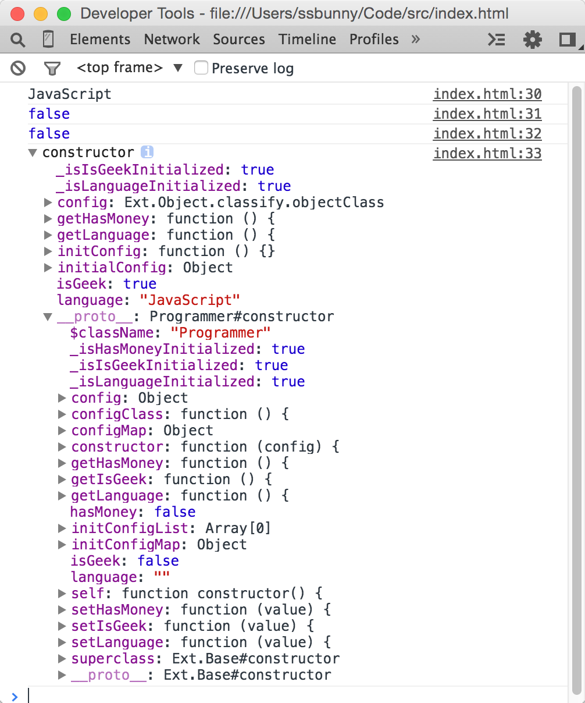
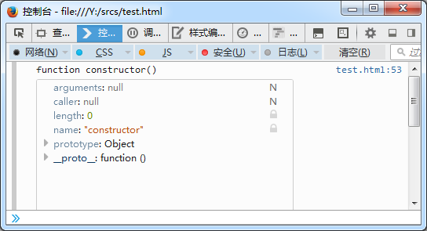
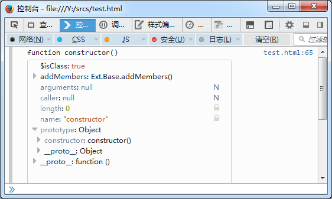
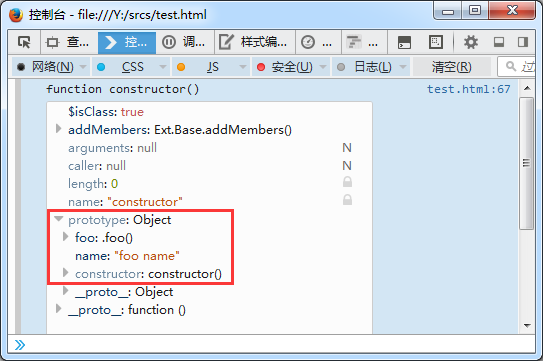
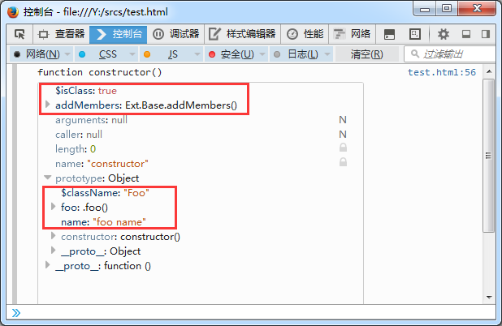
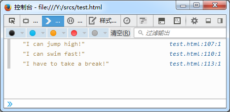
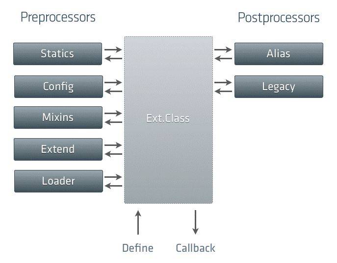

# ExtJS 核心概念 - 类系统

*[本内容只针对 ExtJS 4.x 和 ExtJS 5.x 版本]*

JavaScript 是一门富有表现力的编程语言，它既可以进行面向对象编程(OOP)，也可以进行函数式编程(FP)。函数是 JavaScript 的一等公民。面向对象编程风格相对要简单一些，这也是 ExtJS 的选择。

## 传统方式
我们先来看一下传统的使用 JavaScript 实现 OOP 的代码：

```js
var Programmer = function () {
    this.lang = 'java';
    this.name = '';
};

Programmer.prototype = {
    isProgrammer: true,
    setName: function (name) {
        this.name = name;
    },
    program: function () {
        console.log(this.name + ' codes in ' + this.lang + '.');
    }
};
```

我们借用函数对象模拟出“类“的概念，并创建了 `Programmer` 类。同时，给此类增加了两个属性： `name` 和 `lang` 。紧接着，我们在 Programmer 的原型对象上增加了 `isProgrammer` 属性和 `setName` 、`program` 方法(函数对象的属性与原型对象的属性是有区别的，但不在本教程的讨论范围)。

现在来看看如何创建 `Programmer` 的实例并调用其方法：

```js
var zhangsan = new Programmer();
zhangsan.setName('ZhangSan');
if (zhangsan.isProgrammer) {
    zhangsan.program();
}
```

控制台将打印出：

```
ZhangSan codes in java.
```

这看上去并不难。那么如果我们想模拟出“子类”及“继承”的概念呢？我想先给你看一下它的代码实现：

```js
var Geek = function () {
    Geek.superclass.constructor.call(this);
    this.niubility = true;
};
Geek.prototype = new Programmer();
Geek.superclass = Programmer.prototype;

Geek.prototype.superSkill = function () {
    return 'kill himself.';
};
```

我们实现了 `Programmer` 的子类 `Geek` 并为其扩展了 `niubility` 属性和 `superSkill` 方法。这里将 `Geek` 的原型指向 `Programmer` 的一个实例，以此来获得 `Programmer` 上的所有属性及方法。除此之外，我们还将 `Geek` 的 `superclass` 指向 `Programmer.prototype` ，这么一来便可以通过 `superclass` 引用调用并继承父类方法。

如果上面的代码对你来说并不容易理解，那么你可能需要补充一下 JavaScript 的基础知识。虽然 ExtJS 为我们隐藏了诸多实现细节，但若想有所提高并了解 ExtJS 的工作原理，准确理解以上代码是极为必要的。更多 JavaScript 面向对象编程的知识，我推荐你阅读
[MDN相关文档](https://developer.mozilla.org/en-US/docs/Web/JavaScript/Introduction_to_Object-Oriented_JavaScript) 。

接下来构造一个 `Geek` 实例并调用其方法：

```js
var lisi = new Geek();
lisi.setName('LiSi');
lisi.lang = 'JavaScript';

if (lisi.isProgrammer && lisi.niubility) {
    lisi.program();
    console.log(lisi.name + ' can ' + lisi.superSkill());
}
```

控制台将打印出：

```
LiSi codes in JavaScript.
LiSi can kill himself.
```

## ExtJS的方式

从上一小节可以看出，传统的面向对象编程方式稍有些复杂，而且代码较为分散，继承关系也不直观。ExtJS 为了克服此问题，在 4.0+ 版本中引入了全新的类系统。让我们先来看看如何用 ExtJS 的方式实现上一节的例子：

```js
Ext.define('Programmer', {
    isProgrammer: true,
    constructor: function () {
        this.lang = 'java';
        this.name = '';
    },
    setName: function (name) {
        this.name = name;
    },
    program: function () {
        console.log(this.name + ' codes in ' + this.lang + '.');
    }
});

var zhangsan = Ext.create('Programmer');
zhangsan.setName('ZhangSan');
if (zhangsan.isProgrammer) {
    zhangsan.program();
}
```

实现继承关系也非常简单直观，来看子类的代码：

```js
Ext.define('Geek', {
    extend: 'Programmer',
    constructor: function () {
        this.callParent();
        this.niubility = true;
    },
    superSkill: function () {
        return 'kill himself.';
    }
});

var lisi = Ext.create('Geek');
lisi.setName('LiSi');
lisi.lang = 'JavaScript';

if (lisi.isProgrammer && lisi.niubility) {
    lisi.program();
    console.log(lisi.name + ' can ' + lisi.superSkill());
}
```

可以看出，ExtJS 类系统的核心即为 **Ext.define** 函数，熟悉 Java 的开发人员可以将其理解为 ExtJS 的定义类的语法。继承关系则可以通过 extend 属性指定。从 4.0+ 版本开始，ExtJS 整个框架都基于 `Ext.define` 来构建，除了继承以外，该方法还实现了其它诸多类系统特性，让我们通过代码的方式展示一下 `Ext.define` 的用法。

## Ext.define的用法

### 1.定义一个类

正如前面看到的，`Ext.define` 可以用来定义一个类：

```js
Ext.define('Programmer', {
    constructor: function (language) {
        if (language) {
            this.language = language;
        }
    },
    language: '[default]',
    code: function () {
        return ('I\'m coding in ' + this.language + '.');
    }
});

var zhangsan = new Programmer('Java');
console.log(zhangsan.code()); // I'm coding in Java. 
```

### 2.继承

还有继承：

```js
Ext.define('JavaScripter', {
    extend: 'Programmer',
    constructor: function (skilled) {
        this.skilled = skilled || '';
        this.callParent(['JavaScript']);
    },
    skill: function () {
        return (this.code() + 'I am good at ' + this.skilled + '.');
    }
});

var lisi = new JavaScripter('ExtJS');
console.log(lisi.skill()); // I'm coding in JavaScript.I am good at ExtJS. 
```

继承使用 `extend` 属性实现，在构造器或方法中，通过 `this.callParent()` 以调用父类方法。

### 3.Config

定义在 `config` 中的属性会自动生成 getters/setters： 

```js
Ext.define('Programmer', {
    constructor: function (config) {
        this.initConfig(config);
    },

    config: {
        language: '',
        isGeek: false,
        hasMoney: false
    }
});

var zhangsan = new Programmer({
    language: 'JavaScript',
    isGeek: true
});

console.log(zhangsan.getLanguage());
console.log(zhangsan.getHasMoney());
console.log(zhangsan.hasMoney);
console.dir(zhangsan); 
```

执行结果如下： 



需要*注意*的是，如果不是继承自现有组件，而是自己定义新类，需要在 `constructor` 中明确调用 `initConfig()` 方法。 

ExtJS 框架并没有对 `isXxx` 、`hasXxx` 方法做特殊处理，即示例中默认并**不存在** isGeek() 方法，可以访问 `isGee` 属性获得其值。然而，`isXxx` 属性通常更适合作为类的成员对象(属性)，不需放入config中。

对于 `config` 中的属性 `foo`, 框架还会为其自动生成 `applyFoo()` 和 `updateFoo()` 方法，这两个方法分别作为 `setFoo()` 的前置和后置方法被调用，具体使用说明可参考相应API文档。 

### 4.Statics 和 InheritableStatics 

```js
Ext.define('Computer', {
    statics: {
        factory: function(brand) {
            // `this` 指向类本身
            return new this(brand);
        }
    },
    constructor: function(brand) {
        this.brand = brand || '';
    }，
    foo: function () {
        // `this.statics()` 可以引用到当前类
    }
});

var thinkComputer = Computer.factory('Thinkpad');
console.log(thinkComputer.brand); // Thinkpad 
```

关于静态方法，你需要知道：

1. 在statics方法中，`this` 指向类本身;
2. 在其它成员方法中，`this.statics()` 可以引用到当前类；
3. statics对象中的属性/方法，不会被 `extend` 或 `mixin`，如有此需求，可使用 `InheritableStatics` .

### 5.Mixins

ExtJS 提供了掺和模式的实现：

```js
Ext.define('CanSing', {
    sing: function() {
        console.log("I'm on the highway to hell...");
    }
});

Ext.define('Musician', {
    mixins: ['CanSing'],
    eat: function() {
        console.log("Everyone is able to eat.");
    }
})

new Musician().eat(); // Everyone is able to eat.
new Musician().sing(); // I'm on the highway to hell...
```

你应该通过掺和模式合理的拆分一些较大的类，将其中可共用的行为方法拆分出去。例如你在设计一个Web界面模板类，它可以保存新数据，也可以删除已有数据，另外还有可能会包含数据修改、数据导入导出、查询检索等等一系列操作。你当然可以设计一个大而全的类来实现所有功能，如果某一特殊场景中不需要“导入导出”功能则通过子类将对应功能入口“弱化”掉。这个设计很糟糕，维护这个大类会让人疯狂，尤其面对新的功能扩展时。

聪明一些的办法则可以通过继承层级划分，在基类中实现“基本功能”并在子类中扩展其它功能。然而我们的例子中如何划分子类呢？它有太多可能的功能组合。你肯定已经想到，掺和模式可以解决此类问题。

`mixins` 背后的思想即是通过**聚合**而非继承的方式为某类型扩展行为能力。
Java 开发人员理应对此极为熟悉。使用 Golang 的开发人员可以将其理解为结构体的嵌入。

下面展示一个稍复杂的例子，更多的用法希望你通过API文档自行学习：

```js
Ext.define('Jqueryable', {
    skill: 'jQuery'
});

Ext.define('Extjsable', {
    skill: function () {
        return 'ExtJS';
    }
});

Ext.define('Seajsable', {
    cmd: 'Seajs'
});

Ext.define('JavaScripter', {
    extend: 'Programmer',
    constructor: function (skilled) {
        this.skilled = skilled || '';
        this.callParent(['JavaScript']);
    },
    
    mixins: {
        writejQuery: 'Jqueryable',
        writeExtjs: 'Extjsable',
        writeSeajs: 'Seajsable'
    },

    skill: function () {
        return [
            this.code(),
            'I am good at ',
            this.mixins.writejQuery.skill,
            ',',
            this.mixins.writeExtjs.skill(),
            ',',
            this.mixins.writeSeajs.cmd,
            '.'
        ].join('');
    }
});

var lisi = new JavaScripter('ExtJS');
console.log(lisi.skill());
// I'm coding in JavaScript.I am good at jQuery,ExtJS,Seajs.
```

### 6.保留私有作用域空间

接下来要展示的代码你应该一看就明白它的用意为何，如下：

```js
Ext.define('Foo', function () {
    // nested scope
    return {
        // properties
    }
});
```

类似的代码结构在使用 ExtJS 之前，你已经无数次使用了。通过给 `Ext.define` 第二个参数传函数参数的方式，可以在函数中保留私有作用域空间。如果返回对象的属性中包含override等需要预处理的类，必须将上面的函数改为立即执行的方式：

```js
Ext.define('Foo', function () {
    // nested scope
    return {
        override: 'Ext.Component',
        // properties
    }
}()); 
```

唯一需要再次好心叮嘱你的是，使用这种方式一定要注意保证函数造成的闭包空间中，引用到的任何变量一定要能够在合适的时机被GC处理。

来看一个该用法的示例(注意函数中传入了参数)：
 
```js
Ext.define('Bar', function (bar) {
    return {
        statics: {
            id: 0,
            nextId: function () {
                return ++bar.id;
            }
        },
        // properties
    };
});

console.log(Bar.nextId()); // 1
console.log(Bar.nextId()); // 2 
```

### 7.定义匿名类

可能没太大用处，`Ext.define` 可以用来定义匿名类，将类名设为 `null` 即可：

```js
var Foo = Ext.define(null, {
    constructor: function () {
        this.name = '[ anonymous class ]';
    }
});

console.log(new Foo().name); // [ anonymous class ] 
```

### 8.单例模式

只需将 `singleton` 属性设置为 `true` 即可： 

```js
Ext.define('Logger', {
    singleton: true,
    log: function(msg) {
        console.log(msg);
    }
});
```

### 9.覆盖

通过 `override` 属性可以替换掉父类的方法，也可以为其增加新方法(详细的用法请参考API文档，毕竟本教程并非为了介绍API文档而作)。值得一提的是，它有一些很实用的场景，例如，拆分巨大的类 ： 

```js
// 在定义巨大的类时，可以只定义一些基础属性config、statics
// 以及一些基础的成员方法等
Ext.define('MyLargeClass', {
    constructor: function (config) {
        this.initConfig(config);
    },
    config: {
        name: null
    }
});

// 将MyLargeClass的方法分类，一部分方法放到part1中
Ext.define('MyLargeClass.part1', {
    override: 'MyLargeClass',
    constructor: function () {
        this.callParent(arguments);
    },
    jump: function () {
        console.log(this.name + ' jumps!');
    },
    code: function () {
        console.log(this.name + ' is coding in javascript!');
    }
});

// 另一部分方法放到part2中
Ext.define('MyLargeClass.part2', {
    override: 'MyLargeClass',
    sing: function () {
        console.log(this.name + ' sings a song!');
    },
    // 一般情况下应该避免像code方法这种多次覆盖的现象
    code: function () {
        console.log(this.name + ' is coding in java!');
    }
});

var largeClass = new MyLargeClass({name: 'ZhangSan'});
largeClass.jump(); // ZhangSan jumps!
largeClass.sing(); // ZhangSan sings a song!
largeClass.code(); // ZhangSan is coding in java! 
```

实际应用时，当一个类方法特别特别特别多时(巨大的类)，可以进行合理拆分。同时，结合动态类加载机制，将不同的部分part1、part2放在不同的JS源文件中，主类定义中使用 `requires` 引用所有的部分。

`Ext.define` 还提供了定义别名、动态加载、定义向下兼容的类名等多种功能用法，不再一一叙述。

## 深入一些

ExtJS 类系统提供了这么多花哨的功能，怎么实现的呢？下面的内容我将带着你一步一步深入学习 ExtJS 类系统的实现过程。

ExtJS 在定义类的时候，基本思路为：

1. 提供一个基类 `Ext.Base`，所有类继承自此，在此类中定义所有类共有的属性(function对象的属性，亦即所谓静态属性)；
2. 提供 `Ext.Class` 类，完成类定义后的前置处理；
3. 提供 `Ext.ClassManager` 单例，负责管理框架内的类。Ext.define方法的实际实现也源于此，同时实际的后置处理方法也在此实现；
4. 提供 `Ext.Loader` 单例，负责类的动态加载。同时，加载相关的前置处理方法在此实现。

动态加载的内容将单独讲解，不在此讨论。

我剥离出实现类定义的**骨干代码**，先来看看：

```js
var Ext = {};

function mkCtor() {
    return function constructor() {
        return this.constructor.apply(this, arguments) || null;
    };
}

Ext.Class = function (Class) {
    return Class;
};

Ext.ClassManager = {
    create: function (className) {
        var ctor = mkCtor();
        return new Ext.Class(ctor);
    }
};

Ext.define = function () {
    return Ext.ClassManager.create.apply(Ext.ClassManager, arguments);
};

console.dir(Ext.define('Foo'));
```

控制台将打印出：



从代码中可以看出， `Ext.define` 通过调用 `Ext.ClassManager.create` 方法，实际生成的是 `Ext.Class` 的实例，即 `new Ext.Class(ctor);`。而根据 `new` 操作符的特性，当创建 Ext.Class 时实际创建的将是传入的函数对象，即执行 `makeCtor()` 后生成的 **constructor** 函数对象。

于是可以知道，ExtJS 类系统实质上创建的都是 `makeCtor` 函数中的 `constructor` 对象，其内部只是继续调用当前(this)配置中的 constructor 属性所指向的函数，这么做的好处便是：所得到的 constructor 的原生链非常干净，没有其它多余的属性，同时便于在这一过程中为生成的对象增加属性、做预处理等。

明白了以上基础代码结构，现在来加个 `Ext.Base` 类，同时我们实现一个极度简化版的 `addMembers` 方法(该方法的使用说明参见API文档)和私有属性 `$isClass` ：

```js
Ext.Base = function () {};
Ext.Base.$isClass = true;
Ext.Base.addMembers = function (members) {
    var i, member;
    for (i in members) {
        if (members.hasOwnProperty(i)) {
            member = members[i];
            this.prototype[i] = member;
        }
    }
};
```

接下来改造一下 `Ext.Class` ：

```js
Ext.Class = function (Class, data) {
    var name;
    for (name in Ext.Base) {
        if (Ext.Base.hasOwnProperty(name)) {
            Class[name] = Ext.Base[name];
        }
    }
    return Class;
};
```

执行代码，控制台将打印出：



现在，我们的 `Foo` 类已经获取到 `Ext.Base` 中的方法了。改变打印输出代码，来用一下新方法：

```js
var Foo = Ext.define('Foo');
Foo.addMembers({
    name: 'foo name',
    foo: function () {
        console.log('I\'m foo');
    }
});
console.dir(Foo);
```

可以看到结果如下，我们成功地给 `Foo` 增加了原型方法：



现在把 `addMembers` 放到我们的框架代码内部调用，并增加 `$className` 属性，以此表示我们已经有能力按需要扩展所定义的类的属性，于是得到如下**相对完整的代码** ：

```js
var Ext = {};

function mkCtor() {
    return function constructor() {
        return this.constructor.apply(this, arguments) || null;
    };
}

Ext.Base = function () {};
Ext.Base.$isClass = true;
Ext.Base.addMembers = function (members) {
    var i, member;
    for (i in members) {
        if (members.hasOwnProperty(i)) {
            member = members[i];
            this.prototype[i] = member;
        }
    }
};

Ext.Class = function (Class, data) {
    var name;
    for (name in Ext.Base) {
        if (Ext.Base.hasOwnProperty(name)) {
            Class[name] = Ext.Base[name];
        }
    }
    Class.addMembers(data);  //  <-----------
    return Class;
};

Ext.ClassManager = {
    create: function (className, data) {
        var ctor = mkCtor();
        data && (data.$className = className);  //  <-----------
        return new Ext.Class(ctor, data);
    }
};

Ext.define = function () {
    return Ext.ClassManager.create.apply(Ext.ClassManager, arguments);
};

console.dir(Ext.define('Foo', {
    name: 'foo name',
    foo: function () {
        console.log('I\'m foo');
    }
}));
```

结果如我们所愿：



### 预处理器

现在我们已经有了 ExtJS 类系统基本的代码结构，并能为生成的类提供附加的属性。那么，`Ext.define` 中诸多的功能特性又是怎么实现的呢，例如 `extend` 、`statics`、`mixins` 等？答案就是：预处理器。

ExtJS 的预处理器分为 **前置处理器** (在类构造前做一些事情)和 **后置处理器** (在类构造成功后正式使用前做一些事情)。前置处理器放在 `Ext.Class` 对象中，后置处理器放在 `Ext.ClassManager` 对象中。如果你熟悉 Nodejs 的 Express 框架或是 Python 的 django 框架，ExtJS 预处理器的设计理念对你来说 so easy, 来看看吧。

我们先来自己实现它。预处理器至少需要三部分组成：

1. 盛放处理器的容器
2. 注册处理器的方法
3. 执行处理器具体处理过程的方法

先来解决第一个问题：我们用数组 `[]` 表示容器，用形如 `{name: '处理器名称', fn: 执行的处理方法}` 的对象表示一个处理器。容器就分别叫做 `preprocessors` 和 `postprocessors` 吧。之后，注册方法就对应地叫做 `registerPreprocessor` 和 `registerPostprocessor` ; 执行方法叫 `doPreprocessor` 和 `doPostprocessor` 。

我说了这么多废话，你一看前置处理器的骨干代码，发现“原来如此简单”：

```js
Ext.Class.preprocessors = [];
Ext.Class.registerPreprocessor = function (name, fn) {
    Ext.Class.preprocessors.push({
        name: name,
        fn: fn
    });
};
Ext.Class.doPreprocessor = function () {
    var i, len,
        pre = Ext.Class.preprocessors;
    for (i = 0, len = pre.length; i < len; ++i) {
        pre[i].fn.call(Ext.Class);
    }
};
```

我们在 `ExtClass` 中加个 `preprocessors` 数组，注册方法是往数组里放处理器，执行方法则是把数组里的所有处理器取出来调用一下。就是这么简单！对应的后置处理器完全相同：

```js
Ext.ClassManager.postprocessors = [];
Ext.ClassManager.registerPostprocessor = function (name, fn) {
    Ext.ClassManager.postprocessors.push({
        name: name,
        fn: fn
    });
};  
Ext.ClassManager.doPostprocessor = function () {
    var i, len,
        post = Ext.ClassManager.postprocessors;
    for (i = 0, len = post.length; i < len; ++i) {
        post[i].fn.call(Ext.Class);
    }
};
```

处理器有了，调用一下吧。现在改造 `Ext.Class` ，把已有的代码移到 `create` 方法中，并为其增加 `onCreated` 参数，以便回调后置处理器：

```js
Ext.Class = function (Class, data, onCreated) {
    Ext.Class.create(Class, data);
    Ext.Class.doPreprocessor(Class, data);      // <----------
    Class.addMembers(data);
    onCreated.call(Class, Class);               // <----------
    return Class;
};

Ext.Class.create = function (Class, data) {
    var name;
    for (name in Ext.Base) {
        if (Ext.Base.hasOwnProperty(name)) {
            Class[name] = Ext.Base[name];
        }
    }
};
```

相应地，加上后置回调函数并在其中调用后置处理器的执行方法：

```js
Ext.ClassManager.create = function (className, data) {
    var ctor = mkCtor();
    data && (data.$className = className);
    return new Ext.Class(ctor, data, function () {
        Ext.ClassManager.doPostprocessor();   // <----------
    });
};
```

就是这么简单，快注册几个处理器试试吧：

```js
Ext.Class.registerPreprocessor('jump', function () {
    console.log('I can jump high!');
});
Ext.Class.registerPreprocessor('swim', function () {
    console.log('I can swim fast!');
});
Ext.ClassManager.registerPostprocessor('rest', function () {
    console.log('I have to take a break!');
});

Ext.define('Qiang');
```

此时可以看到，当我们定义一个新类( `'Qiang'` )时，各预处理器被执行：



其实，ExtJS 实现前置处理器和后置处理器的过程是非常复杂的，不过思路却极为简单，正如我们刚刚看到的。在我们的代码基础上，还可以增加很多辅助方法，例如，调整已注册的处理器顺序、增加更多的钩子方法、注册事件并触发等等。事实上 ExtJS 正是这么做的，它还为我们提供了很多优秀的处理器，不像我们的示例代码只是粗糙的 `console.log` ，它们非常强大，它们正是之前介绍的 `Ext.define` 诸多功能的实际实现：



## 就此结束了吗？

还不够，我们应该只处理用户指定的处理器，如下面的调用只执行 `swim` 处理器：

```js
Ext.define('Swimmer', {
    swim: 'very fast!'
});
```

另外，`Ext.define` 创建出的类，只是通过字符串静态指定的类名，我们还应该把它放入全局变量中，同时为其处理好命名空间问题，以便可以直接调用它。

还有一大堆需要实现的 API 方法，还有无数的细节需要处理。

我对 ExtJS 系统的讲解结束了，而我希望对你仅仅是开始，希望我的分析讲解可以帮你更深入地理解 ExtJS 类系统，更便于你理解它的源码，更便于你使用、扩展它。

---
@ssbunny 2015-06-26