# 培训讲义——密码学基础

## 密码学能干什么？

我们用社交工具，聊天的内容是否被监听了呢？（端到端加密）

激活码是如何保护软件版权的？（可撤销广播加密）

我和你不认识，想通过各自的微信联系人列表知道我们有没有共同认识的人。如何在不泄露双方联系人列表的基础上实现？（乱码电路）

如何在互不见面的网络中确认“你就是你”？（身份认证、网络协议）

一辆 AI 自动驾驶的车辆，如何保障不被黑客控制？区块链是如何保证信息不被篡改的？

## 信息安全所面临的威胁

* 窃听：私密泄漏
* 篡改：信息被修改
* 伪装：伪装成消息发送者骗取信息
* 否认：事后称自己没有做

为了解决这些问题，我们先从最简单的入手：

##  恺撒密码

下面的文本是什么意思?

> KHOOR FLSKHU

这是一种公元前 100 年左右使用过的密码。

恺撒密码：最早由古罗马军事统帅盖乌斯·尤利乌斯·恺撒在军队中用来传递加密信息。它通过将字母表中的字母平移一定字数来进行加密。

前面的文本是我们通过将字母平移 3 位得到的：

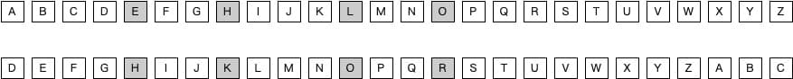

H -> K
E -> H
L -> O
L -> O
O -> R

原文其实是：

> HELLO CIPHER

我们来看一下恺撒密码的构成：

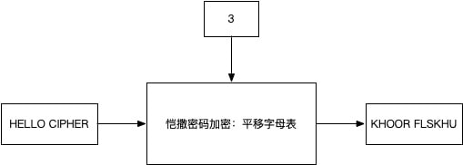

恺撒密码虽然简陋，但却包含了比较完整的密码学基本术语：
* 明文：HELLO CIPHER
* 密文：KHOOR FLSKHU
* 加密算法：平移字母表
* 密钥：3

恺撒密码的解密过程只需要按反方向把字母平移回去即可。我们加上解密过程并为其再增加几个角色，得到密码学中最常见的术语关系：

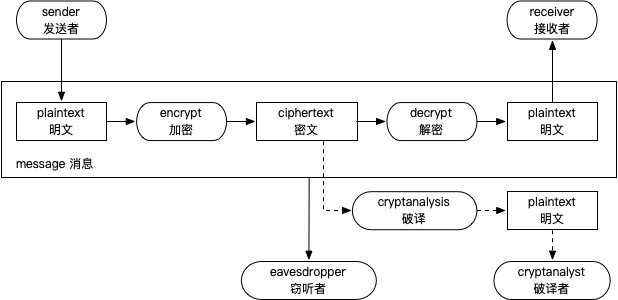

**窃听者**：不一定是人，也可能是某程序，他对信息传递的全过程“窃听”。
**破译者**：不一定是坏人，也可能是密码学研究者，他尝试通过解密以外的手段将密文还原为明文。

现在我们来重点关注恺撒密码中的密钥，即，字母平移的步数：3 。在“平移字母表”这样一个加密算法中，由于字母一共为 26 个，可以平移的步数必然为 0 到 25 共 26 种可能。于是，当接收者以外的人拿到密文 KHOOR FLSKHU 时，尽管他不知道密钥，却可以从 0 开始依次尝试所有的可能，最终他一定能得到 HELLO CIPHER 。

将所有的密钥都尝试一遍的过程，被叫作**暴力破解**。恺撒密码实在是太脆弱了，只需要最多 25 次尝试便可将其破解。另外地，我们把这 25 种可能，叫作**密钥空间**，一个可靠的加密算法至少要包含足够大的密钥空间。

## 恩尼格码

创造人类手工无法企及的高强度密码：恩尼格码（Enigma）密码机

二战时期德国军方所使用的一种高级机械加密系统，以转子结构为主体。

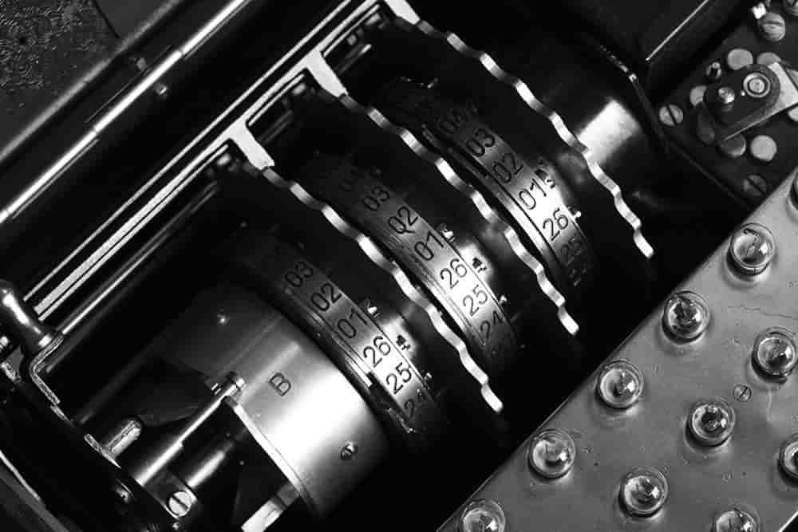

该密码机的工作原理这里不展开介绍。通过转子和接线板的不同配置方案，破译者需要尝试 158962555217826360000 种不同的可能才能暴力破解它。

关于破译恩尼格码密码机的过程，有兴趣的朋友可以看这本书：

或是这部电影：

能够战胜机器的唯有机器。

## 对称加密

现代密码所处理的数据量非常大且算法非常复杂，想完成加密和解密操作，必须借助计算机的力量。

计算机处理的不是文字而是**比特**序列，因此需要先对现实世界进行**编码**。

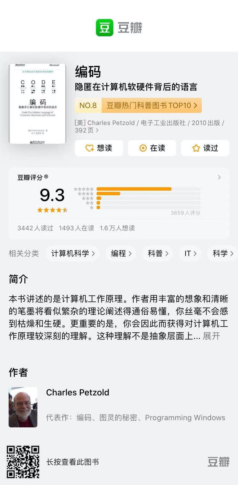

编码是一门系统的学问，这里不再展开。我们比较常见的编码规则有 ASCII、UTF-8 等。需要注意的是，**编码并不是加密**，比如开发中经常对文本或图片进行 Base64 处理，Base64 是一种编码规则，通过反向解码即可得到原始信息，整个过程中我们只要明确编码算法而不存在“密钥”的概念。顺便一提，如果解码时用错了编码算法，便是开发中常遇到的“乱码”问题。

有了比特序列，计算机便可以对其进行加密。

让我们从一个简单的加密算法开始：DES 。 DES 以 64 比特明文为输入，使用 Feistel 网络进行加密。先来看一下 Feistel 网络：

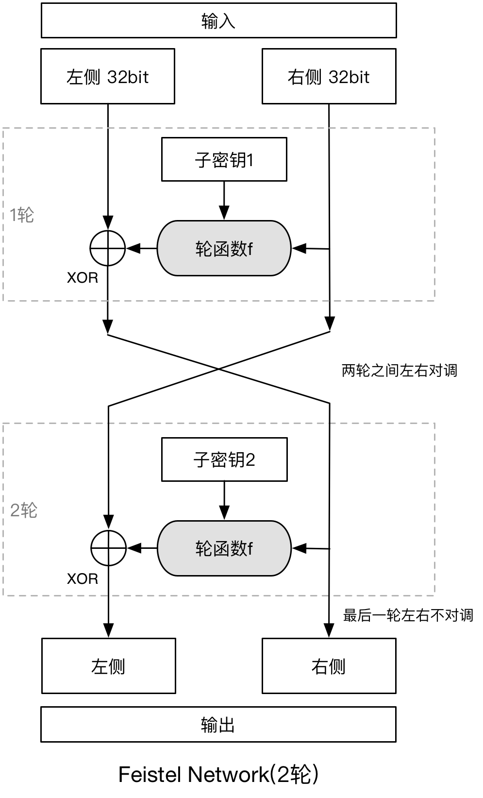

示例仅为 2 轮，Feistel 网络的轮数可以多次进行下去。

64 位的输入被拆分为左右各 32 位，第一轮处理中，右侧不做处理，直接准备进入下一轮。另一方面，右侧通过轮函数.....（看图即懂）
**子密钥**只在本轮中使用，每一轮使用不同的子密钥。

由于 XOR 操作的特性及左右对调关系，解密过程只需要按“子密钥N、子密钥N-1....子密钥2、子密钥1”的顺序以同样的方式进行 N 轮即可。也就是说解密时依然正向执行轮函数，设计时，轮函数不需要具有反函数，故其可以设计地更为复杂。

**DES 算法**

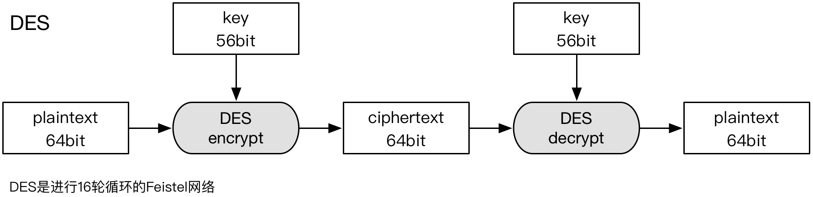

在此基础上还发展出了三重 DES

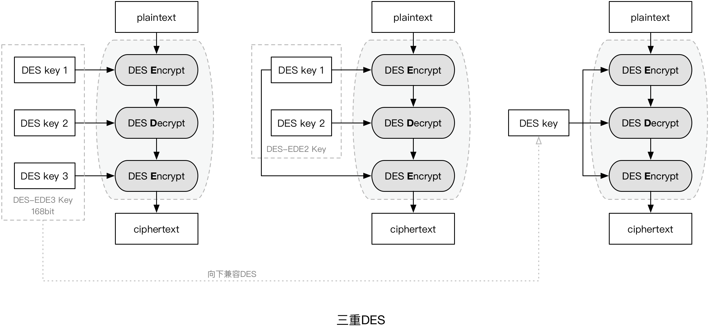

DES 相对脆弱，处理速度一般，更重要的是随着破译水平的提高其安全性日渐显出不足。为了取代 DES，美国国家标准技术研究所公开竞选新的加密算法作为美国标准，后来它也成为了世界标准，这就是我们更为熟悉且经常使用的 AES 算法。

**AES 算法**

AES 实际上是一种“标准”，其竞选入围的算法有 15 种，最终选定的算法叫作 Rijndael 。Rijndael 算法的输入为 128 比特，其过程如下：

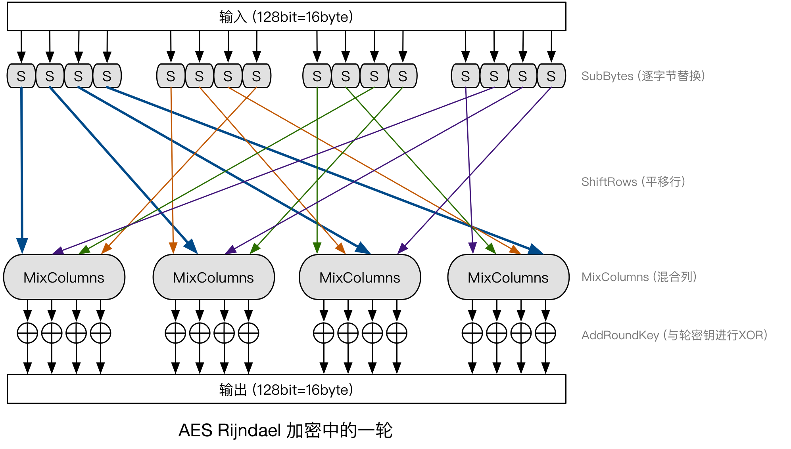

1. SubBytes：将每个字节(8 bit)的值，通过一张替换表进行替换，得到新的字节；
2. ShiftRows：将上一步的字节平移打乱；
3. MixColumns：将打乱后的每个 4 字节值进行比特运算，得到新的 4 字节的值；
4. AddRoundKey 将上一步的输出与轮密钥进行 XOR 操作。

Rijndael 一般会进行 10 ～ 14 轮计算。相比 DES 它的优势：

* 在一轮中，每一比特都会被处理，因此计算轮数可以更少；
* SubBytes、ShiftRows 和 MixColumns 可以并行计算。

不同于 Feistel 网络的轮函数，Rijndael 的解密过程需要对 SubBytes、ShiftRows 和 MixColumns 进行反向运算。

### 分组模式

前面讲的 DES 使用 64 bit 为输入，而 AES 使用 128 bit 为输入，那么当明文大于 64 或 128 比特怎么办呢？

一个最直接的办法就是把明文分成若干个分组再逐个加密就可以了。

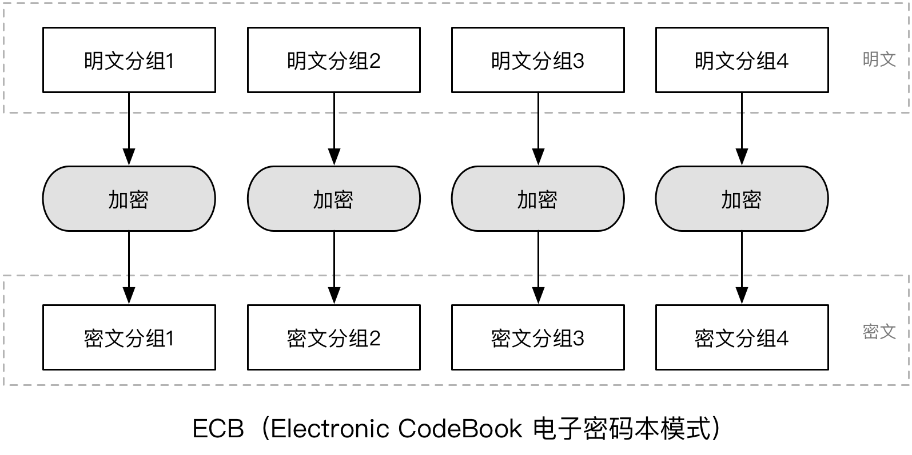

这种分组模式被称为 ECB ，它有一些明显的缺点：

假设有一段明文被分组加密后为

> 你好我叫张三 --> 1D C1 6A 3E 2A 46

而另一组被加密后为

> 你好我叫李四 --> 1D C1 6A 3E 61 28

我们单从密文 `1D C1 6A 3E` 中，就可以推断出明文存在重复的文本。如果破译者拥有足够的密文信息，他便有机会通过词频统计等手段，反推明文。或者更幸运地他知道了一部分明文和密文的对应关系，便更容易破解全部明文。

为了解决类似问题，密码学中引入了更多的分组模式供不同场景使用：

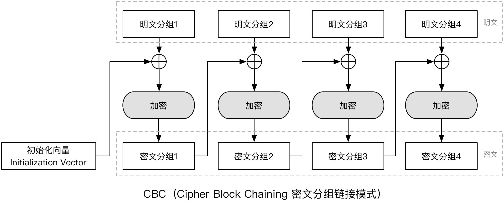

CBC 分组模式将上一组的密文和本组明文进行 XOR 操作后再加密，因此可以保障相同的明文本文加密后的密文仍不相同。那么谁来和第一组明文进行 XOR 操作呢？这正是**初始化向量**的概念。

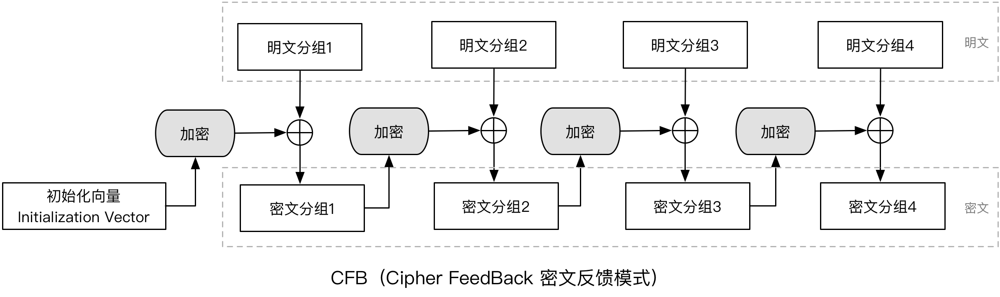

CFB 和 CBC 很接近，不再说明。

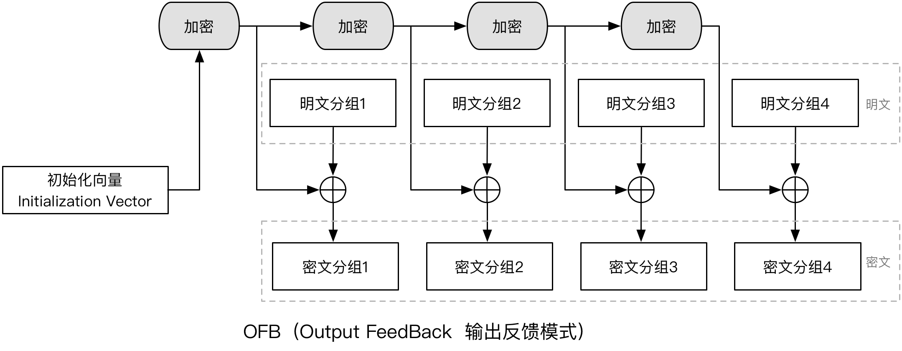

从图中可以看出，OFB 可以提前生成一组**密钥流**，后续各分组的 XOR 操作则可以并行进行，故其性能更好。

了解了分组模式后我们再来看另一个问题，当明文长度小于 64 或 128 比特，又或明文分组后最后一个分组长度小于 64 或 128 比特怎么办呢？

答案很简单：凑！这在密码学中被称为**填充(Padding)**。填充方式也有很多，这里展示几个常用的方式：

1、填充数据为填充字节的长度
>原文数据：FF FF FF FF FF FF FF FF FF
 填充后为：FF FF FF FF FF FF FF FF FF 07 07 07 07 07 07 07

2、填充数据的最后一个字节为填充字节序列的长度
>原文数据：FF FF FF FF FF FF FF FF FF
 填充后为：FF FF FF FF FF FF FF FF FF 58 B3 98 9B AD F4 07

3、填充数据为0x80后加0x00
>原文数据：FF FF FF FF FF FF FF FF FF
 填充后为：FF FF FF FF FF FF FF FF FF 80 00 00 00 00 00 00

4、填充数据为空格
>原文数据：FF FF FF FF FF FF FF FF FF
 填充后为：FF FF FF FF FF FF FF FF FF 20 20 20 20 20 20 20

填充的思路：能够确认哪些内容是填充进去的，以便解密的时候把它去除。

密码学家们已经把填充方式也帮我们设计好了，相应的标准有 ISO10126Padding、PKCS5Padding、PKCS1Padding 等等。

综合前面的内容我们发现，在解密的时候，除了必须拥有密钥，算法必须一致，分组模式、初始化向量、填充方式等等也必须一致，当然你可以认为后面所有这些都属于算法的一部分。换句话说，我们在写代码时，算法一致不单单指 “咱俩用的都是AES”。

现在，我们一起来看一下 JavaScript API 的 [Web Crypto API](https://www.w3.org/TR/WebCryptoAPI/) 中 `SubtleCrypto.encrypt()` 方法。下面是其 MDN 中的用法截图：

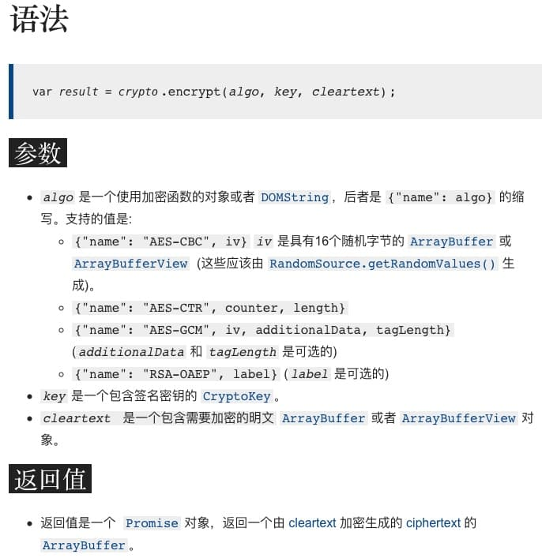

当我们掌握的前面的知识后再来看这一 API，便很容易理解各参数的含义。比如 `algo` 是加密算法，其中 `name` 为 AES-CBC 时表示使用 AES 的 CBC 分组模式， `iv` 显然是指初始化向量，看来它为我们提供了默认的填充方式。密钥 `key` 则由另一个接口 `CryptoKey` 实现，`cleartext` 是明文。

一切似乎很完美了，在散会去写更安全的代码之前，我们还得来看一个令人头疼的问题。

## 公钥密码

在真实的网络中，加密过程几乎总是和解密过程分开执行的。你会在 A 计算机中加密，继而在 B 计算机中解密。这中间经历了无数次路由、中继，漫过了无数的网线。那么，在 A 中加密的你，如何把密钥给到 B 以解密呢？不管怎么办，中间总有可能存在一个 C ，悄悄地复制了你的密钥并窃听着你的信息：

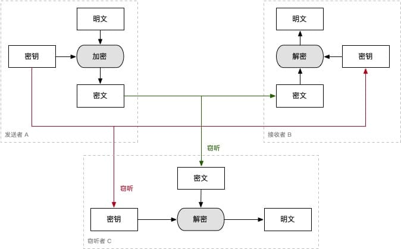

为了安全起见，**不能发送密钥！** 然而为了加密系统正常工作，**密钥必须发送**！

这个难题在密码学中被称为**密钥配送问题**。这里不卖关子，开始介绍大家都早有耳闻的**公钥密码**（或**非对称密码**），相应的把前文介绍的称为**共享密钥密码**（或**对称密码**）。

公钥密码的核心思想在于，把密钥分为加密密钥和解密密钥两种，相应地，加密时使用加密密钥，解密时使用解密密钥。这样一来，只要解密密钥在接收者自己手里，即便是加密密钥被人窃听了依然没有关系，因为他没有解密密钥，所以不能解密出明文。

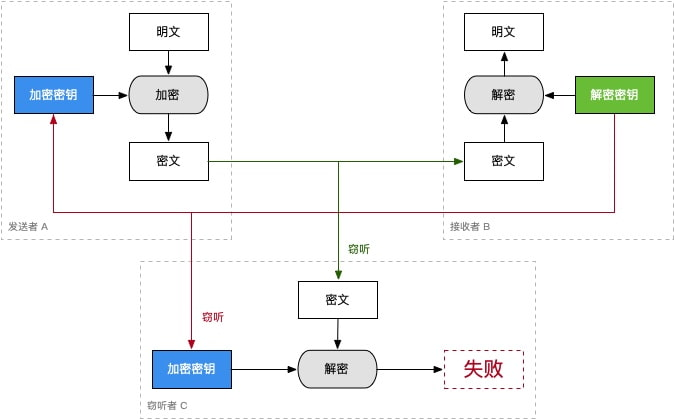

在上面的密码系统中，接收者 B 生成一对密钥（加密密钥和解密密钥）并把其中的加密密钥发给发送者，自己手里保留解密密钥。从示意图可以看出，窃听者只能窃听到加密密钥，因而无法完成解密过程。由于加密密钥是公开发布出去的，所以把它叫做**公钥**，相应地自己保管的解密密钥叫做**私钥**。
（私钥也被用来指对称加密中的密钥）

公钥密码听起来很神秘，毕竟加密和解密用的密钥居然可以不同！它其实是一种数学发现。下面我们进入本次培训最烧脑的部分，可能需要你具备一些初中数学知识:)

有两个质数 p = 3 和 q = 11
(1) 求 N ，其中 N = p * q  `(结果为 33)`
(2) 求 L ，L 是 p-1 和 q-1 的最小公倍数  `(结果为 10)`
(3) 求 E ，其中 E 和 L 的最大公约数是 1，满足条件的数很多，如 3、7、9、11... 假设我们选 `7`
(4) 求 D ，D 满足 E * D mod L = 1 ，L是10，余数为1，所以 D 乘以 7 之后为 11、21、31...，我们发现 `3` 可以。

于是我们得到了两组数：
(E, N) = (7, 33)
(D, N) = (3, 33)

现在假设有个数 `25` ，我们计算
25^E mod N 即 25^7 mod 33 = `31`

再来看
31^D mod N 即 31^3 mod 33

它刚好为 `25` !这并非一种巧合，事实上你可以尝试任何小于 33 的数。相信大家已经猜得出来，这里的 
* 25 正是明文，
* 而 31 则是密文
* 我们使用的公钥是 (7, 33)
* 私钥则为 (3, 33)

因为

> 密文 = 明文^E mod N

所以如果通过破译的手段计算明文的话，相当于求离散对数的问题。这在数学领域是非常复杂、困难的问题，尤其当初始的质数 p 和 q 选取的足够大时（计算机生成公私钥对时，通常是先生成一个很大的伪随机数，再去判断它是不是质数。），几乎是不可能。

（PS：不同的非对称加密算法可能依托于不同的数学难题，但基本方向是一致的。）

事实上，上面的计算过程，正是我们经常听到的 RSA 加密的基本原理。

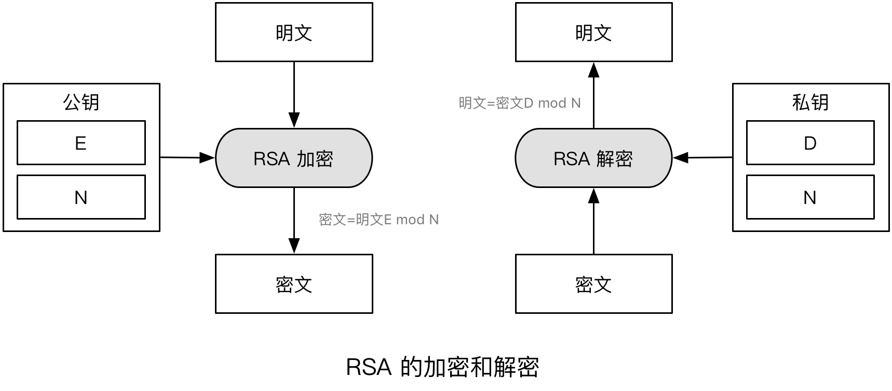

我们刚才提到，示例中的明文数字必须小于 33 ，这是因为需要计算 mod 33 ，用过 RSA 的朋友也知道，使用 RSA 时，明文长度也是有限制的，这正是来自算法的缺陷造成的限制。

另一方向，我们的示例极其简单，但依然包含的大量的运算，实际安全可用的 RAS 算法中，初始生成的两个大质数会造成运算量更加巨大，RAS 的性能相比 AES 甚至三重 DES 都更差。

那怎么办呢？

## 混合密码系统

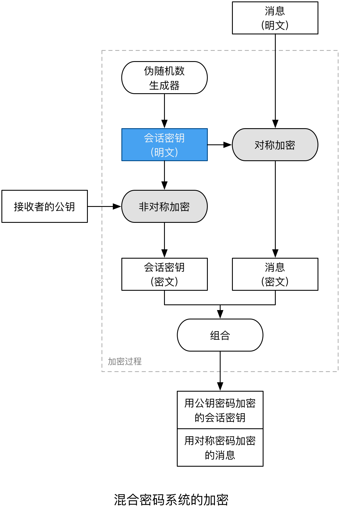

把对称和非对称加密综合起来即可。我们把随机生成的私钥（会话密钥）用非对称的算法加密，同时用对称的算法加密消息文本，这样一来，非对称的算法只需要加密少量的文本（会话密钥），而大量的文本（消息正文）则交由对称的算法处理。

由于只有接收者能解密会话密钥，所以也只有他能解密消息正文：

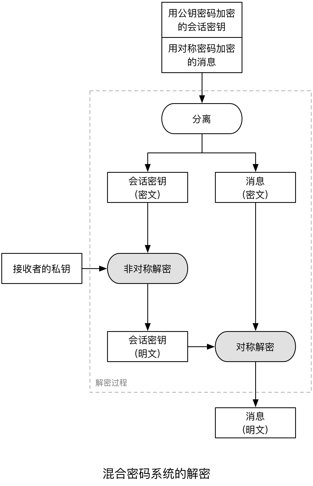

## 认证

现在我们几乎解决了密钥配送问题。然而新的挑战还在等着我们。来看这样一种场景，（介绍图片即可）。

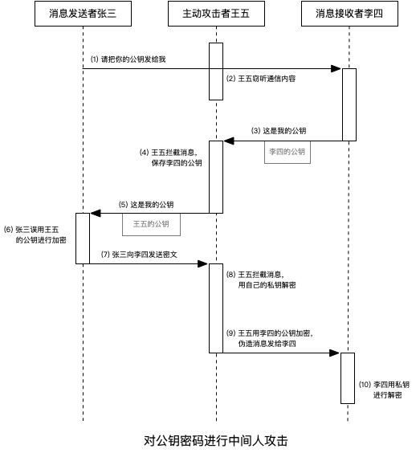

上面过程中，张三和李四以为自己已使用合理的加密手段进行通信，然而他们却毫无知觉地被王五窃取了消息。所以，使用公钥加密算法时，还必须解决一个哲学中的超级难题：

> 你要证明：你就是你！

事实上你永远无法证明你就是你。通常的做法是，你会拿出一张只属于你的身份证。在密码学的世界里也是通过类似的做法来解决这一难题：

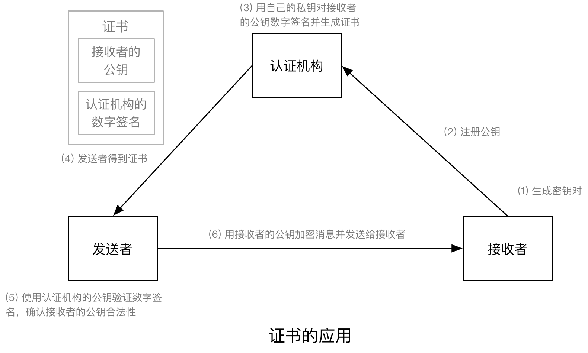

接收者不再直接把公钥发给发送者，而是注册到“认证机构”，发送者通过“认证机构”下发的证书来确认接收者的身份。这样一来，我们将“对接收者的信任”，转嫁到“对认证机构的信任”，由认证机构来担保接收者的合法性。

那么问题又来了？

>我们凭什么相信认证机构？

解决这一问题，只需要引入另一家认证机构，让他来为这家认证机构做担保即可。（玩笑脸）

再回到我们的身份证问题上，假设它是由魏家庄派出所发给你的，你这张身份证的合法性则必须由魏家庄派出所的合法性来保障，而魏家庄派出所则要由济南市公安局保障，它又由山东省公安厅保障，再往上则是国务院公安部进而是我们的政府体制。

那么我们凭什么相信认证机构？这归到底是“信任是如何产生的”这一本质性问题。我们为什么把钱存到银行？我们为什么相信地球是圆的，你去太空看过吗？你为什么相信到目前为止我给你讲授的这些知识？一言以蔽之，你“感觉应该是可信的”。如果你对一切都怀疑，那么让你作出怀疑论的意识本身，也是值得怀疑的。

支撑起认证机构信任链条的层级结构，有着严密的管理、技术保障，我们“应该”相信它。

认证过程中，我们引入了**数字签名**的概念。它是将公钥密码反过来用：

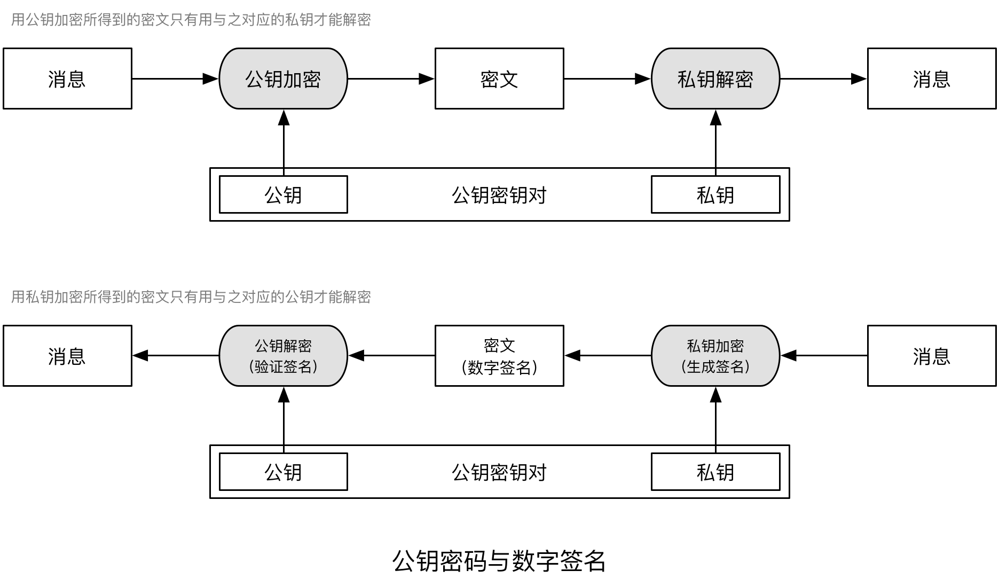

为什么反过来就能达到“签名”的效果呢？首先我们要的签名效果并不是消息保密，而是这一消息“确实是由你发送过来的”。而私钥正好能达到这一效果，因为私钥只有你自己拥有。

现在再来看我们常说的“https协议的证书”，是不是容易理解多了，它就是一个接收者的公钥，外加一份认证机构的数字签名！接收者的公钥用于你后续加密消息，数字签名让我们确信认证机构并非假的，进而选择相信它为接收者所做的担保。

## 单向散列函数

现在回过头来看信息安全所面临的 4 大类威胁：

* 窃听：对称加密、非对称加密、混合加密
* 篡改：？
* 伪装：数字签名 + 认证
* 否认：数字签名

只剩下“篡改”没有解决了。对了，你意识到了，我们每天都会听说的 MD5 要登场了。MD5 算法本身不再讲解，咱们也没必要了解这么多细节。

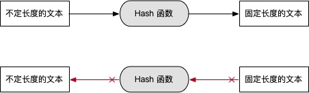

> y = f(x) ，输出值 y 为固定长度的文本，输入值 x 为不定长度的文本

我们需要知道的是，MD5 可以将不定长度的文本经过一个函数映射为固定长度的文本，更为重要的是，这个过程是**不可逆**的！

这个函数被称为**哈希(Hash)函数**，这是音译。有时你会听到别人说**单向散列函数**或**散列函数**，这是意译。还有时候，你会听到**消息摘要**的说法，这是从功能应用层面上讲它的作用。而 MD5 的 MD 正是 Message Digest 的缩写。

提到 MD5 不得不说咱们山东诸城的王小云教授，她在 2004 年国际密码学会议上公布了 MD 系列算法的破解，MD５的堡垒轰然倒塌。不过也正是算法的不断破解、改进、破解、改进，我们才拥有 MD4、MD5、SHA-1、SHA-256、SHA-384、SHA-512 等等一系统优秀的算法。

虽然被破解了，MD5 在保证数据完整性时还是可以使用的。它的算法会彻底打散原文中的每一个字节，因而如果你试图对原文哪怕进行一丁点改动，映射后的文本也会相去千里。

这里我展示一下很早以前研读 Redis 源码时候画的一张图(由于懒，没画新的)：

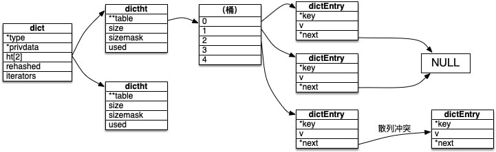

Redis 为了做渐进式再散列，所以存在两个散列表，这里可以忽略它。图中可以看出来，大部分的“字典”结构，各位每天都在用的 HashMap ，内部会保留一张 HashTable 。使用字典结构比列表结构有什么好处呢？我们知道了字典的查找靠的是计算 hash 函数，它的时间复杂性是基本不变的，不管字典有多大。而列表结构会随着列表长度增长使得查找变得缓慢。（扩展思考：使用表驱动法重构分支语句）

关于散列函数最后再说一点，就是**碰撞**问题。既然输出的文本是固定长度的，而输入是任意长度的，用庄子的话讲——“以有涯随无涯,殆己”。很容易理解：一定会存在两份不同的文本，它们经过同一个 hash 函数映射后，结果相同。这样一来，设想你在用 MD5 处理用户口令。那么，即便我不知道你的原始口令，我却可以通过碰撞，找到一份和原始口令 hash 后相同的文本。

## 总结

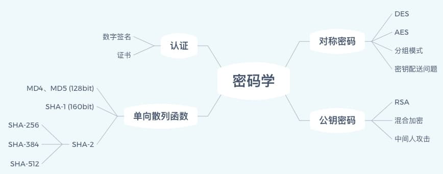

国密：
SM1、SM4、SM7、祖冲之密码（ZUC）是对称算法；
SM2、SM9是非对称算法；
SM3是哈希算法。

## 信息隐藏 VS 信息加密

最后的最后，我们来看个经典:

(图)

> 我唐寅今十六岁苏北人氏身家清白素无过犯只 
> 为家境清贫卖身华府充当书僮身价报五十两自 
> 秋节起暂存帐房三年后取从此承值书房每日焚 
> 香扫地洗砚磨墨等事听凭使唤从头做起立此为据

(客户端代码混淆技术)

---

@ssbunny 2021年2月