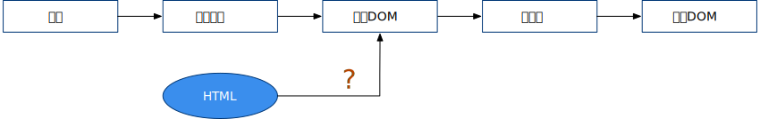
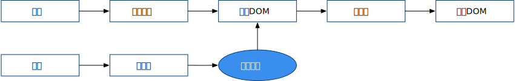

# 高观点下的 Vue.js 框架

本文是我在学习、使用 Vue.js 过程中的一些个人观点，有些观点仅为我个人的推测，故难免有纰漏甚至偏颇。所谓高观点，只是希望 Standpoint 尽可能高一些，从设计层面看待 Vue.js 这样一个框架，而不陷入具体的 API 讲解或源代码分析中，另外，也是为文章标题赢得一些噱头而已。

---

Web 前端编程最本质的工作内容其实仅有两条：
1. 处理数据
2. 更新 DOM

这里的“更新”当然包括首次加载、新增和删除 DOM 。DOM 被更新了，剩下的渲染、绘制过程均由浏览器完成。一直以来，我们的编程工作也是围绕这两件事展开。然而事情的细枝末节太多，繁琐的业务场景让代码量日增，我们的编码方式本身也亟需改进。第一次大变革自然是 jQuery 这类聚焦于“更新 DOM”的库或框架，它们帮我们消除浏览器差异、提供更便利的 API 等。第二次大变革则是前端的全面 MVC 化。

前端 MVC 历经了 `MVC --> MVP --> MVVM` 的过程，这里不去述说它的历史。现在我们说到前端 MVC , 说的是它的变种：**MVVM** 。而 Vue.js ，不论官方将其描述得如何高大上，其本质仍只是 MVVM 框架。

现在来细想 MVVM ，其中 M 为模型（Model），在前端其存在形式只可能是 JavaScript 对象——不管是语言层面最直接的 JavaScript 对象，还是经过一番折腾后封装的 JavaScript 对象——似乎无大可为，只能依赖 JavaScript 解释器来做更多的事情。而对 JavaScript 这样一种动态弱类型语言，模型过分地“充血”似乎也不妥。第二个字母 V 为视图（View），它就是我们所更新的那个 “DOM”，这一切都交由浏览器处理。似乎只有在它们中间放个夹层才能做些大事，这便是 VM ，视图模型层。

至此，我们在“数据”和“DOM”间建立了桥梁。

## 鸟瞰

统观 Vue.js 框架，它所放置的这个夹层，便是被叫作 **“虚拟 DOM”** 的东西。其它一切围绕它展开：


我想，Vue.js 所面临的第一个决策便是其所采用的编程范式是“命令式”还是“声明式”的。**声明式**显然在用户层面有其优势，用户代码只需要关注视图最终结果。不管结果存在几种状态，只需要通过某种方式（如 Vue.js 的模板）描述出来。实现声明式后，模型层的数据应当自动流经虚拟 DOM 进而进入真实 DOM 。

因此，框架中需要一个功能模块，用它来监听用户数据的变化，继而更新虚拟 DOM。这样一来，在引擎层面引入的该功能模块使得用户代码仅为处理数据，而不需要直接与虚拟 DOM 打交道。能够自动捕获用户数据变化并更新虚拟 DOM 的功能模块便是学习 Vue.js 的开发人员最为熟知的**响应系统**：


**响应系统是用户代码进入框架引擎的发端。** 如果从一开始便是可响应的，后续引擎中引入的一切功能，便有了“自动”执行的可能。另一方面我们清醒地知道，程序并没有那么多所谓的“自动”，总归是要存在一个触发点的。而响应系统的触发，直接面向 JavaScript 语言层面的对象修改、删除或数组、集合的增删改等操作。这样一个大的观察者模式的被观察对象直接是语言层面最原始的东西，这可能让很多不熟悉语言规范的人感到陌生而神奇，此点后文详说。

有了虚拟 DOM 这个夹层后，很多事情便有了切入点，方便框架施展手脚。然而虚拟 DOM 是不能被浏览器识别并渲染成可视的界面的。在虚拟 DOM 与真实 DOM 之间必然要存在一层转换机制，这便是**渲染器**，渲染器本质是把虚拟 DOM 这种静态的描述，变成对真实 DOM 的挂载、卸载与更新等操作。


至此，一个完整的声明式的框架系统便可以工作了。然而我们更进一步来看，模型层的数据可以直接使用语言层面的 JavaScript 对象，框架没入侵我们的编码习惯，没有要求我们遵从特殊的约定写代码（这是响应系统的功劳）。而视图层面呢？从我们熟知的 DOM 变成了一个叫“虚拟 DOM”的东西。可我们还不知道虚拟 DOM 究竟是什么。现在有必要揭开虚拟 DOM 的面纱。

其实，它只是一个用来描述真实 DOM 的 JavaScript 对象。举个例子便可知，如真实 DOM 结构：

```html
<div id="foo">bar</div>
```

对应的虚拟 DOM 为：

```js
const vnodeDiv = {
	tag: 'div',
	props: {
		id: 'foo'
	},
	children: 'bar'
}
```

整个 Vue.js 框架居然是围绕这么一个简单的东西在运作，想起来有些微妙。

现在回到刚才的问题，视图层如何表示？当应用系统需求复杂后，这种 JavaScript 对象的表示方式显然过于丑陋（用过 ExtJS 等框架的开发者显然了解这种方式的痛苦所在）。Vue.js 框架的设计者想让开发者的使用体验回归到编写 HTML 的方式，这是一个很好的设想，如何实现呢？



经验非常自然地告诉我们，此处需要一个**编译器**，用它来架起 HTML 和虚拟 DOM 的桥梁，将用户写的 HTML 翻译成虚拟 DOM。值得注意的是，此处的 HTML 已不再是直接交给浏览器解析的 HTML，而只是借鉴了它的语法形式，本质上只是一些字符串而已。既然决定引入编译器这种复杂的结构，对于这个形如 HTML 的字符串，何不做做手脚让它更为丰富呢？于是框架设计者建立了一套**模板**系统，可以用它扩展 HTML 的语法。


现在还有两个小问题未解决，它们在框架架构上是小问题，在用户使用上却至关重要。第一个问题是如何让 HTML 灵动起来。例如如何重复书写 100 遍 `div` ，如何在特定条件下输出某 `span` ？HTML 并不是图灵完备的语言，而 JavaScript 却是，虚拟 DOM 刚好也是用 JavaScript 表示。那么，如果用一个 JavaScript 函数来输出虚拟 DOM，而编译器的编译目标不再是虚拟 DOM，改为这个函数，问题便可迎刃而解。



这便是**渲染函数**在框架中存在的位置及其存在的最根本意义。当虚拟 DOM 的存在形式从普通对象上升为函数，一切便“灵动”起来。函数中使用 `for` 或者 `if` 语句，可以解决我们刚才提出的问题。

第二个小问题。庞大的应用系统中，势必存在繁多的虚拟 DOM ，如何维持其秩序？最简单的方式当然是把这个出力不讨好的活交给开发者本人。Vue.js 框架层面只给开发者提供管理制度，具体的管理方式让其用户（即开发者）自行决定。这套管理制度被叫作**组件系统**。所谓组件系统，本质上是针对虚拟 DOM 进行的打包捆绑方式。我们已经知道了虚拟 DOM 的样貌，在此不妨也来看看组件的样貌（注意，这不是 Vue.js API 层面的组件形式）：

```js
const MyComponent = {
	name: 'foo',
	myProperty: 'bar',
	...
	render () {
		return {
			tag: 'div',
			...
		}
	}
}
```

可以看到，只要组件里包含一个渲染函数（示例中的 `render`），它便可以通过渲染函数成为一个或一组虚拟 DOM 。而组件对象本身则可以在渲染函数之外附加更多的属性或其它处理函数。这样一来，我们通过提供渲染函数把一组虚拟 DOM 进行打包，附加的属性则像这个包裹上贴的标签一样，描述了这组虚拟 DOM 的特征，让它们成为一个共同体，与其它组件合作构成整个应用系统。由于组件的组织方式交给了用户，我们经常可以看到卓越的程序员封装出卓越的组件库，低劣程序员写的组件却支离破碎。

至此，我们围绕着虚拟 DOM 完成了 Vue.js 框架的全部顶层设计。用户侧模型层的代码，围绕语言层面最普通的 JavaScript 对象展开，而视图层的代码，聚焦在一种类似 HTML 的模板中。


等等！也就是说虚拟 DOM 在 MVVM 框架中是不可或缺的吗？并非如此。可以看到，响应系统完全可能直接工作于真实 DOM 之上，而编译器也可以直接编译出真实 DOM 。事实上确实也有其它框架在这么做。这中间夹杂了诸多性能、易用性各方面的问题，而 Vue.js 大概是一种稳妥折中的抉择结果吧。

## 响应系统

TODO

## 渲染器

## 组件系统

## 编译器
