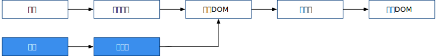
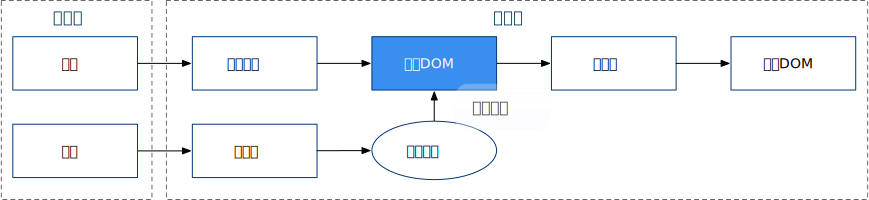
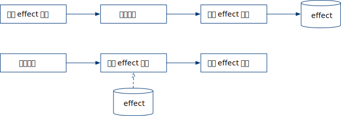
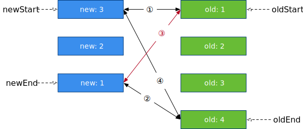
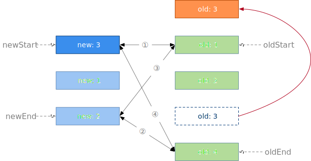
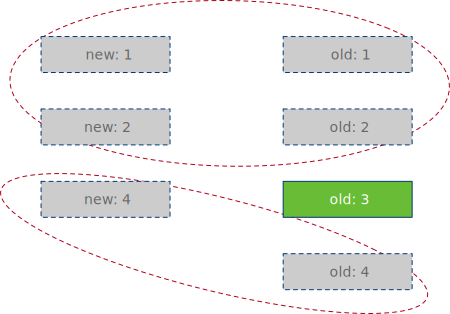
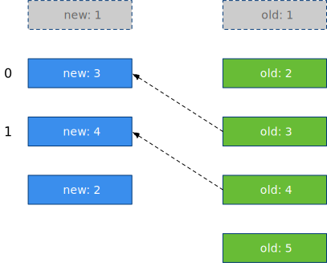
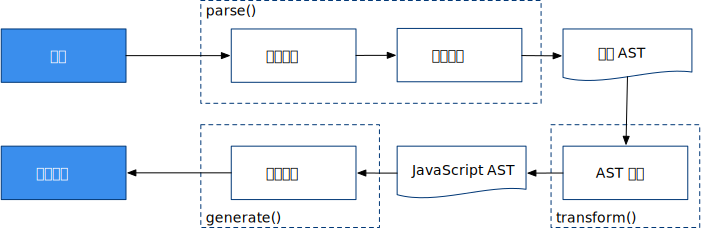

# 高观点下的 Vue.js 框架

本文是我在学习、使用 Vue.js 过程中的一些刍议，有些想法仅为我个人的推测，故难免有纰漏甚至偏颇。所谓高观点，只是希望 Standpoint 尽可能高一些，从设计层面看待 Vue.js 这样一个框架，而不陷入具体的 API 讲解或源代码分析中，另外，也是为文章标题赢得一些噱头而已。

---

Web 前端编程最本质的工作内容其实仅有两条：
1. 处理数据
2. 更新 DOM

这里的“更新”当然包括首次加载、新增和删除 DOM 。DOM 被更新了，剩下的渲染、绘制过程均由浏览器完成。一直以来，我们的编程工作也是围绕这两件事展开。然而事情的细枝末节太多，繁琐的业务场景让代码量日增，我们的编码方式本身也亟需改进。第一次大变革自然是 jQuery 这类聚焦于“更新 DOM”的库或框架，它们帮我们消除浏览器差异、提供更便利的 API 等。第二次大变革则是前端的全面 MVC 化。

前端 MVC 历经了 `MVC --> MVP --> MVVM` 的过程，这里不去述说它的历史。现在我们说到前端 MVC , 说的是它的变种：**MVVM** 。而 Vue.js ，不论官方将其描述得如何高大上，其本质仍只是 MVVM 框架。

现在来细想 MVVM ，其中 M 为模型（Model），在前端其存在形式只可能是 JavaScript 对象——不管是语言层面最直接的 JavaScript 对象，还是经过一番折腾后封装的 JavaScript 对象——似乎无大可为，只能依赖 JavaScript 解释器来做更多的事情。而对 JavaScript 这样一种动态弱类型语言，模型过分地“充血”似乎也不妥。第二个字母 V 为视图（View），它就是我们所更新的那个 “DOM”，这一切都交由浏览器处理。似乎只有在它们中间放个夹层才能做些大事，这便是 VM ，视图模型层。

至此，我们在“数据”和“DOM”间建立了桥梁。

## 1. 鸟瞰

统观 Vue.js 框架，它所放置的这个夹层，便是被叫作 **“虚拟 DOM”** 的东西。其它一切围绕它展开：


我想，Vue.js 所面临的第一个决策便是其所采用的编程范式是“命令式”还是“声明式”的。**声明式**显然在用户层面有其优势，用户代码只需要关注视图最终结果。不管结果存在几种状态，只需要通过某种方式（如 Vue.js 的模板）描述出来。实现声明式后，模型层的数据应当自动流经虚拟 DOM 进而进入真实 DOM 。

因此，框架中需要一个功能模块，用它来监听用户数据的变化，继而更新虚拟 DOM。这样一来，在引擎层面引入的该功能模块使得用户代码仅为处理数据，而不需要直接与虚拟 DOM 打交道。能够自动捕获用户数据变化并更新虚拟 DOM 的功能模块便是学习 Vue.js 的开发人员最为熟知的**响应系统**：


**响应系统是用户代码进入框架引擎的发端。** 如果从一开始便是可响应的，后续引擎中引入的一切功能，便有了“自动”执行的可能。另一方面我们清醒地知道，程序并没有那么多所谓的“自动”，总归是要存在一个触发点的。而响应系统的触发，直接面向 JavaScript 语言层面的对象修改、删除或数组、集合的增删改等操作。这样一个大的观察者模式的被观察对象直接是语言层面最原始的东西，这可能让很多不熟悉语言规范的人感到陌生而神奇，此点后文详说。

有了虚拟 DOM 这个夹层后，很多事情便有了切入点，方便框架施展手脚。然而虚拟 DOM 是不能被浏览器识别并渲染成可视的界面的。在虚拟 DOM 与真实 DOM 之间必然要存在一层转换机制，这便是**渲染器**，渲染器本质是把虚拟 DOM 这种静态的描述，变成对真实 DOM 的挂载、卸载与更新等操作。


至此，一个完整的声明式的框架系统便可以工作了。然而我们更进一步来看，模型层的数据可以直接使用语言层面的 JavaScript 对象，框架没入侵我们的编码习惯，没有要求我们遵从特殊的约定写代码（这是响应系统的功劳）。而视图层面呢？从我们熟知的 DOM 变成了一个叫“虚拟 DOM”的东西。可我们还不知道虚拟 DOM 究竟是什么。现在有必要揭开虚拟 DOM 的面纱。

其实，它只是一个用来描述真实 DOM 的 JavaScript 对象。举个例子便可知，如真实 DOM 结构：

```html
<div id="foo">bar</div>
```

对应的虚拟 DOM 为：

```js
const vnodeDiv = {
	tag: 'div',
	props: {
		id: 'foo'
	},
	children: 'bar'
}
```

整个 Vue.js 框架居然是围绕这么一个简单的东西在运作，想起来有些微妙。

现在回到刚才的问题，视图层如何表示？当应用系统需求复杂后，这种 JavaScript 对象的表示方式显然过于丑陋（用过 ExtJS 等框架的开发者显然了解这种方式的痛苦所在）。Vue.js 框架的设计者想让开发者的使用体验回归到编写 HTML 的方式，这是一个很好的设想，如何实现呢？


经验非常自然地告诉我们，此处需要一个**编译器**，用它来架起 HTML 和虚拟 DOM 的桥梁，将用户写的 HTML 翻译成虚拟 DOM。值得注意的是，此处的 HTML 已不再是直接交给浏览器解析的 HTML，而只是借鉴了它的语法形式，本质上只是一些字符串而已。既然决定引入编译器这种复杂的结构，对于这个形如 HTML 的字符串，何不做做手脚让它更为丰富呢？于是框架设计者建立了一套**模板**系统，可以用它扩展 HTML 的语法。



现在还有两个小问题未解决，它们在框架架构上是小问题，在用户使用上却至关重要。第一个问题是如何让 HTML 灵动起来。例如如何重复书写 100 遍 `div` ，如何在特定条件下输出某 `span` ？HTML 并不是图灵完备的语言，而 JavaScript 却是，虚拟 DOM 刚好也是用 JavaScript 表示。那么，如果用一个 JavaScript 函数来输出虚拟 DOM，而编译器的编译目标不再是虚拟 DOM，改为这个函数，问题便可迎刃而解。


这便是**渲染函数**在框架中存在的位置及其存在的最根本意义。当虚拟 DOM 的存在形式从普通对象上升为函数，一切便“灵动”起来。函数中使用 `for` 或者 `if` 语句，可以解决我们刚才提出的问题。

第二个小问题。庞大的应用系统中，势必存在繁多的虚拟 DOM ，如何维持其秩序？最简单的方式当然是把这个出力不讨好的活交给开发者本人。Vue.js 框架层面只给开发者提供管理制度，具体的管理方式让其用户（即开发者）自行决定。这套管理制度被叫作**组件系统**。所谓组件系统，本质上是针对虚拟 DOM 进行的打包捆绑方式。我们已经知道了虚拟 DOM 的样貌，在此不妨也来看看组件的样貌（注意，这不是 Vue.js API 层面的组件形式）：

```js
const MyComponent = {
	name: 'foo',
	myProperty: 'bar',
	...
	render () {
		return {
			tag: 'div',
			...
		}
	}
}
```

可以看到，只要组件里包含一个渲染函数（示例中的 `render`），它便可以通过渲染函数成为一个或一组虚拟 DOM 。而组件对象本身则可以在渲染函数之外附加更多的属性或其它处理函数。这样一来，我们通过提供渲染函数把一组虚拟 DOM 进行打包，附加的属性则像这个包裹上贴的标签一样，描述了这组虚拟 DOM 的特征，让它们成为一个共同体，与其它组件合作构成整个应用系统。由于组件的组织方式交给了用户，我们经常可以看到卓越的程序员封装出卓越的组件库，低劣程序员写的组件却支离破碎。

至此，我们围绕着虚拟 DOM 完成了 Vue.js 框架的全部顶层设计。用户侧模型层的代码，围绕语言层面最普通的 JavaScript 对象展开，而视图层的代码，聚焦在一种类似 HTML 的模板中。



等等！也就是说虚拟 DOM 在 MVVM 框架中是不可或缺的吗？并非如此。响应系统完全可能直接工作于真实 DOM 之上，而编译器也可以直接编译出真实 DOM 。事实上确实也有其它框架在这么做。这中间夹杂了诸多性能、易用性各方面的问题，而 Vue.js 大概是一种稳妥折中的决策结果吧。

## 2. 响应系统

现在更近一步来思考响应系统。响应系统是网络上资料最为繁多的一部分。有诸多文章甚至以“深入 Vue 原理”之名，内容却只讲了 `Object.defineProperty` 的用法，再写个示例代码便结束。我这里自然不去讨论 JavaScript 的语法细节，只看响应系统的设计过程。

### 设计思路

有必要先弄清楚根本目标：**响应系统是为了实现用户模型层数据到视图层界面的声明式编程。** 思考 Vue.js 的工作方式，或者说 Web 前端开发的工作方式：首先拿到用户数据，然后使用数据挂载页面，这是初次加载的情况。后续界面操作进行过程中，数据产生变动，拿到最新的用户数据，更新或卸载页面。

产生响应的重点，显然是后续数据更新的过程。Vue.js 的设计者并没有其它更高明的办法，他使用的是我们很容易想到的观察者模式——观察数据，通知视图。观察者 Observer 时刻关心响应式数据的变化，一有变化便通知更新视图（通过渲染器完成）。其接口中应该包含用于调用渲染器以更新视图的方法，这里遵从 Vue3 的命名，叫它 `effect` 函数。 **唯一特殊的一点是，** 注册观察者的过程似乎不需要用户来执行，是否可以在挂载页面或者说是首次执行 `effect` 时进行注册呢？答案是肯定的。`effect` 函数内部势必会去获取用来渲染视图的数据，如果在获取数据的时候注册观察者，后面修改数据的时候便可以通知观察者，即执行 `effect` 函数。此时我们引入一个存放 `effect` 函数的桶:



示例代码如下，请先忽略代码可能产生的 BUG，仅关心其所蕴含的调用关系：

```js
const bucket = new Set()
function effect () {
	let data = getData()  // 获取数据,用于后续更新视图
	updateView(data)
}
function getData() {
	arr.push(effect)  // 注册观察者，即 effect 函数
	return data
}
function setData(val) {
	// 更新数据时通知观察者，即重新执行 effect 函数
	bucket.forEach(effect => {
		effect()
	})
	data = val
}
```

现在聚焦“读取数据”和“更新数据”操作。可以对其进行封装。使用代理模式，从模型层面为原始数据提供代理对象：

```js
class DemoProxy {
	constructor (data) {
		this.raw = data
	},
	getData () {
		// ...
	},
	setData (val) {
		// ...
	}
}
let data = new DemoProxy(data)
data.setData('123')
```

而 JavaScript 在语言层面，提供了一个函数对象  `Proxy` 用于代理（ECMAScript 2015 开始提供，在此之前可以使用 `Object.defineProperty` 实现类似效果），使用它可以实现语言层面的代理，从而用户侧代码不需要调用形如 `data.foo.setData('bar')` 的函数，而是可以直接进行赋值，如 `data.foo = 'bar'`。 只是有一点要保持清醒，代理后的 data 并非用户一开始提供的那个 data , 对它的任何操作都可能被进行了拦截。另外也可以看出，即便 JavaScript 语言层面不提供 `Object.defineProperty ` 或 `Proxy` ，框架仍然可能实现响应系统，只是用户侧代码相对约束会多一些。

由此可见， **响应系统在设计层面极其简单：代理模式 + 观察者模式。** 代理普通 JavaScript 对象，调用 `effect` 函数从而触发对象读取操作，在读取操作的代理方法中注册 `effect` 函数作为观察者，之后当对象产生更新操作时，执行 `effect` 函数从而促使后续视图层重新渲染。

### 技术实现

使用 `Proxy` 是无法处理原始值的。如 String、Number、Symbol、null 等，它们只传值而不传引用。此特殊情况下，Vue.js 框架引入了特殊的函数 `ref` 。该函数的原理是给原始值包裹一层对象。当然用户可以自己来包裹对象，但使用 `ref` 的方式更为统一，更为要紧的是让框架知道用户的意图是将原始值转为可响应的代理对象，如此框架便可以在特定的场合帮助用户自动脱去这层包裹，让代码看起来更为优雅。阅读 Refs 相关的一组 API 文档可知，它还会额外处理响应丢失的问题。不管怎么说，引入额外的函数始终会让响应系统的工作模式显得不一致，但现阶段受技术限制，想必未有其它更好的解决办法。

`Proxy` 在代理对象、数组、Map、Set 时， **主要通过拦截相应内置方法实现，** 如 `foo.bar` 操作对应着内置方法 `[[Get]]` ，API 层面叫作 `get` ，相应的还有 `set` 、 `has` 、`deleteProperty` 等等。通过查阅 JavaScript 语言规范我们可以知道所有语法细节并处理所有可能产生响应变化的操作。这是一个非常细碎的工作，框架应该已经帮我们处理过了，但面对庞杂的语言细节，也许在某个角落还存在某个特殊的 BUG 为框架所未及。但要相信，Vue.js 框架确实已经努力考虑周全了，比如这些情况：

当 `effect` 函数使用 `for...in` 访问对象时，对对象属性的增删改操作要被响应；当使用 `find` 、`map` 、`forEach`等方法访问数组时，对数组元素的操作要能够被响应；当获取从原型链中继承的属性时，要正确处理响应等等。


### 边界情况

响应系统中有很多边界情况要考虑。比如分支切换问题：

```js
let foo = obj.isFoo ? obj.foo : 'bar'
```

分支切换可能使 `effect` 函数被遗留在桶中。又如 `effect` 函数的嵌套问题，可以使用 stack 结构解决。另外还有无限递归、循环调用等问题。

另外有一种特殊情况，当用户执行了修改数据的操作但数据却没有变化：

```js
let foo = 'foo'
foo = 'foo'
foo = 'fo' + 'o'
```

此时是不应该再触发响应的。这些边界情况的处理都属于框架细节，此文不深入讨论，但我们应该感受到，一个功能完善的框架要考虑的问题确实很多。

### API 设计

基于响应系统的设计，框架在 API 层面设计实现了计算属性与 watch 函数。`watch` 的目的是给用户一个介入响应系统的控制点，其实质为对 `effect` 函数的二次封装。另外由于响应存在响应深度的问题，API 提供了深响应和浅响应两种方式。相应的，对于只读数据提供深只读和浅只读。

## 3. 渲染器

虽然“鸟瞰”一章节中，我在画图时把“响应系统”指向了“虚拟 DOM”，事实上响应系统中的 `effect` 函数执行时，会使用渲染器进行页面渲染，而渲染器中所使用的虚拟 DOM 是由响应系统提供数据。严格来说，**渲染器是由响应系统直接调用的。** 由于其在引擎层面被自动触发执行，渲染器通常不为普通开发者所知。

### 设计思路

渲染器的输入为虚拟 DOM，输出为真实 DOM。虚拟 DOM 英文写做 virtual DOM ，后文将用 vdom 简写它。相应的，vdom 中的节点被称作 virtual node ，简写做 vnode 。

我们可以使用 `class` 表示一个渲染器，不同的作用空间下 `new` 出多个渲染器。也可以使用 `function` 直接创建返回一个渲染器，多次函数调用则返回多个渲染器（当然也可以返回单例，这取决于设计者对渲染器作用范围的设定）。为了方便描述，我们选用函数来表示。


函数输入虚拟 DOM 的某节点 ，输出真实 DOM ，因此形如：

```js
function createRenderer (vnode) {
	let div = document.createElement('div')
	...
	return div   // 也可能生成一组 dom ，视 vnode 而定
}
```

进一步想，输出的真实 DOM 是需要挂载到某个容器上的，也就是某个父节点。如果 `createRenderer` 能够接管挂载操作，同时获得父节点的信息，似乎可以做更多工作。同时，用户侧代码也更为简洁。因此，我们把渲染器设计为：

```js
function createRenderer (vnode, container) {
	...
}
```

至此，我们需要约定一下在本文中对 DOM 操作时的四类情况及叫法：

* 挂载( mount )：将新生成的节点增加到空的容器节点中；
* 卸载( unmount )：将容器节点下的节点删除；
* 更新( patch )：相同节点类型时，更新节点内容；
* 移动( move )：将容器节点下的兄弟节点交换位置。

### 细节处理

写个函数生成 DOM 并非难事，Vue.js 之所以要将渲染器作为独立模块，是因为其处理的技术细节太多。我们先把细碎的点罗列一下，再专注于核心问题。如果不感兴趣，可以跳过此节。

一个相对简单的情况：vnode 中包含子节点，此时可以用递归迭代的方式处理。

第二个问题是：DOM 的 property 和 HTML 的 Attribute 基本存在对应关系，但却不尽相同。例如 HTML 的 `class` 属性，在 DOM 中叫作 `className` （因为 class 是 JavaScript 关键字）。而有些 DOM 中的属性在 HTML 中不存在，有些 HTML 中的属性在 DOM 中不存在。Vue.js 框架使用 `in` 操作符先检测某属性在 DOM 中是否存在，如不存在再使用 `setAttribute` 处理。

第三个问题是：某些属性是枚举值（如 `<input>` 的 `type`），只接受特定的取值范围，而某些属性是只读的，不能后续修改。另外，值为 bool 型时，HTML 中的设置方式是不同的，如 `<button disabled>` ，如果设置为 `<button disabled="false">` 该按钮将不可用。

第四个问题来自事件。首先要解决如何在 vnode 中描述事件。由于事件名也只是普通的属性，所以需要一个命名约定，如 click 事件的属性名叫 `onClick` 或 `onclick` 或 `handleClick` 或 `clickHandler` ，总归可以通过统一的前缀或后缀实现。这样一来框架引擎层面就可以按约定解析出正确的事件名并进行绑定。其次是事件的更新问题。HTML 中绑定了事件，如果 HTML 产生更新操作，相应地需要解除事件绑定再重新绑定新事件处理函数。此问题可以通过绑定一个伪造的函数 invoker，在 invoker 内部调用真实的事件处理函数，后续更新时只更新处理函数而不解除对 invoker 的绑定。最后，如果更新操作发生在事件冒泡之前，会产生我们意想不到的结果，这种情况用代码示例一下比较容易说明：

```js{3,10}
const vnode = {
	type: 'div',
	props: bol.isOk ? {
		onClick: () => {...}
	} : {},
	children: [{
		type: 'p',
		props: {
			onClick: () => {
				bol.isOk = true
			}
		}
	}]
}
```

第 10 行代码执行后，会造成第 3 行中父组件事件的绑定。这样一来，子组件的事件仍会冒泡至父组件中执行。为应对此情况，Vue.js 选择屏蔽了绑定时间晚于触发时间的事件处理函数。个人觉得，是否屏蔽它是件偏主观的决定，只能说大多数情况下，屏蔽后更易于避免用户写出诡异的 BUG 。

以上问题虽被我说成“细节”，但高视角下的细节往往还会包含更多复杂的真正细节。

### 核心问题

现在可以专注于渲染器的两个核心问题，首先是对 `vnode` 类型的区分。vnode 可以描述普通标签：

```js
const vnode = {
	type: 'div',
	props: {}
}
```

也可描述文本节点。文本节点没有明确的标签名，那么它的 type 如何定义？注释节点也存在同样的问题。事实上它们只要是框架可识别的唯一类型便可，因而可以通过 Symbol 类型来定义。

```js
const Text = Symbol()
const vnode = {
	type: Text,
	props: {}
}
```

另一种类型是组件。组件最终会被转化成 vdom ，但在渲染器中需要首先将其区分开来，才可能使其正确渲染。那么何为组件类型？vnode.type 为对象而已。

值得一提的是，Vue.js 3.x 中增加了一个特殊的 vnode 类型：Fragment 。在 2.x 版本中，根节点不能是多个而 3.x 却可以，这并非什么高端技术。2.x 时，框架设计者认为不管 vdom 层级多深，万物总归要有一个根，而 3.x 时呢？不要根了吗？当然不可能，设计者灵机一动，这个 Fragment 类型节点就是它们的根啊！渲染器识别到 Fragment 类型时，不再渲染节点自身，而只处理其子节点，同理卸载时则遍历卸载所有子节点。相当于人为造了一个根节点，而它在 JavaScript 语言层面也可以用 Symbol 类型表示。

综合起来，可以推测 `createRenderer` 的结构应该形如：

```js
function createRenderer (vnode, container) {
	const type = vnode.type
	if (typeof type === 'string') {

	} else if (type = Text) {

	} else if (type = Comment) {

	} else if (type = Fragment) {
		
	} else if (typeof type === 'object') {
		
	}
	...
}
````

识别出 vnode 的类型后，就可以依据不同情况处理 DOM 了。DOM 操作可以概括为前面总结的四类。我们都知道，DOM 是树形结构，vnode 的描述中，除了包含自己的特征描述，还包含了一个 `childen` 属性。`childen` 属性可能有 3 种情况：

* 空，表示没有子节点
* 字符串，表示文本节点或注释节点
* 数组，表示一个或多个子节点，而子节点的类型也是 vnode

这样一来，更新子节点时一共需要处理 9 种情况：

| 新节点 | 旧节点 | 操作 |
| ---- | ---- | ---- |
| 空  | 空 | 无 |
| 空  | 字符串 | unmount  |
| 空  | 数组 | unmount  |
| 字符串  | 空 | mount  |
| 字符串  | 字符串 | patch |
| 字符串  | 数组 | unmount + mount  |
| 数组  | 空 | mount  |
| 数组  | 字符串 | unmount + mount |
| 数组  | 数组 | <span style="color:red">？</span> |

新旧节点均为数组时，当然也可以先将旧节点 unmount 再将新节点进行 mount 操作。然而这里牵扯到性能问题。如果新旧节点差异不大，1000 个节点只有 2、3 处变化，全量地更新必然有太多无谓的性能消耗。此处便牵扯到包含 Vue.js 框架在内、基于 vdom 的框架被讨论的最多的 Diff 算法问题。我们能想到的最直接的比较方法是：遍历旧节点，依次与各新节点进行对比，找出哪些节点需要 move、哪些需要 unmount 或 mount、哪些需要 patch 。但是这样的策略显然不会是最优，直接来看框架的实现方法， **Vue.js 2.x 版本使用双端 Diff，3.x 版本使用快速 Diff 。** 接下来对其原理做简单介绍。

这里有个共同的前提，需要用户为每个节点标记一个唯一的 key 值，后续算法中便可认为相同节点类型且相同 key 值时，即为相同节点。

**双端 Diff**

双端 Diff 的核心思路是从新旧节点的两端同时开始对比，多轮步进。



如果在本轮中命中，则进行相应处理并将下一轮索引指向后续的节点。具体地说：
* 如果情况 1 命中，则进行 patch 操作，并将 newStart、oldStart 加 1 ；
* 如果情况 2 命中，则进行 patch 操作，并将 newEnd、oldEnd 减 1 ；
* 如果情况 3 命中，则进行 patch + move 操作，并将 newEnd 减 1 ，oldStart 加 1；
* 如果情况 4 命中，则进行 patch + move 操作，并将 oldEnd 减 1 ，newStart 加 1；

经过一轮一轮的操作，就会像啃甘蔗一样，一节一节地把新旧节点啃光。但其实还有第 5 种情况，那就是都未命中时。此时可以通过特殊处理进行补救，具体做法为：在旧节点中找到与新节点头部节点相对应的节点，将其 move 至头部并标记（Vue.js 使用 `undefined` 标记）。



此时说明第一个新节点曾是旧节点，只需将其移动至开头。我想说的是，这只是补救策略，是为了将甘蔗继续啃下去，你用尾节点甚或随机节点去做处理都是可以的，只是设计者使用头节点显然相对简单。但或许第一个新节点不曾是旧节点呢？此时说明该新节点只需要直接 mount 至所有旧节点的头部即可。由于补救措施只处理了第一个新节点，因此将 newStart 加 1 。

注意，这个算法有个缺陷。如果新节点为 `1，2，4` 旧节点为 `1，2，3，4` ，用这个算法从两端啃下去，3 号旧节点会剩余。如果新节点为 `1，2，3，4` 旧节点为 `1，2，4` ，3 号新节点会剩余。也就是说，甘蔗没啃完，因此算法结束后，我们要填补这一缺陷。对于前者旧中有遗留，则 unmount 之，后者新中有遗留则 mount 之。

双端 Diff 的过程非常简单，其代码结构应该形如：

```js
while (/* 根据四个索引判断步进情况，进行每一轮的处理 */) {  
	if (/* 存在标记过的节点 */) {
		// 直接跳过
	} else if (oldStartNode.key === newStartNode.key) {
		// 情况 1 
	} else if (oldEndNode.key === newEndNode.key) {
		// 情况 2
	} else if (oldStartNode.key === newEndNode.key) {
		// 情况 3
	} else if (newStartNode.key === oldEndNode.key) {
		// 情况 4
	} else {
		// 特殊情况
		if (/* 首个新节点在旧节点中可找到 */) {
			// 移动，并标记节点
		} else {
			// 挂载
		}
	}
	// 填补缺陷
	if (/* 新中有遗留 */) {
		// 遍历遗留的，全挂载上
	} else {
		// 遍历遗留的，全卸载
	}
}
```

**快速 Diff**

快速 Diff 的核心思路是求 **最长递增子序列LIS** ，在此之前，先把两头多余的节点切除掉。



算法查找并处理相同的前置、后置节点，只对其进行 patch 操作。处理后如果旧节点有剩余，则全部 unmount ，如果新节点有剩余，则全部 mount 。之后，只存在两组都有剩余的情况。接下来找最长递增子序列，也就是找出最长的、不需要移动的节点序列。



示例中找出的最长递增子序列为 `[0, 1]` ，则节点 3、4 不需要移动，只 patch 。节点 2 move 并 patch 。节点 5 需要 unmount 。

## 4. 编译器

编译器的实现思路中规中矩，没有太多可以说的，主要就是构造、转换抽象语法树（AST）的过程：



parse 过程中，使用递归下降算法，为每个标签创建一个状态机。过程中解析标签名、标签属性、文本节点并处理 HTML 实体。由于 Vue.js 的模板大多是 HTML ，直接参考相关规范处理，并加入框架特殊的约定即可。
标签属性处理过程中，可以处理 Vue.js 内置的指令。同时还要处理 Vue.js 的插值符号。

在 AST 转换后，将渲染函数的各个语句，用 JavaScript 对象描述为节点信息，为下一步生成代码做准备。生成代码时处理函数声明、参数、返回语句、String、Array、函数调用等等一系列细节。

### 编译优化

Vue 3 进行了编译优化。优化思路是将模板中的动态内容和静态内容区分开。实现层面，通过在编译阶段给 vdom 增加额外的属性来完成。另外，通过将所有动态节点提取到平级的数组中，在渲染阶段直接对该数组进行更新，省去了 diff 过程，因而可以大幅度提升性能。

但是由于增加了额外的 vdom ，可能造成一定的运行时内存负担。框架设计者绞尽脑汁去减少 vnode 产生的数量，例如，使用了静态提升的方式——把静态内容（静态节点、静态的属性等）提升到 `render` 函数以外。

```js
const staticNode = createNode(...)
function render() {
	return createNode([
			createNode(...),
			staticNode,
			...
		])
}
```

## 5. 组件系统

组件是 Vue.js 框架提供给开发者的上层门面。可以说它才是用户真正需要日常面对的内容。我们知道其本质也只是用 `render` 函数返回 vdom 。

### 实现原理

组件需要完成自更新，即数据变化时，其视图就要变化。显然可通过响应系统实现。组件同时还需要完成来自父组件的被动更新，当 `props` 数据变化时，父组件产生自更新，如果需要，其应带动子组件被动更新。说到 `props` ，Vue.js 在子组件层面声明其可接受的所有属性，算作一种约定，而父组件直接在模板的标签中赋值即可。框架需要将 `props` 以外的内容算作普通的 attribute 。

```html
<!-- 父组件, foo 被当作普通属性 -->
<blog-post :title="title" foo="bar"></blog-post>

<!-- 子组件 -->
props: {
    title: String
}
```

用户层面看到的组件对象，往往来自框架内部构造的对象，出于扩展方便考虑，大多数框架源码都会这样处理。Vue.js 并不例外，其内部构造了一个对象实例，作为返回给用户的真正实例。然而 Vue 3.x 版本的源代码中，又将该实例作代理，把代理对象返回给用户，难以推测其意图。大约觉得这样便于控制扩展，但该实例位于框架内部，扩展能力本便属于框架。

```js
// 非框架源代码，仅为示例。下同
function Vue (option) {
	let instance = { }
	return new Proxy(instance, ...)
}
```

框架内部有了这个实例后，一来是可以用于维持组件状态，如：

```js{3}
function Vue (option) {
	let instance = {
		__isMounted: false
	}
	...
}
```

二来可以为其配置参数整合统一的上下文。例如用户传入的 `methods` 中的 `foo` 函数：

```js{5}
function Vue (option) {
	let instance = {
		__isMounted: false
	}
	option.methods.foo.call(instance, ...)
	...
}
```

这样一来，用户层面的 `data`、`props`、`methods` 或 `computed` 等，均可获得一致的上下文对象，也即可以通过 `this` 直接操作相应数据或调用相应方法。


### 生命周期

组件作为各模块的统一装配车间，其流水线上的各个环节可以开放给用户代码介入，亦即所谓的组件生命周期。生命周期通常通过模板方法模式或直接使用钩子函数实现，Vue.js 为后者。框架只需要在合适的代码时机，去调用用户传入的钩子函数即可。大致经历了:


代码结构可示例为：

```js
function Vue (option) {
	option.beforeCreate()
	// 代理响应数据
	reactive(option.data())

	let instance = {
		__isMounted: false，
		...
	}
	option.created.call(instance, /* 其它参数 */)

	effect(() => {
		...
		if (instance.__isMounted) {
			option.updated.call(instance, /* 其它参数 */)
		} else {
			option.mounted.call(instance, /* 其它参数 */)
		}
	})
	...
}
```

### 高阶组件

**异步组件** 是对组件的高阶封装，其内部使用 Promise 模式，帮用户解决了超时处理、Error 组件/Loading 组件的显示、失败重试的问题。例如其内部处理失败重试时，在 `catch` 中继续返回 Promise ，通过 retry 回调重新去 load 组件内容。

**函数式组件** 只是个返回 vdom 的函数，它无状态。将 `props` 作为函数的静态属性。另外由于无状态，它无需初始化 `data` ，也不需要处理生命周期钩子函数。 

### 内置组件

Vue.js 框架内置了 `KeepAlive` 、`Teleport` 和 `Transition` 等组件，由于这些组件的操作机制需要渲染器作出相应响应才能实现，故而框架只能内置实现。例如 `KeepAlive` 并不实际销毁组件，而是将其挂载到一个隐藏容器中，再次加载时也只是重新移动回来，并不产生真正的挂载操作。这一过程显然只有由渲染器来处理。如若某天 Vue.js 的渲染器扩展性设计的更进一步，我们也许也可以获得内置组件的特权，来实现更复杂的自定义组件。

## 6. 生态

完整的工程开发，仅仅依靠框架本身的力量可能并不理想。因此，Vue.js 建立了比较完善的生态圈。然而生态圈必然是依托核心而存在，理解了核心之后，生态圈的东西只需要对照文档便能轻易理解。例如 Router ，其实质仍是组件，只是该组件根据 URL 动态切换。又如 Vuex ，其为依托响应系统的状态机。

另外一方面是工具链的完善。Vue.js 为了编写形式上的便利，提出了 **单文件组件** 的概念（即用户最常用的 `.vue` 文件形式），官方文档对其有详细地说明。其借助三方工具，通过为工具链提供插件的方式，实现其约定。

---
@ssbunny 2022-03-10
