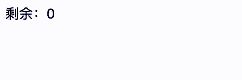
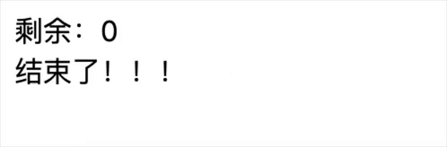
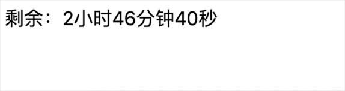
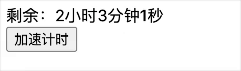

# 用 Vue 实现计时器功能

要实现的功能非常简单。但团队中总有人理解不了数据驱动视图的编程思路，总爱用过程式的、命令式的思维方式使用 Vue 框架，枉费框架给我们提供的一些便捷特性。

要实现计时器，首先考虑视图：

```html
<template>
	<div>剩余：{{ timeLeft }}</div>
</template>
```

它只受一个数据限制：

```js
data() {
    return {
      timeLeft: 5
    }
}
```

分离出数据后，我们不再关注视图，只要用一个定时器不断改变 `timeLeft` 即可。可以按需在 `created` 周期或其它按钮事件中启动定时器。

```js
startTimer () {
  this.timer = setInterval(()=> {
    this.timeLeft--
  }, 1000)
}
```

逻辑就是如此简单。可一旦陷入现实的业务需求中，有人就会厘不出这层最简单的代码结构，把一堆业务操作和计时器逻辑混淆在一起写。根据我的经验，带计时的业务，混在一起写是非常痛苦的，改的时候则更是只有当事人懂这种心酸了。

现在，我们需要关心计时过程中的状态。第一个状态是“计时结束”。跟踪数据状态变化，Vue 有个非常好的特性：`watch` 。

```js
watch: {
    timeLeft (val) {
      if (val < 0) {
        this.clearTimer()
        this.timeOver()
      }
    }
}
```

这样便可以在结束 `timeOver` 中处理其它业务逻辑。完整的示例代码如下：

```html
<template>
	<div>剩余：{{ timeLeft }}</div>
</template>

<script>
export default {
  data() {
    return {
      timeLeft: 5
    }
  },
  watch: {
    timeLeft(val) {
      if (val<0) {
        this.clearTimer()
        this.timeOver()
      }
    }
  },
  created () {
    this.startTimer()
  },
  methods: {
    startTimer () {
      this.timer = setInterval(()=> {
        this.timeLeft--
      }, 1000)
    },
    clearTimer () {
      this.timeLeft = 0
      clearInterval(this.timer)
    },
    timeOver () {
      alert('计时结束')
    }
  }
}
</script>
```



你是不是会在 `setInterval` 中不断判断 `timeLeft` 的值来处理呢？在控制逻辑中改变控制逻辑，是一件令人崩溃的事，我希望你不要去尝试。

## 迭代一

至此一切都太简单。现在进行第一次迭代：增加新的状态控制。由于我们已经通过 `watch` 跟踪了数据的变化，此时，只是增加个判断条件而已。例如我们想在最后 3 秒做些提示：

```js
watch: {
    timeLeft(val) {
      if (val < 3 && val > 0) {
        this.nearFinish()
      }
      if (val < 0) {
        this.clearTimer()
        this.timeOver()
      }
    }
}
...
nearFinish () {
    this.tip = '还有不到 3 秒了，加油！！！'
}
```

完整的代码示例如下：

```html
<template>
	<div>剩余：{{ timeLeft }}</div>
	<div>{{ tip }}</div>
</template>

<script>
export default {
  data() {
    return {
      timeLeft: 5,
      tip: ''
    }
  },
  watch: {
    timeLeft(val) {
      if (val < 3 && val > 0) {
        this.nearFinish()
      }
      if (val < 0) {
        this.clearTimer()
        this.timeOver()
      }
    }
  },
  created () {
    this.startTimer()
  },
  methods: {
    startTimer () {
      this.timer = setInterval(()=> {
        this.timeLeft--
      }, 1000)
    },
    clearTimer () {
      this.timeLeft = 0
      clearInterval(this.timer)
    },
    timeOver () {
      this.tip = '结束了！！！'
    },
    nearFinish () {
      this.tip = '还有不到 3 秒了，加油！！！'
    }
  }
}
</script>
```



## 迭代二

然后是迭代二：换一种显示方式。活用 `computed` ，用 `computed` 出来的数据驱动视图。不需要耦合到 `setInterval` 之类的方法中不断地格式化它。要充分理解响应式的价值。

```js
computed: {
    timeLeftStr () {  // 仅示例，按需格式化
      let h = Math.floor(this.timeLeft / 3600 % 24);
      let m = Math.floor(this.timeLeft / 60 % 60);
      let s = Math.floor(this.timeLeft % 60);
      return `${h}小时${m}分钟${s}秒`  // 提示：有的 markdown 编辑器对模版字符串高亮有BUG
    }
}
```

完整的代码示例如下：

```html
<template>
	<div>剩余：{{ timeLeftStr }}</div>
	<div>{{ tip }}</div>
</template>

<script>
export default {
  data() {
    return {
      timeLeft: 10000,
      tip: ''
    }
  },
  computed: {
    timeLeftStr() {
      let h = Math.floor(this.timeLeft / 3600 % 24);
      let m = Math.floor(this.timeLeft / 60 % 60);
      let s = Math.floor(this.timeLeft % 60);
      return `${h}小时${m}分钟${s}秒`
    }
  },
  watch: {
    timeLeft(val) {
      if (val < 3 && val > 0) {
        this.nearFinish()
      }
      if (val < 0) {
        this.clearTimer()
        this.timeOver()
      }
    }
  },
  created () {
    this.startTimer()
  },
  methods: {
    startTimer () {
      this.timer = setInterval(()=> {
        this.timeLeft--
      }, 1000)
    },
    clearTimer () {
      this.timeLeft = 0
      clearInterval(this.timer)
    },
    timeOver () {
      this.tip = '结束了！！！'
    },
    nearFinish () {
      this.tip = '还有不到 3 秒了，加油！！！'
    }
  }
}
</script>
```



## 迭代三

接下来尝试迭代三：改变计时器，让计时器加速。有了前面的代码结构，这个需求非常简单。假设增加一个加速的按钮：

```html
<button @click="runfast">加速计时</button>
```

只需要增加相应的控制定时器的方法即可：

```js
runfast () {
  clearInterval(this.timer)
  this.timer = setInterval(()=> {
    this.timeLeft--
  }, 10)
}
```

因为我们的计时逻辑和其它业务逻辑是分离的，所以你才能随心地 `clearInterval` 又再启动它。设想你在 `setInterval` 中做了 N 步操作，这里要如何适从？还能如此简单的清空并改变定时器吗？

完整的代码示例如下：

```html
<template>
	<div>剩余：{{ timeLeftStr }}</div>
	<div>{{ tip }}</div>
  <button @click="runfast">加速计时</button>
</template>

<script>
export default {
  data() {
    return {
      timeLeft: 10000,
      tip: '',
    }
  },
  computed: {
    timeLeftStr() {
      let h = Math.floor(this.timeLeft / 3600 % 24);
      let m = Math.floor(this.timeLeft / 60 % 60);
      let s = Math.floor(this.timeLeft % 60);
      return `${h}小时${m}分钟${s}秒`
    }
  },
  watch: {
    timeLeft(val) {
      if (val < 3 && val > 0) {
        this.nearFinish()
      }
      if (val < 0) {
        this.clearTimer()
        this.timeOver()
      }
    }
  },
  created () {
    this.startTimer()
  },
  methods: {
    startTimer () {
      this.timer = setInterval(()=> {
        this.timeLeft--
      }, 1000)
    },
    clearTimer () {
      this.timeLeft = 0
      clearInterval(this.timer)
    },
    timeOver () {
      this.tip = '结束了！！！'
    },
    nearFinish () {
      this.tip = '还有不到 3 秒了，加油！！！'
    },
    runfast(){
      clearInterval(this.timer)
      this.timer = setInterval(()=> {
        this.timeLeft--
      }, 10)
    }
  }
}
</script>
```



## 迭代四

还是改变计时器，这一次我们尝试控制计时器的启停。逻辑是一样的，可以增加一个状态 `isPaused` 来辅助页面按钮的显示等：

```html
<button @click="controlTimer">{{ isPaused ? '继续' : '暂停'}}</button>
```

依然得力于定时逻辑的松耦合：

```js
controlTimer () {
  if (this.isPaused) {
    this.timer = setInterval(()=> {
      this.timeLeft--
    }, 1000)
  } else {
    clearInterval(this.timer)
  }
  this.isPaused = !this.isPaused
}
```

完整的代码示例如下：

```html
<template>
	<div>剩余：{{ timeLeftStr }}</div>
	<div>{{ tip }}</div>
  <button @click="controlTimer">{{ isPaused ? '继续' : '暂停'}}</button>
</template>

<script>
export default {
  data() {
    return {
      timeLeft: 10000,
      isPaused: false, 
      tip: '',
    }
  },
  computed: {
    timeLeftStr() {
      let h = Math.floor(this.timeLeft / 3600 % 24);
      let m = Math.floor(this.timeLeft / 60 % 60);
      let s = Math.floor(this.timeLeft % 60);
      return `${h}小时${m}分钟${s}秒`
    }
  },
  watch: {
    timeLeft(val) {
      if (val < 3 && val > 0) {
        this.nearFinish()
      }
      if (val < 0) {
        this.clearTimer()
        this.timeOver()
      }
    }
  },
  created () {
    this.startTimer()
  },
  methods: {
    startTimer () {
      this.timer = setInterval(()=> {
        this.timeLeft--
      }, 1000)
    },
    clearTimer () {
      this.timeLeft = 0
      clearInterval(this.timer)
    },
    timeOver () {
      this.tip = '结束了！！！'
    },
    nearFinish () {
      this.tip = '还有不到 3 秒了，加油！！！'
    },
    controlTimer(){
      if (this.isPaused) {
        this.timer = setInterval(()=> {
          this.timeLeft--
        }, 1000)
      } else {
        clearInterval(this.timer)
      }
      this.isPaused = !this.isPaused
    }
  }
}
</script>
```


## 迭代五

增加新的业务控制逻辑。比如这是一次竞赛的倒计时，我们增加“竞赛类型”。这一扩展不会对原代码结构造成任何破坏。

依然从视图出发，增加“改变竞赛类型”的触发点，比如一个按钮：

```html
<div>当前竞赛类型：{{ type }}</div>
<button @click="changeType">改变竞赛类型</button>
```

`data` 中增加相应的 `type` 数据。于是代码只是简单的聚焦于修改数据，此时不需要关心其它地方对数据 `type` 的状态依赖，因为 Vue 是响应式的。

```js
changeType () {
  this.type = this.type === 'A' ? 'B' : 'A'
}
```

而在另一侧，例如我们的 `timeOver` 方法中，业务逻辑只关注 `type` 的状态（即它的值），不用关心哪些逻辑会造成值的改变。

```js
timeOver () {
  // 这里只聚焦 type 值，不用管谁改变它
  if (this.type === 'A') {
    this.tip = '结束了！！！我要跳转页面了，记得清空计时器先！' 
  } else {
    this.tip = '结束了！！！我是呆瓜，我还是迷迷糊糊的不会 Vue！' 
  }
},
```

完整的代码示例如下：

```html
<template>
	<div>剩余：{{ timeLeftStr }}</div>
  <div>当前竞赛类型：{{ type }}</div>
	<div>{{ tip }}</div>
  <button @click="controlTimer">
    {{ isPaused ? '继续计时' : '暂停计时'}}
  </button>
  <button @click="changeType">改变竞赛类型</button>
</template>

<script>
export default {
  data() {
    return {
      timeLeft: 10,
      isPaused: false, 
      tip: '',
      hurryTime: 5,
      type: 'A'
    }
  },
  computed: {
    timeLeftStr() {
      let h = Math.floor(this.timeLeft / 3600 % 24);
      let m = Math.floor(this.timeLeft / 60 % 60);
      let s = Math.floor(this.timeLeft % 60);
      return `${h}小时${m}分钟${s}秒`
    }
  },
  watch: {
    timeLeft(val) {
      if (val < this.hurryTime && val > 0) {
        this.nearFinish()
      }
      if (val < 0) {
        this.clearTimer()
        this.timeOver()
      }
    }
  },
  created () {
    this.startTimer()
  },
  methods: {
    startTimer () {
      this.timer = setInterval(()=> {
        this.timeLeft--
      }, 1000)
    },
    clearTimer () {
      this.timeLeft = 0
      clearInterval(this.timer)
    },
    timeOver () {
      // 这里只聚焦 type ，不用管谁改变它
      if (this.type === 'A') {
        this.tip = '结束了！！！我要跳转页面了，记得清空计时器先！' 
      } else {
        this.tip = '结束了！！！我是呆瓜，我还是迷迷糊糊的不会 Vue！' 
      }
    },
    nearFinish () {
      this.tip = `还有不到 ${this.hurryTime} 秒了，加油！！！`
    },
    changeType () {
      this.type = this.type === 'A' ? 'B' : 'A'
    },
    controlTimer() {
      if (this.isPaused) {
        this.timer = setInterval(()=> {
          this.timeLeft--
        }, 1000)
      } else {
        clearInterval(this.timer)
      }
      this.isPaused = !this.isPaused
    }
  }
}
</script>
```


## 迭代六

至此，呆瓜应该也懂得如何随心所欲控制代码，扩展新功能了。例如增加“重新开始计时”功能，直接上完整的代码示例：

```html
<template>
	<div>剩余：{{ timeLeftStr }}</div>
  <div>当前竞赛类型：{{ type }}</div>
	<div>{{ tip }}</div>
  <button @click="controlTimer">
    {{ isPaused ? '继续计时' : '暂停计时'}}
  </button>
  <button @click="changeType">改变竞赛类型</button>
  <button v-if="isOver" @click="restart">重新开始计时</button>
</template>

<script>
export default {
  data() {
    return {
      timeLeft: 10,
      isPaused: false, 
      isOver: false,
      tip: '',
      hurryTime: 5,
      type: 'A'
    }
  },
  computed: {
    timeLeftStr() {
      let h = Math.floor(this.timeLeft / 3600 % 24);
      let m = Math.floor(this.timeLeft / 60 % 60);
      let s = Math.floor(this.timeLeft % 60);
      return `${h}小时${m}分钟${s}秒`
    }
  },
  watch: {
    timeLeft(val) {
      if (val < this.hurryTime && val > 0) {
        this.nearFinish()
      }
      if (val < 0) {
        this.clearTimer()
        this.timeOver()
      }
    }
  },
  created () {
    this.startTimer()
  },
  methods: {
    startTimer () {
      this.timer = setInterval(()=> {
        this.timeLeft--
      }, 1000)
    },
    clearTimer () {
      this.timeLeft = 0
      clearInterval(this.timer)
    },
    timeOver () {
      // 这里只聚焦 type ，不用管谁改变它
      if (this.type === 'A') {
        this.tip = '结束了！！！我要跳转页面了，记得清空计时器先！' 
      } else {
        this.tip = '结束了！！！我是呆瓜，我还是迷迷糊糊的不会 Vue！' 
      }
      this.isOver = true
    },
    nearFinish () {
      this.tip = `还有不到 ${this.hurryTime} 秒了，加油！！！`
    },
    changeType () {
      this.type = this.type === 'A' ? 'B' : 'A'
    },
    controlTimer(){
      if (this.isPaused) {
        this.timer = setInterval(()=> {
          this.timeLeft--
        }, 1000)
      } else {
        clearInterval(this.timer)
      }
      this.isPaused = !this.isPaused
    },
    restart () {
      // 如果类似的这种状态属性很多，可以用一个 init 之类的方法统一重置为初始状态
      this.timeLeft = 10,
      this.tip = ''
      this.startTimer()
    }
  }
}
</script>
```


-------
@兔子不咬人 2022-07-29