# 图解 Rust 内存布局

<style scoped>
.page img {
  min-width: 40%;
  max-width: 600px;
  max-height: 400px;
}
</style>

## 1. 二进制文件分段

```rust
fn main() {
    println!("Hello, world!");
}
```

当我们编写 Rust 程序时，要么是直接调用 `rustc` ，

```sh
$ rustc main.rs
```

要么通过 `cargo` 生成一个可执行文件。

```sh
$ cargo build
```

然后便可以通过终端运行或直接双击（如 windows 中）运行它。

```sh
$ ./target/debug/demo
Hello, world!
````

生成的可执行二进制文件以特定格式存储数据。对于 linux 系统来说，最常见的格式是 elf 64 。每个操作系统（如 linux、mac 或 windows ）使用不同的可执行格式，尽管二进制文件在各个操作系统上的格式不同，但是它的执行方式却几乎相同。可执行格式大致是：前 x 个字节表示一些头信息，接下来的 y 字节表示其它内容，依此类推。

当你运行二进制文件时，内核会为程序提供一个连续范围的内存地址以供其使用。当然，这并不是 RAM 上的实际内存地址，内核和硬件系统会在程序使用内存时再将它们映射到真实的物理内存地址。这段连续范围的内存被称为程序的**虚拟地址空间**。

正在运行的程序称为进程（Process）。从进程的视角来看，它能看到的只是一段连续的从 0 到最大值的地址空间。像 elf 64 这类可执行文件格式，一般都指定了一些“段（segments）”，当二进制文件执行时，内核将它们映射到内存，segment 的数量因编译器而异，在此，仅展示其中一些重要的。

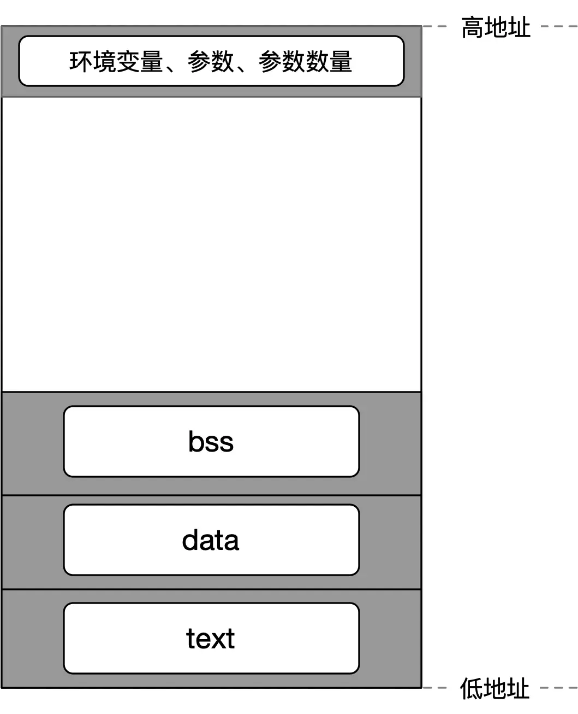

编译器能够将 Rust 这种高级语言编写的代码转换为 CPU 可以执行的机器指令。 **text** segment 便包含这些指令。 text segment 也被称为 **code** segment。这些指令因 CPU 架构而异，例如编译给 x86-64 平台使用的可执行文件便无法在 ARM-64 平台 CPU 上运行。text segment 是只读的，运行中的程序无法更改它。**data** segment 包含已初始化的静态变量（即全局变量）和一些已定义且可以被修改的局部静态变量。**bss** 的意思是 Block Started by Symbol ，该段包含未初始化的全局变量。内核还会将一些**附加数据**，例如环境变量、程序运行参数和参数的数量映射到高位地址。

之后，**栈**（stack）segment 被分配在内存地址高位的末端。我们之前提到过，正在运行的程序称为进程。进程是操作系统用来存储进程名、进程 id 等所有细节的一个抽象。进程至少包含一个执行线程，每个执行线程都包含各自的栈。在 64 位的 Linux 系统中，Rust 程序会为主线程分配 8MB 的栈。而针对用户程序可能创建的任一线程，Rust 标准库则支持指定栈的大小，其默认值为 2MB 。

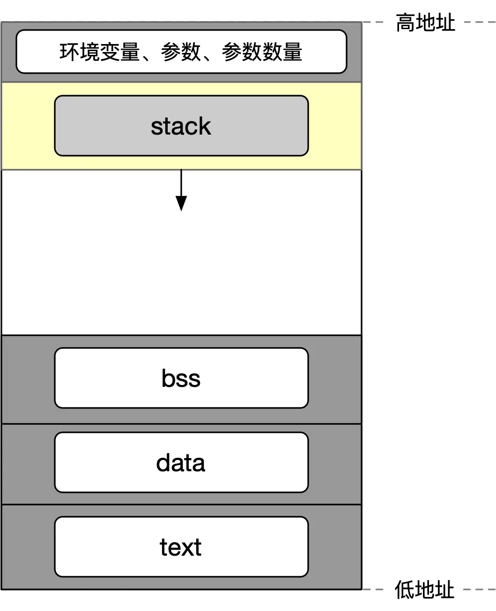

尽管主线程栈的大小是 8MB，但这 8MB 并不是立即分配的。只有当程序真正使用它的时候，内核才会进行分配。栈向下增长，即向着低位内存增长。它只能增长到所属线程的最大栈容量，比如主线程只能到 8MB 。如果程序线程试图使用更多的栈内存，内核则会将其终止，你便会得到一个 "stack overflow" 错误。栈内存用于执行函数，我后续会详细讲。

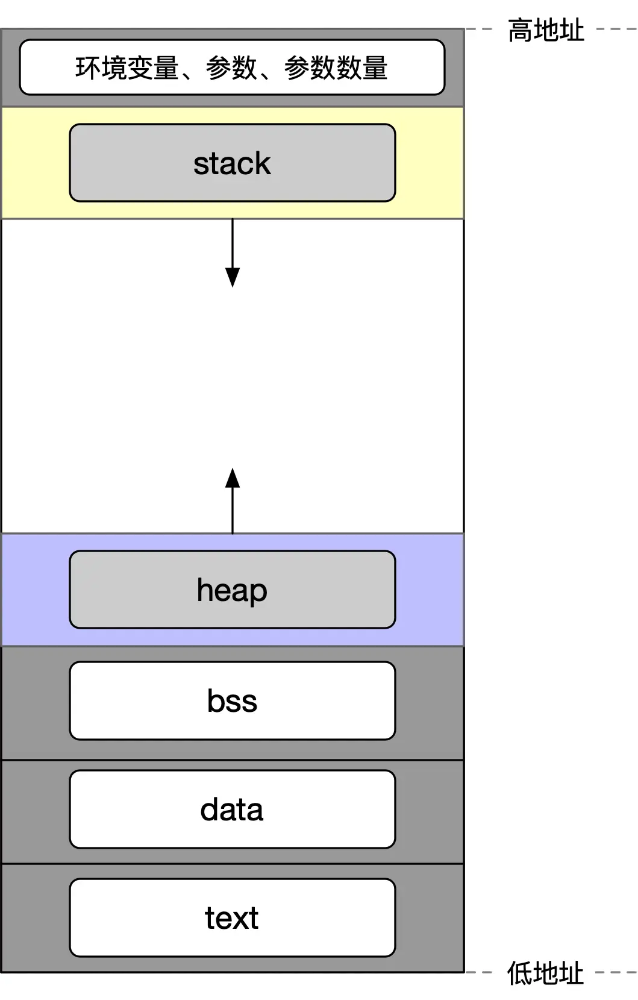

这里要讲的最后一个分段是**堆**（heap）内存。和栈不同的是，堆并非是被各个线程所拥有。同一进程的所有线程共享一个通用的堆内存区域。堆内存向上增长。针对运行中程序的这部分内存映射，操作系统通常会提供一些方法来查看它们，如 Linux 中，这些堆内存可以在 `/proc` 目录的指定进程下的 "maps" 文件中查看。

```sh
$ cat /proc/10664/maps
```

你可能已经意识到了，既然栈内存和堆内存向着彼此增长，那么这部分区域会否产生覆盖呢？通过检测堆内存的最高位地址和栈内存的最低位地址之间的距离不难发现，其相距了近 47TB ，因而极不可能会产生内存覆盖的现象。即便覆盖的现象真的即将发生，内核也提供了守卫机制用以及时中断程序。要知道，这些都只是虚拟地址，纵使电脑只有 16GB 的 RAM，内核依然能够使用如此巨大范围的内存地址。虚拟内存仅会在程序使用它们的时候映射为物理内存。

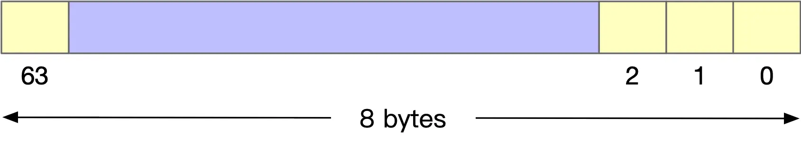

内存地址的范围由 CPU 字长决定，CPU 字长大体上可以认为是 CPU 一次处理的数据量。64 位 CPU 的字长是 64 位（或 8 字节）。CPU 中大多数甚至所有的寄存器都具有相同的字长。64 位 CPU 的寻址范围是从 0 到 2^(64-1) ，也就是把各位都设为 1 的情况，这是一个非常大的值。过去，32 位 CPU 有一些限制，它最多只能寻址到 2^32 的内存地址，大约为 4 GB。如今，在 64 位 CPU 上，我们只将其中 48 位用于内存寻址，这 48 位大约可寻址到 282 TB 的内存。除此之外，只有前 47 位属于用户空间，意味着大约有 141 TB 的虚拟内存被分配给用户程序，而位于高位的 141 TB 则保留给内核自用。47 位，就是说你可以使用的最大地址是 `0x7ffffffffff`，因此如果你检查程序的内存映射，应该能在 stack 附近看到这个值。

## 2. 深入了解堆栈

接下来让我们深入了解栈内存空间的作用。

```rust
fn main() {
    let a = 22;
    let b = add_one(a);
}
fn add_one(i: i32) -> i32 {
    i + 1
}
```

示例中 `main` 函数调用了 `add_one` 函数，我们没有新建其它线程，因此示例中只有一个线程在执行。从上一节的讲解中可以得知，允许为主线程分配的栈的总大小为 8MB，接下来使用一个白框表示这 8MB 内存空间：


仅当程序需要时，内核才会为其分配内存。栈内存的一个主要作用是存储当前正在执行函数的数据，包括函数参数、局部变量以及返回值的地址。为执行一个函数在栈上分配的总内存被称为 **栈帧 (stack frame)** 。

此例中，`main` 函数是入口函数。首先 `main` 函数的栈帧被创建，

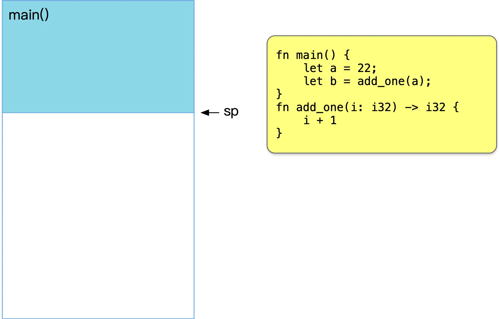

`main` 中有个局部变量 `a` ，它的值是 `22` 。还有另一个局部变量 `b` ，`b` 也是 i32 数据类型。i32 数据类型需要 4 个字节，`main` 的栈帧同样需要包含足够的空间来存放它。另外，使用 **栈指针（stack pointer）** 指向当前栈顶。

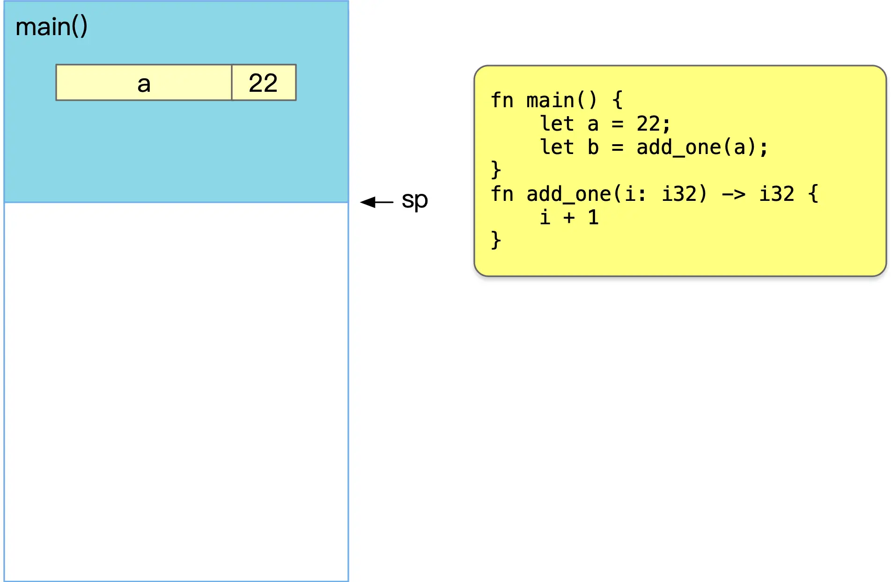

接下来当 `main` 调用 `add_one` 函数时，会创建一块新的栈帧并包含足够的空间来存放它自己的数据。栈指针的指向也切换到当前最新栈顶。`add_one` 函数接收数据类型为 i32 的入参 `i` ，因此需要在栈帧为它保留 4 字节的内存， `add_one` 函数没有局部变量。另外，它还要存储一个返回地址，这是 `main` 函数中的下一条指令，当 `add_one` 函数完成时，执行应返回该指令。

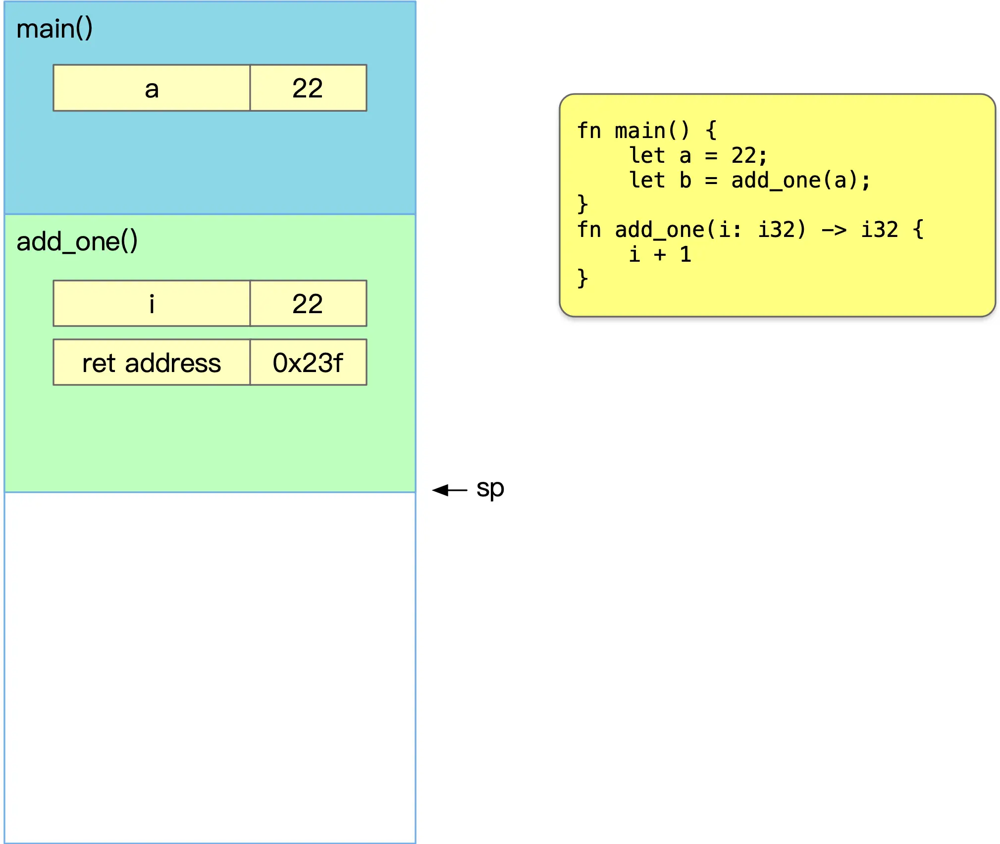


当 `add_one` 函数返回之后，返回值 23 就会被存储在 `main` 的局部变量 `b` 中，同时栈指针也会被更新。这里有一点要注意，此时 `add_one` 的栈帧并没有被释放，它会在程序调用下一个函数时被覆盖。

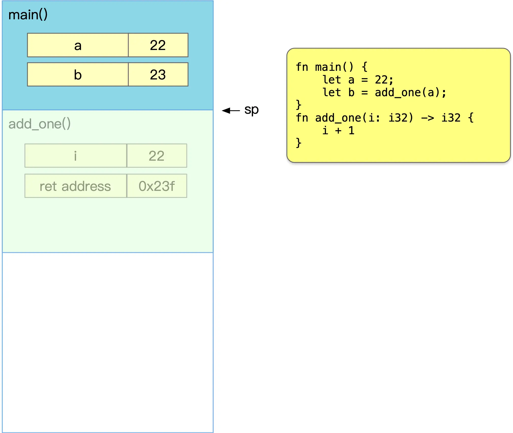

注意一下栈内存的分配方式：分配或释放内存只需要移动栈指针。栈内存的分配速度很快，因为它不需要进行系统调用。当然，它也有一定的局限性，即只有在编译时便已知的、具有固定大小的变量才可以存储在栈上。另外，也不能返回对函数内部局部变量的引用。

```rust
fn add_one(i: i32) -> &'static i32 {
    let result = i + 1;
    &result
}
```

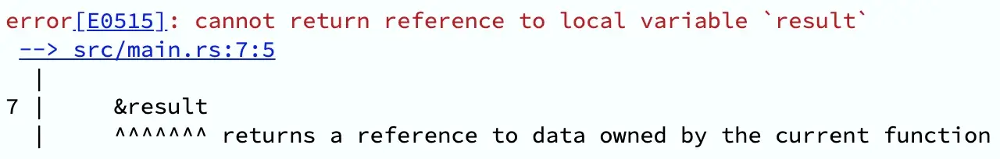

原因很明显，从刚刚对栈的分析便可得知。假如你尝试返回一个定义在 `add_one` 函数内的局部变量的引用，但实际上，当 `add_one` 返回后，其内存就被释放了，当下一个函数被调用时，新的栈帧就会覆盖原来的内存区域。在带有垃圾回收器的语言里，编译器能够自动检测到这种问题，并把该变量分配在堆上，然后返回对它的引用，但把变量分配到堆上会带来一些额外开销。有关堆内存的细节，一会便会讲到。

既然 Rust 没有垃圾回收器，它也不会强制把数据分配到堆上，所以编译器不能编译这段代码。阅读一下错误信息，现在你应该很清楚为什么编译器会抛出这样的错误了吧？

现在来看一下堆内存。


该例中 `main` 正在调用 `heap` 函数，它会为该函数创建一个栈帧。

```rust
fn main() {
    let result = heap();
}
fn heap() -> Box<i32> {
    let b = Box::new(23);
    b
}
```

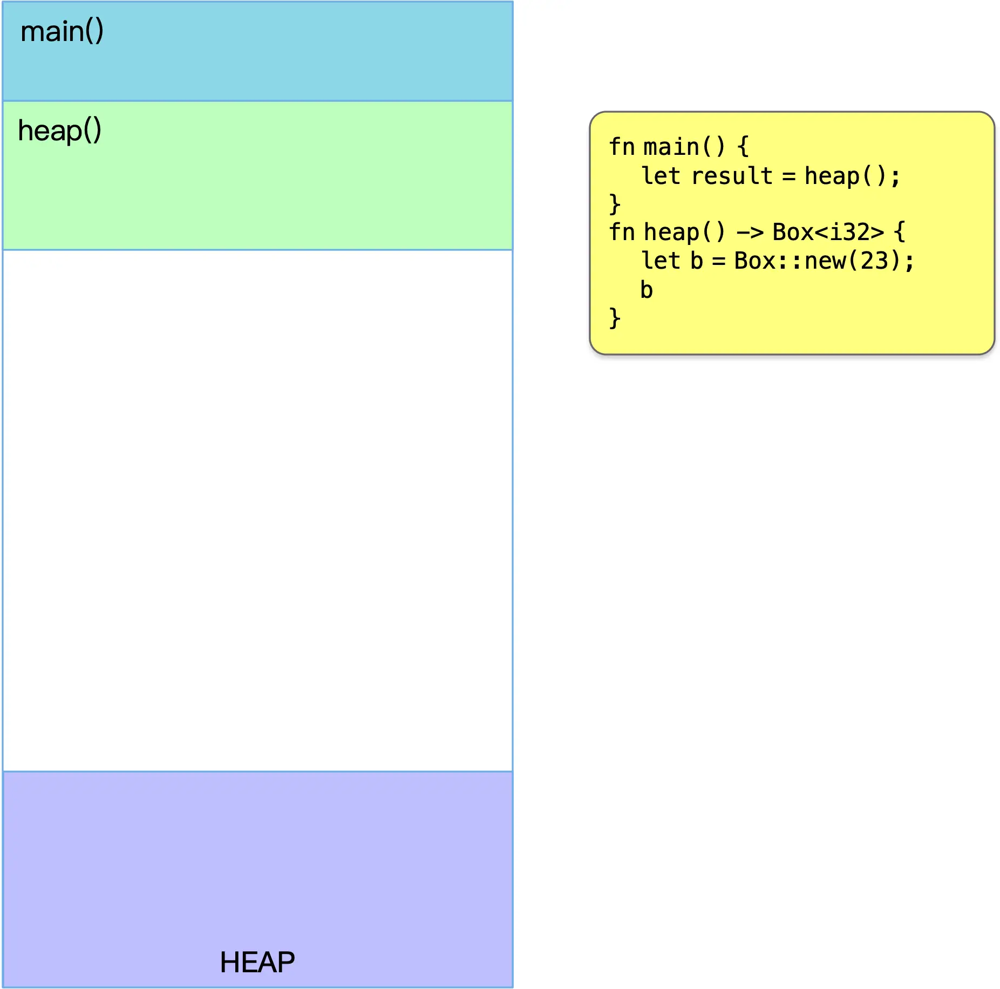


然后我们把值 23 使用 Box 分配到堆上，并把它存储在变量 `b` 中，函数 `heap` 的栈帧将有足够的空间存储该值，这是因为 Box 只是一个指针，存储在 `b` 中的值是一个来自堆上的地址，该地址里放着 23 。

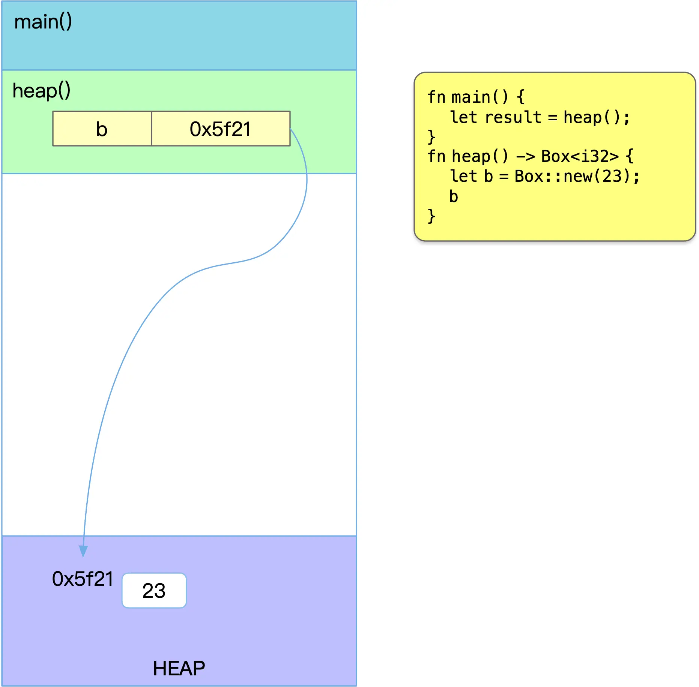

在 64 位系统上，指针的大小是 8 字节，所以变量 `b` 的大小也是 8 字节。指针指向的值是 23，其类型为 i32，它在堆上需要 4 个字节的大小。`heap` 函数返回包含 i32 的 Box，返回值会存储在 `main` 函数的局部变量 result 中。

当你将一个变量赋值给另一个变量时，它的栈内存会被复制。在这种情况下，用于存储地址的 8 个字节会从 `heap` 函数的栈帧复制到 reasult 变量。

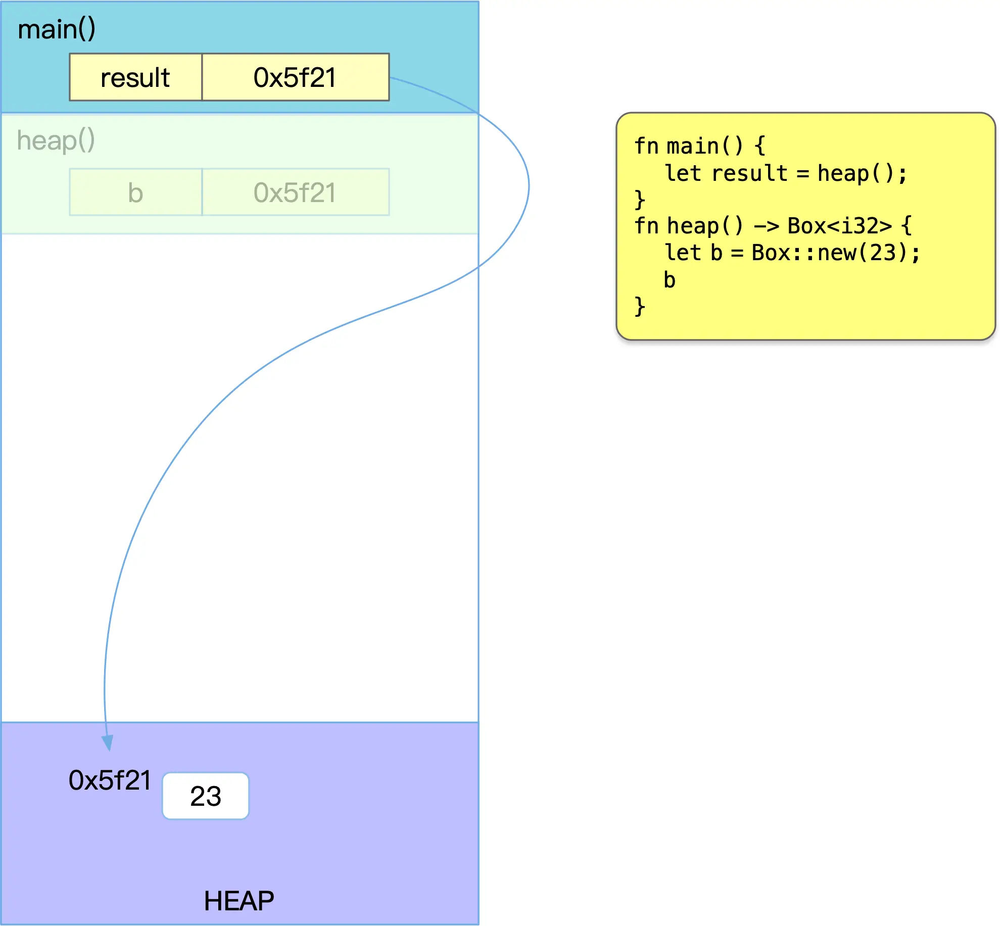

现在，就算 `heap` 函数的栈帧被释放，result 变量也保存着堆上数据的地址。堆允许你共享数据。之前还提到，每个线程都有自己的栈，但它们共享同一块堆内存。假设，程序在 heap 上分配越来越多的数据，直到堆上分配的内存几乎用完了。通常，程序有一个内存管理器，它会通过系统调用负责向操作系统申请更多堆内存。在 Linux 系统中，这些系统调用通常是 `brk` 或 `sbrk` ，它们会增加程序可用的堆内存大小，从而增加用户程序的总可用内存。

在 Rust 中，堆内存分配器由 `GlobalAlloc` trait 描述，该 trait 定义了堆内存分配器必须实现的方法。作为程序员，你可能极少直接使用它，编译器会在需要时自动调用该 trait 的方法。也许你熟悉 c 标准库中的 `malloc` 函数，它并不是系统调用，当程序向内核申请内存时，`malloc` 还是会调用 `brk` 或 `sbrk` 。Rust 的内存分配器使用了 c 库提供的 `malloc` 函数。当使用像 ldd 这类工具来查看二进制文件的动态依赖关系时，将会看到其中一个是 `libc` ，意味着 Rust 二进制文件需要 c 标准库或 `libc` 作为共享对象或已在操作系统中编译好的库。这一假定是安全可靠的，因为 `libc` 更像是操作系统的一部分，并且这种动态链接方式有助于降低 Rust 的编译体积。

另一方面，内存分配器并不总是通过系统调用在堆上分配更多内存，每当程序使用 Box 或者其它类似的东西在堆上分配内存时，内存分配器会成块地去请求内存，以减少系统调用的次数。堆和栈不同，内存不一定从堆的某一端开始释放，当一些内存被释放后，这些内存并没有立即返还给操作系统，内存分配器会跟踪哪些内存分页是已使用的、哪些是空闲的，这时，当要在堆上分配更多数据时，程序就不用再等待操作系统或内核。

大概你已经知道了为什么分配堆内存会比分配栈内存带来更大的性能开销：它可能需要系统调用，并且内存分配器每次分配时都可能要寻找一块空间内存以供分配。

## 3. 基本类型及元组

这一节开始，正式看一看 Rust 的各数据类型在内存中的布局情况。

对于**有符号整型**和**无符号整型**，只听其名字便可以知道它的大小：例如 `i16` 和 `u16` 在内存中都占用两个字节，它们全部分配在函数的栈帧上。`isize` 和 `usize` 的大小取决于机器字长，在 32 位系统上，其大小是 32 位，也就是 4 个字节。

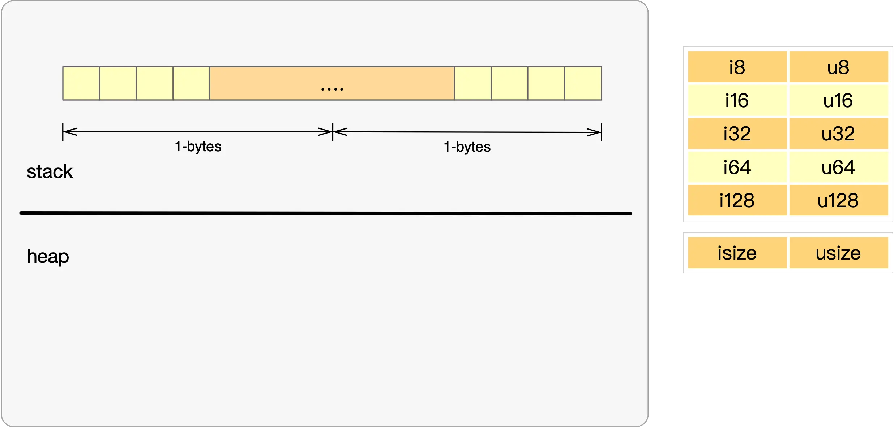

`char` 数据类型存储 unicode 字符，此处展示了些例子。它们在内存中均占用 4 字节，也分配在栈上。

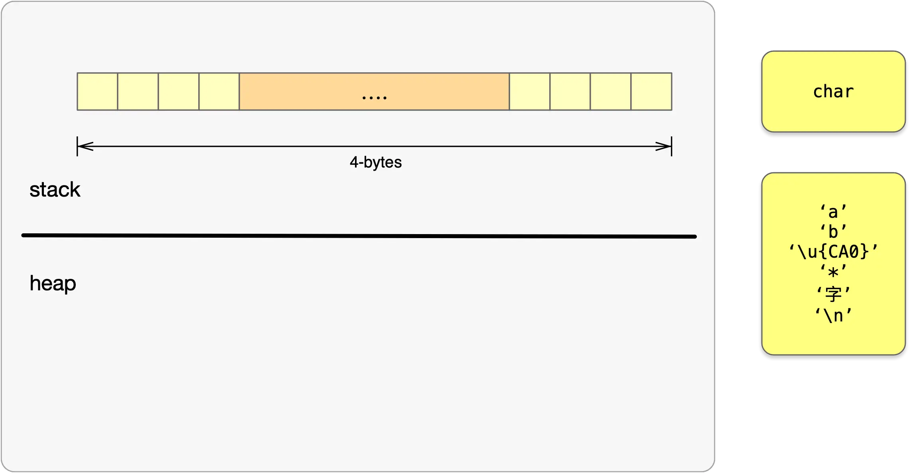

**元组**是不同数据类型的集合。例子中变量 `a` 是由 `char`、`u8` 和 `i32` 组成的元组，其内存布局只是将成员彼此相邻地排列在栈上，示例中 `char` 占用 4 字节，`u8` 占用 1 字节，`i32` 占用 4 字节。既然所有成员都是在栈上分配的内存，所以整个元祖也是在栈上分配内存。

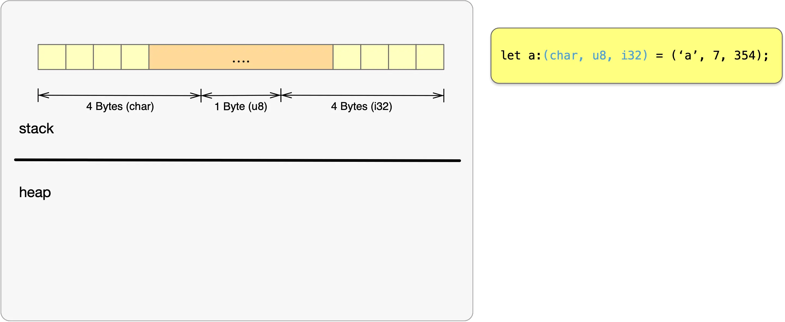

注意，该元组虽然看起来在内存中仅占用 9 个字节，但事实并非如此。关于这一点，可以使用标准库提供的 `size_of` 函数来查看某一数据类型的真实大小。

```rust
std::mem::size_of::<T>()
```

每种数据类型都有一个对齐属性，且分配给该数据类型的总字节数应该是对齐属性的整数倍。不仅 Rust 如此，每个编译器都如此。这样做有助于 CPU 更快更有效地读取数据。`align_of` 函数可以用于展示某种数据类型的对齐属性。

```rust
use std::mem::{align_of, size_of};

size_of::<(char, u8, i32)>();    // 12
align_of::<(char, u8, i32)>();   // 4
```

对于该元组，其对齐属性为 4 。也就是说，纵使只需要 9 个字节，Rust 实际仍会使用 12 字节来表示该元组。额外的 3 字节将作为填充而添加。

## 4. 引用类型

这一节来看引用数据类型 `&T` 。

```rust
let a: i32 = 25;
let b: &i32 = &a;
```

代码中，变量 `a` 是 i32 类型的，其中储存的值是 25 。

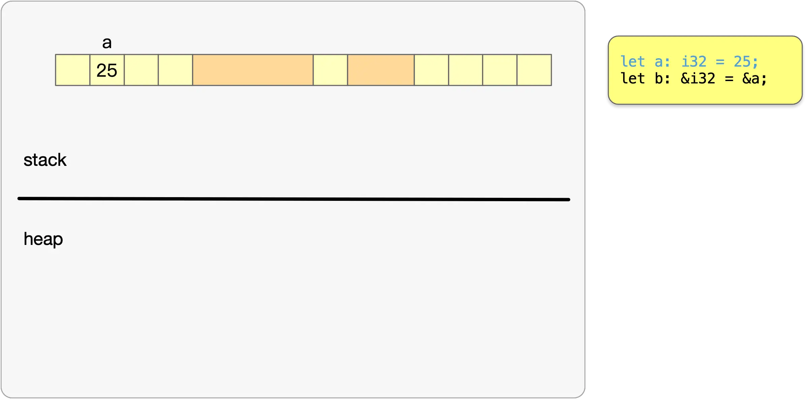

变量 `b` 是对 `a` 的引用。之后的讲解中，将不再详细展示某一类型的具体大小，而是把注意力放到整体上，更多地关注它们是在堆上还是在栈上存储。此处，`a` 存储在栈上，占用 4 字节，引用 `b` 也存储在栈上，它保存了变量 `a` 在栈上的地址。存储地址需要一个机器字长，因此在 64 位系统中，变量 `b` 将占用 8 个字节。

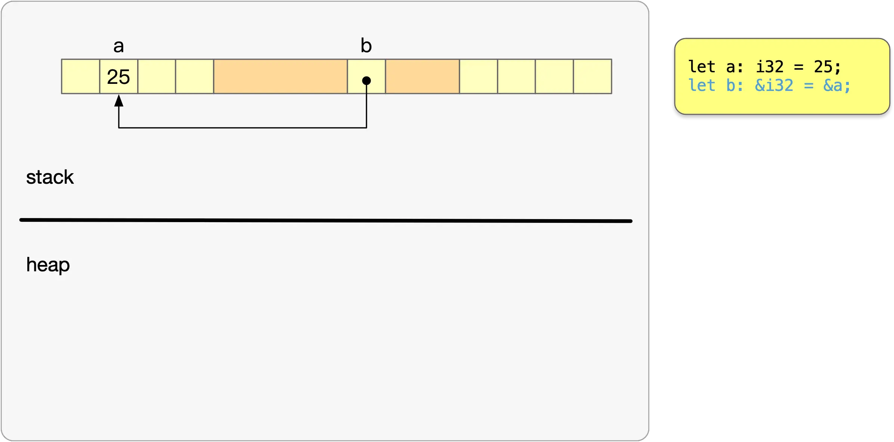

假如我们将 `b` 的引用存储在另一个变量 `c` 中，`c` 的数据类型将是对 i32 的引用的引用（ `&&i32` ）。变量 `c` 也将占用 8 字节并保存 `b` 的地址。

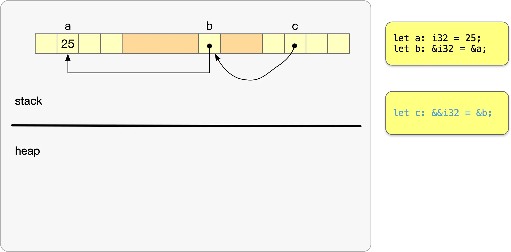

注意，引用也可以指向堆上的数据。


最后要说的是，可变引用 `&mut T` 在内存中也具有相同的布局。引用和可变引用之间的区别在于它们的使用方式以及编译器对可变引用施加的额外限制。

## 5. 数组、Vector 及切片引用

**数组**的大小固定，并且该大小也是其数据类型的一部分。此处数组的每个元素会在栈上相邻排列，但是，在数组创建后就不可以再改变它的大小了。切记，只有编译时已知的、大小固定的数据类型才能分配到栈上。

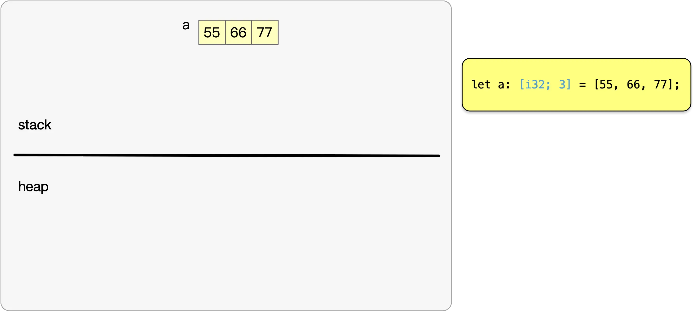

数组的一个可改变大小的替代品是 **Vector** 。示例中 Vector `v` 和数组保存了相同的元素，但数据是在堆上分配的，而声明变量 `v` 的函数栈帧上则包含 3 个机器字长。第一个字长表示指向堆上数据的地址，其余两个字长用于存储 Vector 的容量（cap）和长度（len）。

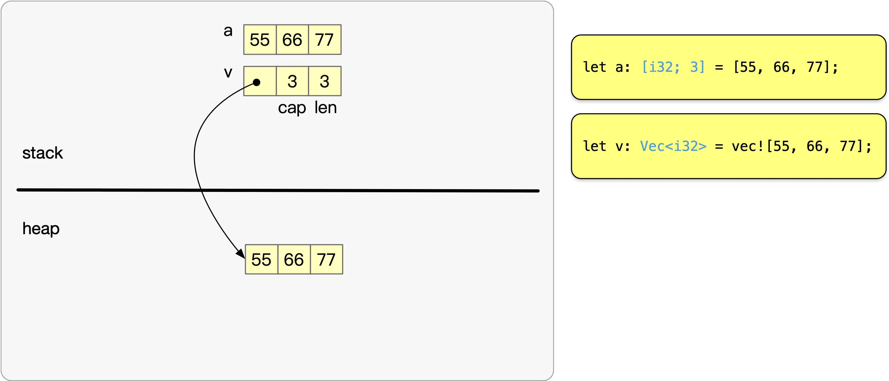

容量字段表示堆上有多少空间被保留用于存储数据， 当向 vector 中添加更多数据时，如果还没有达到为其分配的容量，Rust 并不需要在堆中分配更多的空间。而当长度和容量相同时，并且还有更多元素需要被添加到 vector 中，Rust 必须在堆中分配一个更大的数组空间，然后将当前所有元素复制到新的数组中，继而更新指针指向这个新的内存位置。注意，栈上的 Vector 始终保持固定大小。

另一个与之相关的数据类型是  `T` 的**切片（slice）**。注意，该数据类型和固定大小的数组很像，只不过不需要在数据类型中指定其大小。切片更像是对它底层数组中某些元素的视图。

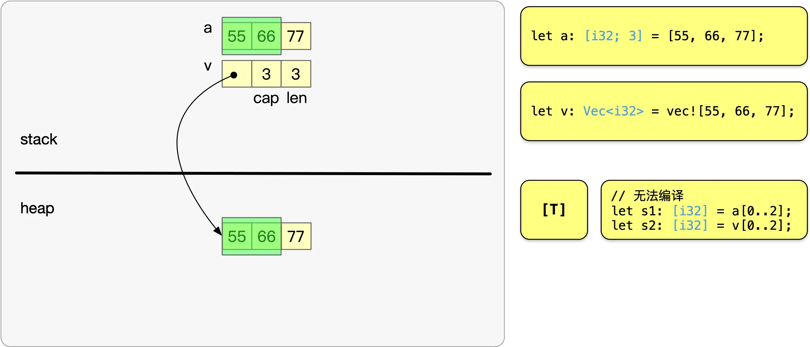

此处，`s1` 表示示例数组中的前 2 个元素，而 `s2` 表示堆上 vector 的前 2 个元素。切片的问题在于它并不指定元素的个数，也就意味着在编译期，Rust 并不清楚需要使用多少字节来表示切片，换句话说，你不能用变量来存储切片，毕竟它们大小未知，不能分配在函数的栈帧上。这种类型被称为 **动态大小类型（DST）** 。另外还有一些其它的动态大小类型，如字符串切片和 trait 对象，将在后续内容中讲解。

几乎所有时候，我们都只会用到切片的引用。之前的章节已经讲过，引用只是一个指针，并使用 1 个机器字长来存放指向数据的地址。当你用到一个对 DST 的引用时（比如对切片的引用），Rust 会使用额外的 1 个机器字长来存储数据的长度，这种引用也被称为**胖指针**，因为我们将一些附加信息连同指针一起存储。

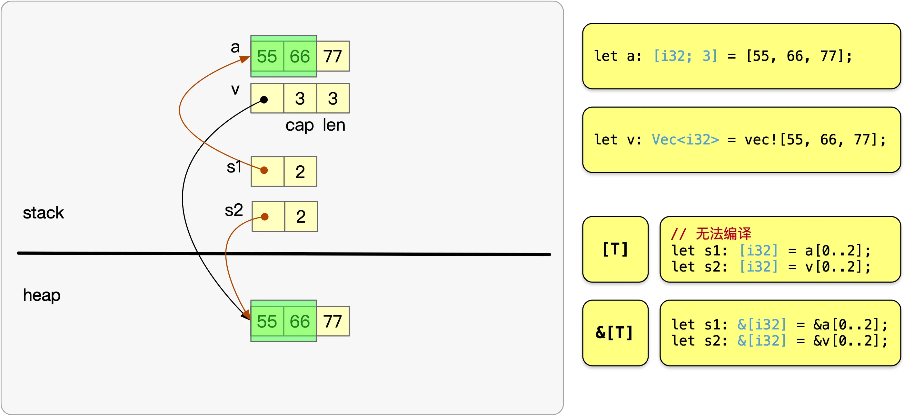

既然切片引用可以使用 2 个机器字长来表示，它便可以存储在栈上。最后有一点要提醒你，切片引用所指向的真实数据既可以在栈上，也可以在堆上。

## 6. 字符串类型

这一节来讨论字符串类型。String 类型的内存布局和 Vector 相同，唯一的区别是 String 必须是 UTF-8 编码。

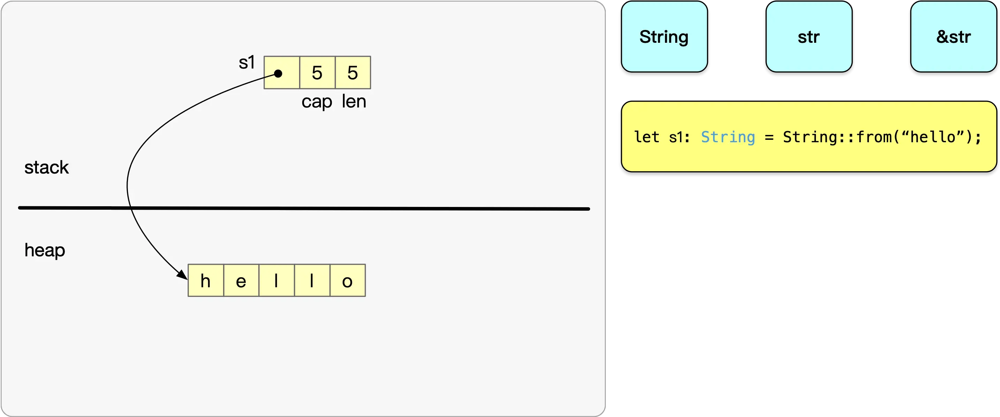

如果将字符串直接存储在变量中，其类型会变为对字符串切片的引用，该字符串不在堆上分配，而是直接存储在已编译的二进制文件中。据我目前所知，Rust 没有明确指出把该字符串具体存到哪个分段（segment）中，但应该就是在 code segment 本身上。

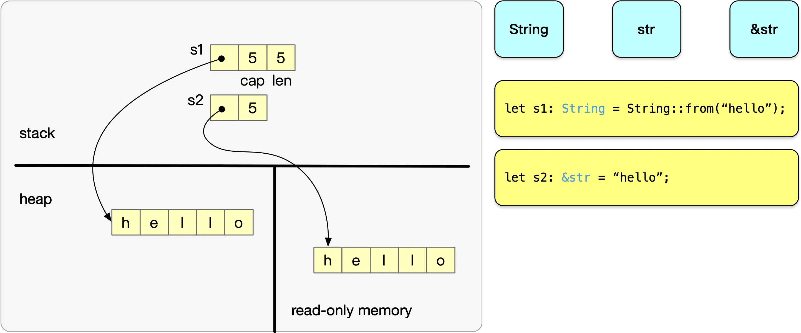

这类字符串具有 `'static` 生命周期，意味着它们永远不会被释放，并在程序的整个生命周期中都可用。就像对普通切片的引用一样，对字符串切片的引用也是一个胖指针，使用 2 个机器字长来表示，一个用于存储实际数据的起始内存地址，另一个则用于存储长度。

可以使用 range 操作来获取字符串的一部分，但这会返回一个字符串切片。

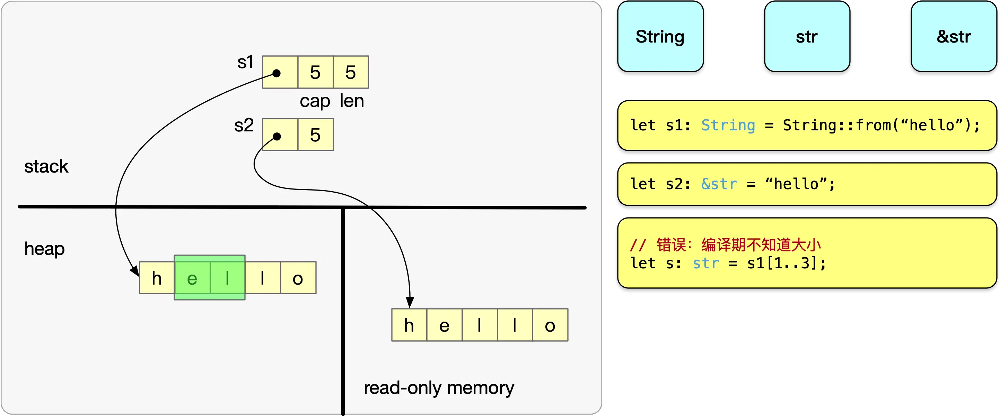

然而，由于字符串切片在编译期的大小未知，不能被存放在函数的栈帧上，因此 Rust 不允许将它赋值给变量。所以此时你还是得用个*引用类型*。

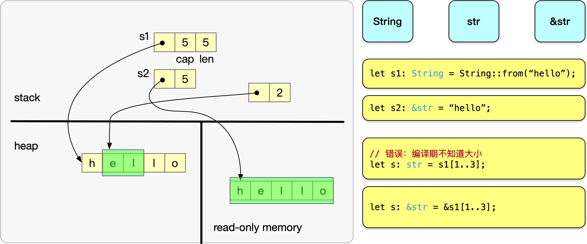

## 7. 结构体类型

Rust 有三种结构体（struct）类型。下面这个结构体便是其中之一，它拥有命名字段：

```rust
struct Data {
    nums: Vec<usize>,
    dimension: (usize, usize),
}
```

另外还有元组结构体（tuple-like struct）：

```rust
struct Data(Vec<usize>);
```

以及单元结构体（unit-like struct）：

```rust
struct Data;
```

单元结构体不包含任何数据，因此 Rust 编译器甚至不需要为其分配内存。另外两种结构体依据其成员有相似的表示方式，并且非常类似于我们之前讲过的元组类型。让我们看看第一种具有命名字段的结构体在内存中的表示方式：

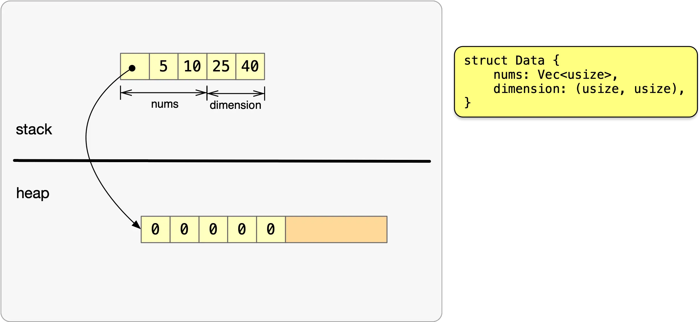

它有两个字段：一个 `Vec` 和一个元组。结构体在栈上的布局等效于将它的各个成员彼此相邻排列。示例中 Vec 将占用三个 usize，而元组将占用另外两个 usize，注意我们忽略了内存对齐和填充。如果 nums 成员内有元素，它们将被分配在堆上。

## 8. 枚举类型

和结构体一样，Rust 支持多种枚举（Enums）表示方法。下面展示了一个 c 风格的枚举：

```rust
enum HTTPStatus {
    Ok,
    NotFound,
}
```

在内存中，它们被存储为从 0 开始的整数。

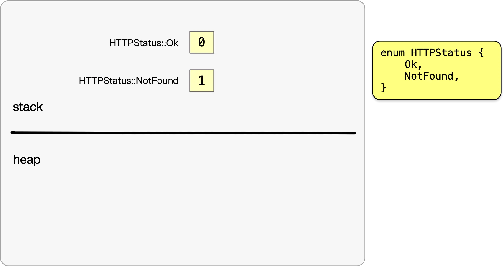

Rust 编译器会选择能够存储该枚举类型的最大的变体（variant）中最短的整型。示例中最大的变体为 1，它只需要 1 个字节就能存储。 你也可以为各个变体指定其整数值：

```rust
enum HTTPStatus {
    Ok = 200,
    NotFound = 404,
}
```

示例中，最大变体值为 404 ，在内存中至少需要 2 个字节来存储，因此枚举的每个变体都占用 2 字节。

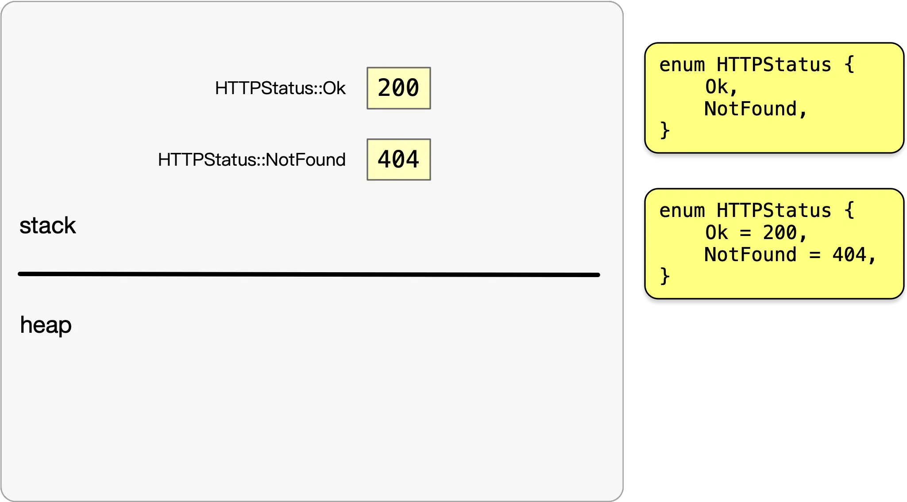

在下一个示例中，枚举有 3 个变体：

```rust
enum Data {
    Empty,
    Number(i32),
    Array(Vec<i32>),
}
```

`Empty` 变体不存储任何其它数据，`Number` 变体中有一个 i32，`Array` 变体保存了一个元素类型为 i32 的 Vec。首先来看一下 `Array` 变体的内存布局：

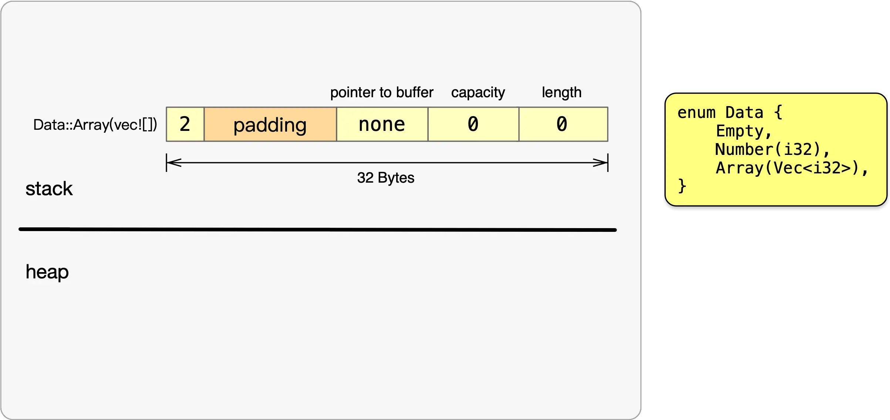

首先是一个整数标记，这里就是 2 。然后是三个 usize 用来存储 Vec 。编译器还将添加一些 padding 以满足内存对齐。在 64 位系统上，这个变体总共需要 32 字节。

现在来看一下 `Number` 变体，它存储一个 i32 类型，占 4 个字节。它也需要一个整数标记值，这里是 1，占用 1 个字节。由于所有的变体都具有相同大小，编译器会为其填充，直到填满 32 个字节。

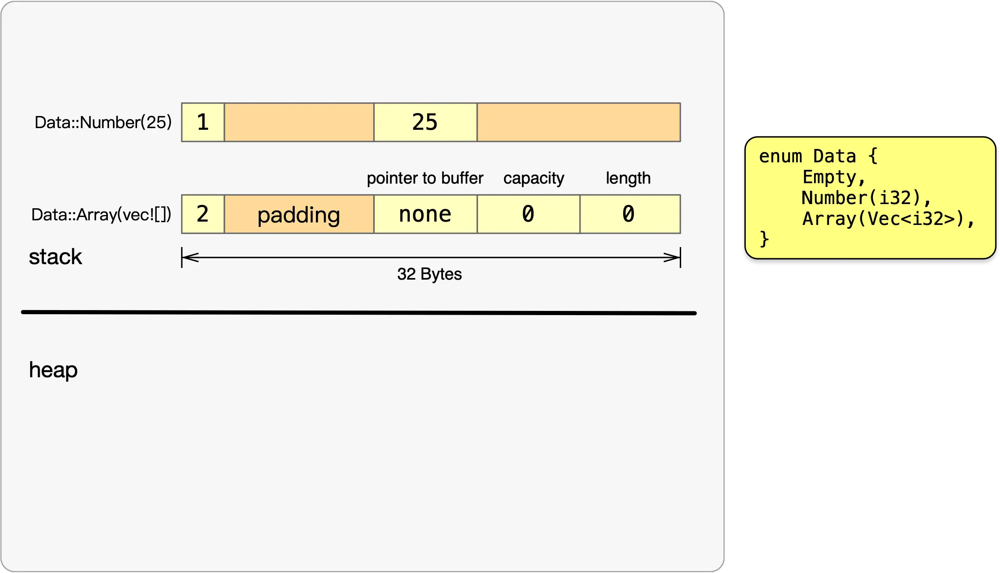

对于 `Empty` 变体，它只需要 1 个字节来存储整数标记即可。但是，编译器还是会为它填充 31 字节的 padding 。

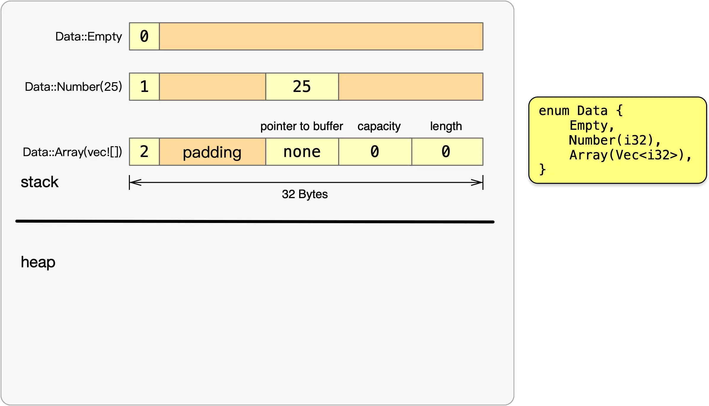

既然枚举的大小由它的最大变体决定，那么很明显，减少内存占用的一个技巧就是降低最大变体的大小。该例子中，相比于直接把 Vec 存储在 `Array` 变体中，如果我们选择只存储 Vec 的指针，这个变体需要的最大内存便可以直接降低一半。`Box` 是指向堆上数据的指针，因此 `Box` 在栈上的部分只需要由 1 个 usize 来存储堆上数据的地址，在 64 位系统上就是 8 个字节。一个被装箱的 Vec 的内存布局如图所示：

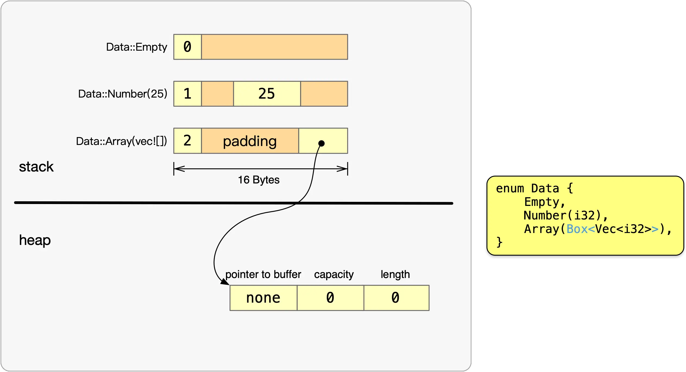

在函数的栈帧上，需要分配一个 usize 去存储它所指向的数据的内存地址。在堆上，需要分配 3 个 usize 去表示 Vec，记住，如果 Vector 里有值，这些值也将保存在堆上，并且指向具体值的指针将存储在 Vec 的指针字段中。

最常用的枚举之一是 `Option` ，它用于表示可能为 null 或空的值。

```rust
pub enum Option<T> {
    None,
    Some(T),
}
```

例如，假设你想表示一个指针，该指针指向一个在堆上分配的 i32 类型的值，你还想同时表示它的 `0 值` 也就是还没有被初始化的状态，在其它使用指针的编程语言中，通常可以使用 `null` 或者 `nil` 指针表示这种状态。在 Rust 中，可以表示为 `Option<Box<i32>>`， 这使得 Rust 编译器能够确保代码不会产生指针相关的异常——比如解引用一个空指针。

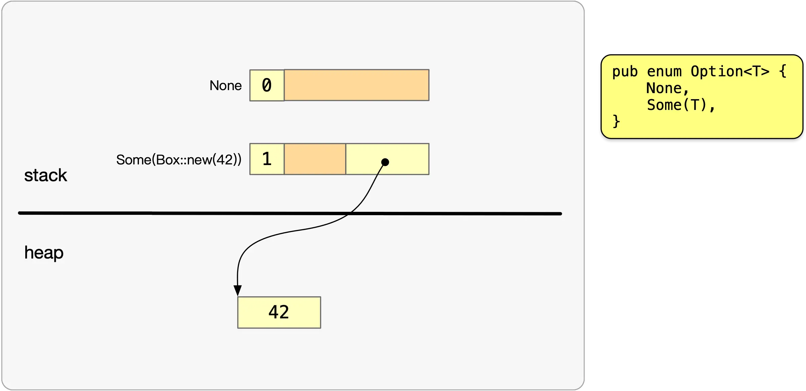

`Option` 有两个变体，`None` 变体不存储任何值，它只存整数标记。`Some` 变体存储实际数据和整数标记，图示的例子中，因为 `T` 是一个 `Box` 指针，故而需要用 1 个机器字长来存储。思考一下，这里其实会产生内存浪费，别的编程语言可以只用 1 个机器字长来表示指针，而 Rust 必须使用额外的 1 字节来存放整数标记，还有随之而来的 padding 也会占用空间。事实上，如果存放在 `Option` 中的值是 `Box` 或其它智能指针，Rust 编译器能够作出一些优化。因为任何智能指针的值都不允许为 0 ，所以 Rust 可以用一个 usize 表示 `Option<Box<i32>>` ，它不再需要整数标记，指针为 0 的值可以用来表示 `None` ，如果值不为 0 ，它则可以表示 `Some` 。这么一来，Rust 中由 `Option` 包裹的智能指针和其它语言中的指针便一样了，不同之处在于，Rust 可以提前规避解引用空指针的问题。


## 9. 所有权与智能指针

在进一步学习之前，我们先来快速认识一下 Rust 中 `copy` 和 `move` 的区别。针对原始数据类型（比如整型），如果你将一个变量赋值给另一个，新变量将获取一份存储在右侧变量中的数据的副本。

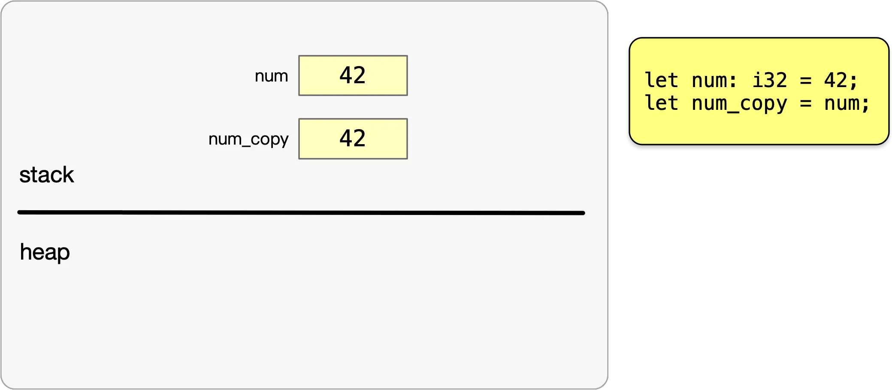

Rust 对右侧的值做了一次逐位复制，这样做是可行的，毕竟这些值只使用栈上的字节来表示。Rust  允许之后的代码同时使用这两个变量。当函数返回后，它的栈帧会自动进行清理。

```rust
let v: Vec<String> = vec![
    "Odin".to_string(),
    "Thor".to_string(),
    "Loki".to_string(),
];
```

现在我们看一下需要在堆上分配数据的情况。此处示例一个在堆上分配了 String 的 Vector，每个字符串使用三个 usize 表示，分别存储着数据地址、容量和长度。在为 Vector 分配的堆内存中，用于存储字符串 header 的数据依次排列，真正用于存储字符串的实际数据会被分配在堆上的其它位置，而指向它们的指针则保存在字符串 header 中。

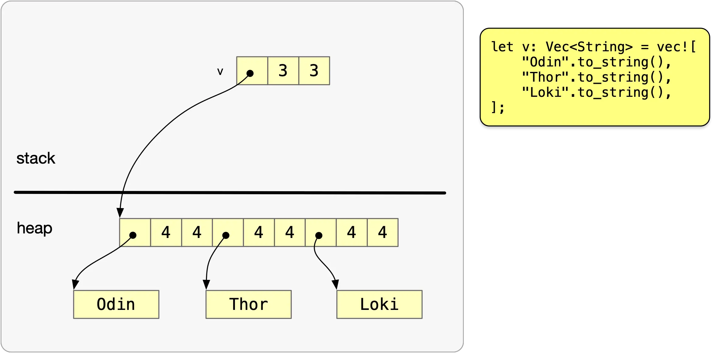

在函数的栈帧中，需要为变量 `v` 分配 3 个机器字长以存储 Vector 的 header ，header 中会有一个指针指向堆中的地址，从**所有权**的角度看，变量 `v` 拥有整个堆上数据的所有权。由于 Rust 没有垃圾回收器，变量在超出作用域后需要负责清理它所拥有的堆内存。

接下来，我们将变量 `v` 赋值给一个新变量 `v2`，假设对该变量在栈上的部分做了逐位复制，那么 `v2` 也将拥有一个指向同一块堆内存的指针，在拥有垃圾回收器的语言中这是常有的事儿。这样做内存开销很小，因为无论堆中数据有多大，我们只需要复制位于栈上的几个字节即可，垃圾收集器可以跟踪对堆分配的引用的数量，当所有引用都超出作用域后，垃圾收集器将负责释放该内存。

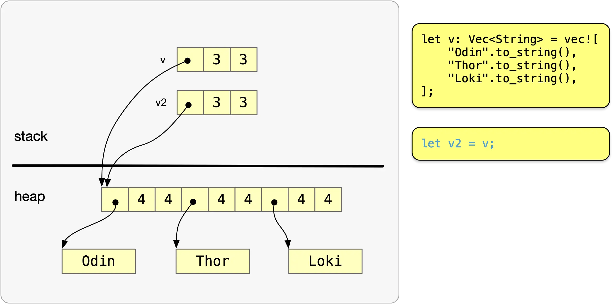

但 Rust 没有垃圾收集器，取而代之的是所有权机制。目前为止，我们尚不清楚哪个变量负责清理堆内存。另一种选择是在赋值给一个新变量时同时将堆内存进行复制，然而这种复制操作可能会导致内存占用升高，继而造成系统性能降低。Rust 的策略是针对各情况做出明确选择——

如果你打算创建一个变量并且拥有整个堆内存的副本，你需要调用 `clone` 方法；如果你不想让它克隆这个值，Rust 编译器就不允许你在后续代码中再使用变量 `v` 了，我们称变量 `v` 被 `move` 了。

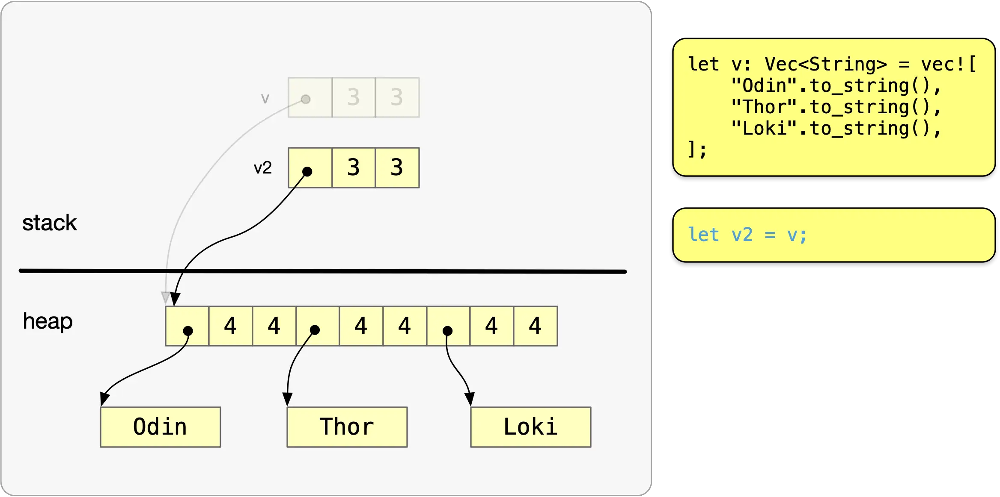

现在变量 `v2` 成为该值的所有者，当 `v2` 超出作用域后，它会负责释放堆中的这个值。

有时可能会需要一个拥有多个所有者的值，大多数情况下，你可以使用普通的引用去共享该值，但这么做的问题是当所有者超出作用域范围时，相应的引用也将无法使用。事实上，我们想要的共享所有权是指所有变量都是该值的所有者，并且只有当所有变量都超出作用域范围时，这个值才应被释放。这便是智能指针 `Rc` 存在的目的。

当将 vector 包裹在智能指针 `Rc` 里时，用于存储 vector head 的三个机器字长（usize）会和引用计数一起分配到堆上。

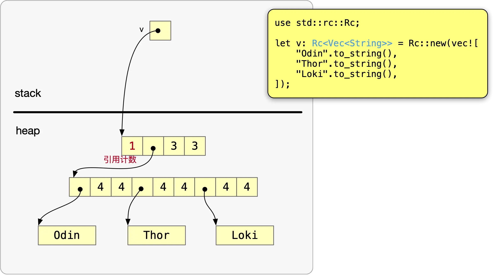

在函数栈帧上，变量 `v` 值只需要一个 usize 用来保存 `Rc` 在堆上的地址。然后可以通过 `clone` 第一个 `Rc` 类型变量 `v` 来创建第二个变量。这里的 `clone` 并不会复制堆上的数据，相反，它只是复制了一次存储在栈上的指针，并简单地让引用计数的值加 1 。

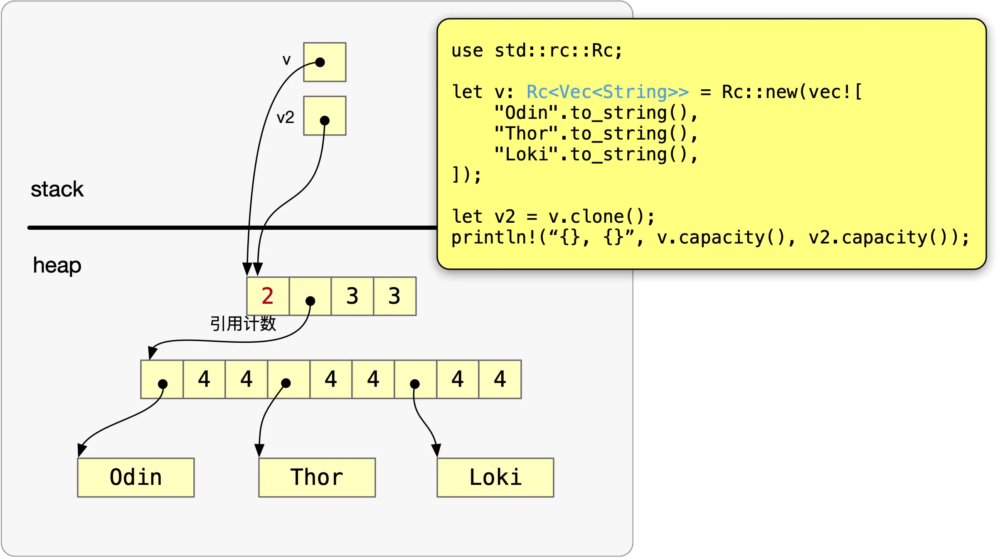

现在 `v` 和 `v2` 都是数据的所有者了。这也正是 `Rc`  被叫作引用计数指针（**R**eference **C**ounted pointer）的原因。`Rc` 有一个限制，它指向的值是不可变的，可以使用内部可变性等方法解决这一限制，但此文不会对其展开讨论。每当数据所有者超出其作用域，引用计数就会减 1 ，当它变为 0 时，整个堆内存值将被释放。

Rust 有一些特殊的标记 trait , 如 `Send` 和 `Sync` 。简单来说，如果一个类型实现了 `Send` ，则意味着该类型的值可以从一个线程传递到另一个线程。如果一个类型实现了 `Sync` ，则意味着可以在多线程间使用共享引用共享其值。

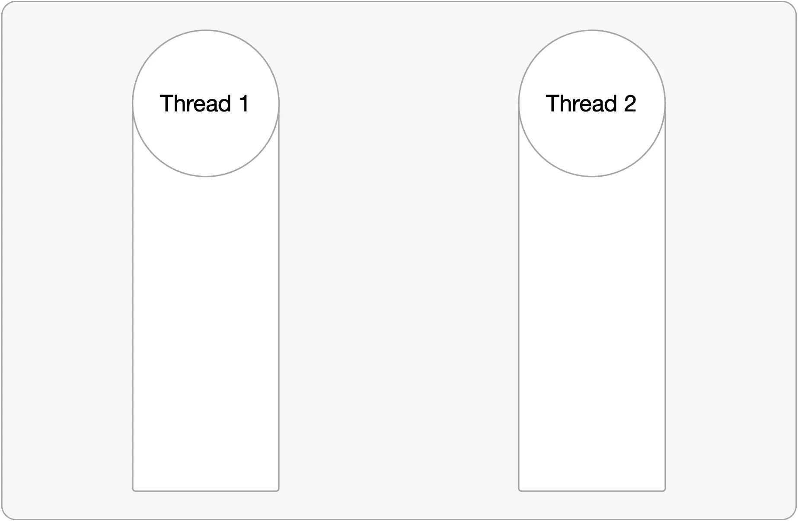

`Rc` 指针没有实现 `Send` 和 `Sync`，假设两个线程拥有指向相同数据的 `Rc` 指针，在某个时间点，两个线程同时 `clone` 并生成了他们的 `Rc` 指针，两者都将尝试更新同一份引用计数，这会导致数据竞争。

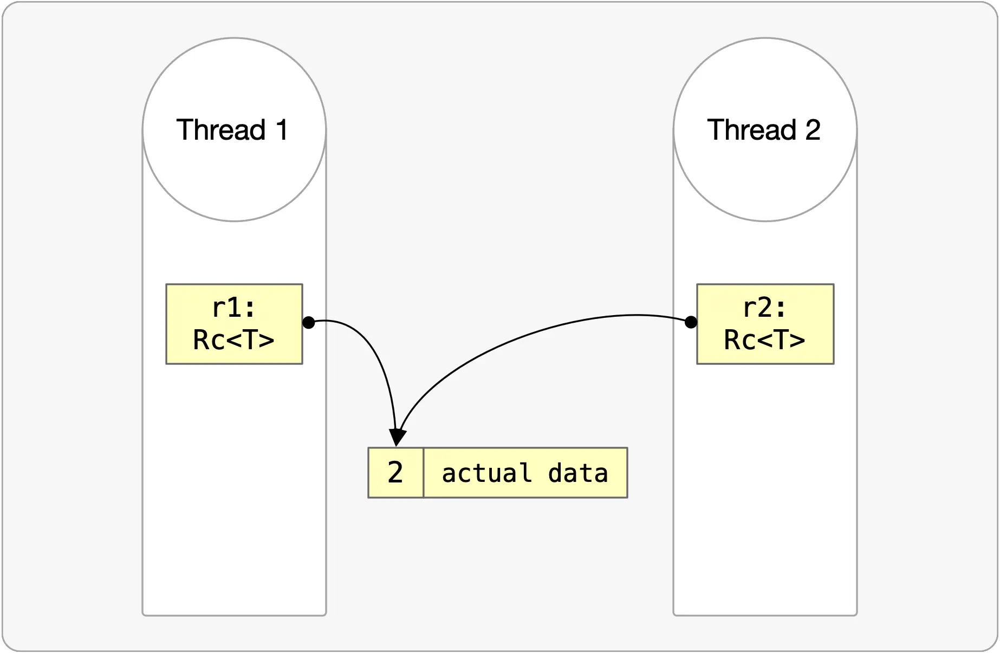

Rust 的一个主要优点就是它规避了所有与内存相关的 BUG，如果你确实需要跨线程共享数据，可以使用原子引用计数指针（**A**tomically **R**eference **C**ounted pointer）`Arc` 。它的工作原理和 `Rc` 几乎相同，只是引用计数更新变为原子操作，可以多线程间安全地执行。但是原子操作会带来一些额外的性能开销，这就是为什么 Rust 需要 `Rc` 和 `Arc` 两种独立的类型——若不需要，你不必花费额外的开销！

注意，默认情况下 `Arc` 也是不可变的，即使多个线程具有指向相同数据的指针，也不允许它们改变数据。如果需要在多线程间共享可变引用，可以在 `Arc` 内再包装一个 `Mutex`。

```rust
let data: Arc<Mutex<i32>> = Arc::new(Mutex::new(0));
```

现在即使两个线程尝试同时访问数据，它们都需要先获取锁。同一时间内，只有一个线程能够获得锁，因此只有一个“写入者”可以改变数据，`Mutex` 会保护数据。

## 10. trait 对象

trait 对象是对 trait 类型的一个引用。有很多方法可以将具体类型转换为 trait 对象。第一个示例中，转换发生在给变量 `w` 赋值时：

```rust
use std::io::Write;

let mut buffer: Vec<u8> = vec![];
let w: &mut dyn Write = &mut buffer;
```

第二个示例中，转换发生在将某种具体类型作为参数传递给接收 trait object 的函数时：

```rust
use std::io::Write;

fn main() {
    let mut buffer: Vec<u8> = vec![];
    writer(&mut buffer);
}
fn writer(w: &mut dyn Write) {
    // ...
}
```

在这两种情况下， `Vec<u8>` 都被转换为实现了 `Writer` 的 trait 对象。在内存中，trait 对象是一个胖指针，它由两个普通指针组成，因此每个 trait 对象均占用两个机器字长。其中，第一个用来存放指向值的指针，在示例中就是 `Vec` ；第二个指向一张表，这张表能够表示值的类型，可以被称为**虚表**或 `vtable` 。

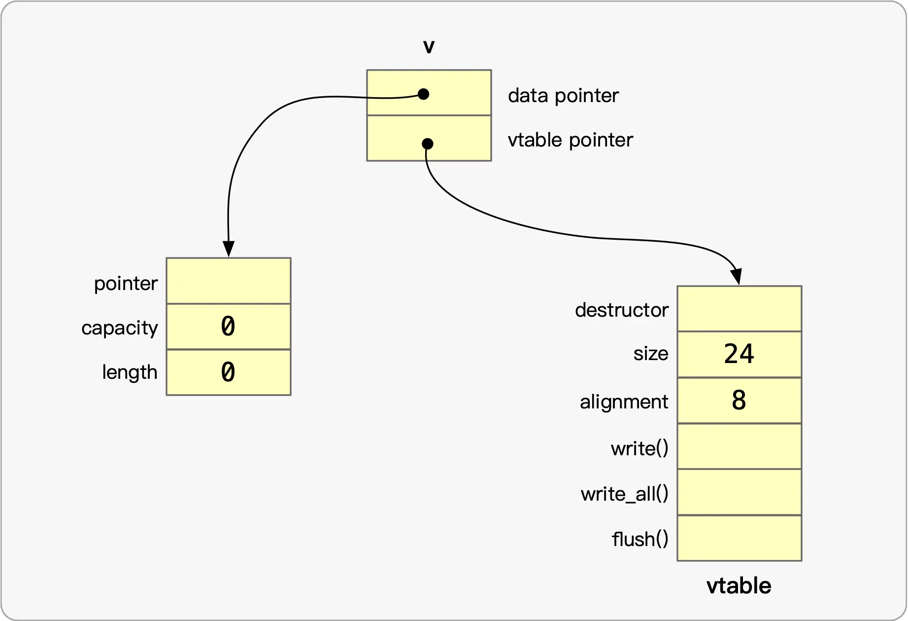

`vtable` 在编译时生成，并被相同类型的所有对象共享。`vtable` 包含了一系列指针指向表示函数的机器码，这些函数是实现 `Writer` trait 必须实现的方法。当你调用一个 trait 对象的方法时，Rust 会自动使用 `vtable` 。注意，像第五节讲的切片一样，`dyn Writer` 也是动态大小类型，所以我们也总是使用它的引用。同时，在上面的示例中直接把 `Vec<u8>` 转换为实现了 `Writer` 的 trait 对象之所以可行，是因为标准库为 `Vec<u8>` 实现了 `Writer` trait 。

刚刚已经见识到 Rust 能够将普通引用转换为 trait 对象，另外 Rust 也可以对智能指针（如 `Box` 或 `Rc`）做同样的转换，这时，它们也会转为胖指针。

```rust
let mut buffer: Vec<u8> = vec![];
let w: &mut dyn Write = &mut buffer;
```

```rust
let mut buffer: Vec<u8> = vec![];
let w: Box<dyn Write> =Box::new(buffer);
```

```rust
let mut buffer: Vec<u8> = vec![];
let w: Rc<dyn Writer> = Rc::new(buffer);
```

`Box<dyn Writer>` 意味着拥有一个在堆上实现了 `Writer` 的值，无论它是普通引用还是智能指针，在发生转换时，Rust 知道引用的真实类型（此例中就是 `Vec<u8>` ）。因此，它只是通过添加适当的 `vtable` 地址，将普通指针转化为胖指针。

## 11. 函数指针和闭包

函数指针只需要一个 usize 来存储函数的机器码地址。

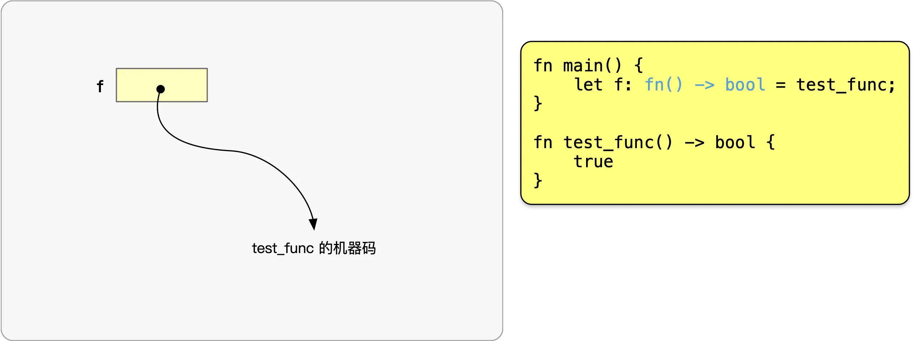

例子中 `test_func` 是一个返回 `bool` 的函数，我们把该函数存储在 `main` 函数的一个变量里。

最后来看一下闭包。Rust 没有具体的闭包类型，语言本身指定了三个 trait `Fn`、`FnMut` 和 `FnOnce` 来描述它。首先看一下 `FnOnce` 闭包：

```rust
fn main() {
    let c = create_closure();
}

fn create_closure() -> impl FnOnce() {
    let name = String::from("john");
    || {
        drop(name);
    }
}
```

此处我们声明了一个名为 `create_closure` 的函数，它返回一个实现了 `FnOnce` 的 trait 对象，在函数体内创建了一个字符串，我们知道，String 在栈上需要 3 个机器字长。

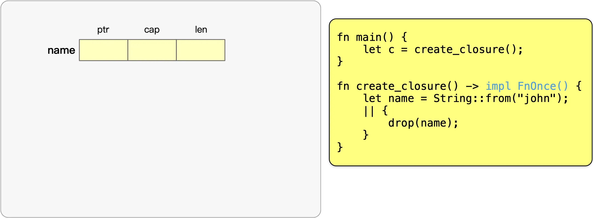

然后我们创建一个闭包。闭包可以使用封闭函数内的数据，在示例的闭包内，只是简单的 `drop` 了刚刚创建的 `name` 变量。注意，`FnOnce` 仅是一个 trait ，它只定义了对象的行为或方法。Rust 内部使用结构体来表示闭包，Rust 会根据闭包使用的变量创建一个适当的结构体，并为该结构体实现最合适的 trait 。

```rust
struct MyClosure {
    name: String,
}

impl FnOnce for MyClosure {
    fn call_once(self) {
        drop(self.name)
    }
}
```

闭包 trait 的实际签名稍微有点复杂，我在这里展示的只是一个简化版本。在例子中，闭包使用这样一个结构体表示：它只有一个 name 字段，该字段被封闭函数捕获。`call_once` 是实现 `FnOnce` trait 时必须实现的方法。由于该 struct 只有一个 String 类型字段，它的内存布局将和 String 的相同。注意一下 `call_once` 的函数签名，它包含一个 `self` ，意味着它只能被调用一次。该例很明显，如果我们调用两次闭包，它就会重复 `drop` 已经被释放的字符串。

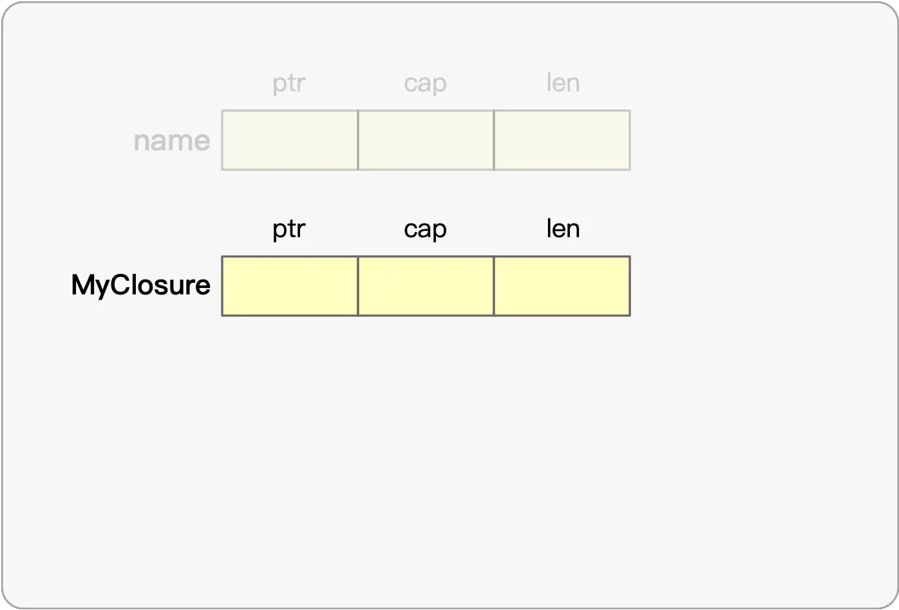

下一个示例中，我们来创建一个 `FnMut` 闭包。

```rust
let mut i: i32 = 0;

let mut f = || {
    i += 1;
};
f();
f();

println!("{}", i);  // 2
```

这次是 `FnMut` ，因为我们正在改变变量 `i` 的值。这种情况下，用于表示闭包的结构体内将拥有一个堆变量 `i` 的可变引用，同时，`FnMut` 需要 `call_mut` 函数接收一个 `&mut self` ，意味着这个闭包可以被多次调用。

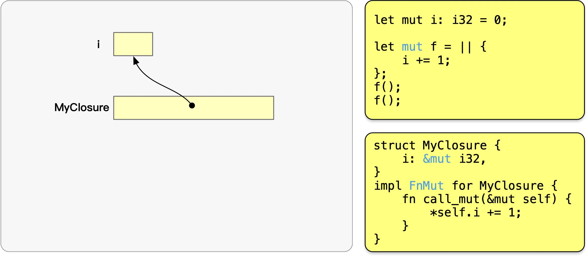

注意，在第一个代码片段中使用了 `mut` 去声明保存了可变闭包的变量 `f` ，`f` 必须是可变的，因为  `call_mut` 函数接收一个对 `self` 的可变引用，如果尝试把 `f` 改为不可变的，编译器将抛出错误信息。

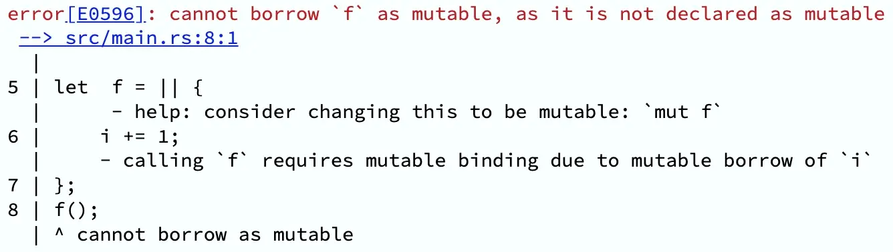

当你理解了其中的细节，错误信息就说的通了。错误信息的意思是说，调用该闭包需要一个可变借用。

最后一个闭包 trait 是 `Fn` trait 。下面的例子中，闭包内部简单地打印了 `message` 变量。

```rust
fn create_closure() {
    let msg = String::from("hello");
    
    let my_print = || {
       println!("{}", msg); 
    };
    
    my_print();  // hello
    my_print();  // hello
}
```

`println` 宏只获取参数的引用，因此 Rust 将在此处实现 `Fn` trait ，结构体内只有一个对堆字符串的引用。还要注意，`Fn` trait 的 `call` 方法需要一个对 `self` 的引用，因此可以多次调用该闭包，闭包内保存的变量也不必是可变的。

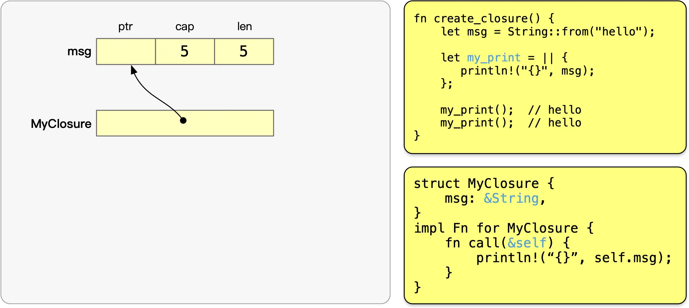

在下一个示例中，我们会使用和刚刚相同的闭包，但是相比于把它保存在变量中，我们直接把闭包返回。

```rust
fn create_closure() {
    let msg = String::from("hello");
    
    || {
       println!("{}", msg); 
    }
}
```

这种情况下，编译器将给出如下编译错误：被借用的字符串 `msg` 可能会超出当前函数的生命周期。

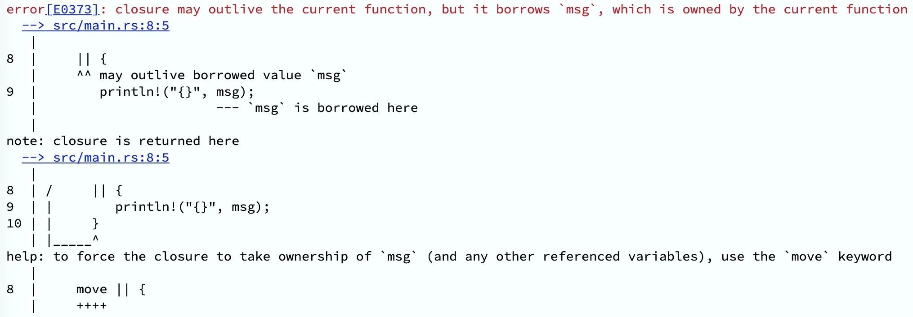

回想一下该闭包的结构体内存布局，闭包内只存储了对字符串的引用，我们在本教程一开始就知道了，当函数返回后，它的栈帧就会被释放，所以该闭包不能持有对其函数栈帧内存区域的引用。Rust 要求我们使用 `move` 关键字明确表示希望让闭包拿走它所用到的变量的所有权。

```rust
fn create_closure() {
    let msg = String::from("hello");
    
    move || {
       println!("{}", msg); 
    }
}
```

当使用 `move` 关键字后，该闭包对应的结构体内就不再是一个引用了，而是字符串本身。

```rust
struct MyClosure {
    msg: String,
}
impl Fn for MyClosure {
    fn call(&self) {
        println!(“{}”, self.msg);
    }
}
```

至此，我们见到的闭包还都只有一个成员，下面的例子展示了一个拿走两个对象（一个字符串，一个 `Vec` ）所有权的闭包。这也没啥特殊的，用于表示此闭包的结构体的内存布局将等效于字符串和 `Vec` 在栈上的表示方式——逐位并排放置。

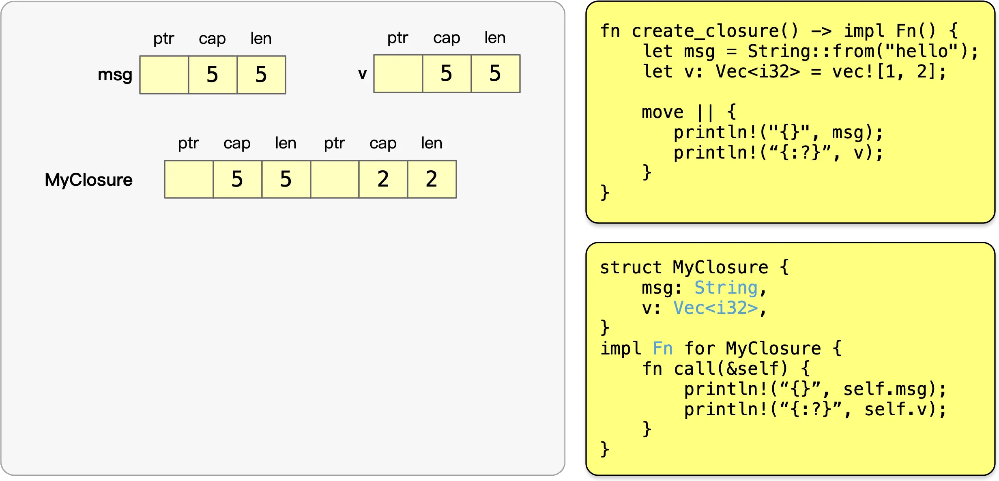

此模式在其它地方亦适用，例如异步生态中大量使用的 `Future` trait 。在内存中，编译器使用 Enum 表示实际对象，并为它实现 `Future` 方法，此教程不再深入讲解。

此至，针对 Rust 内存布局的所有讲解结束，希望对你理解 Rust 语言有所帮助！


-------
@兔子不咬人 2022-12-14