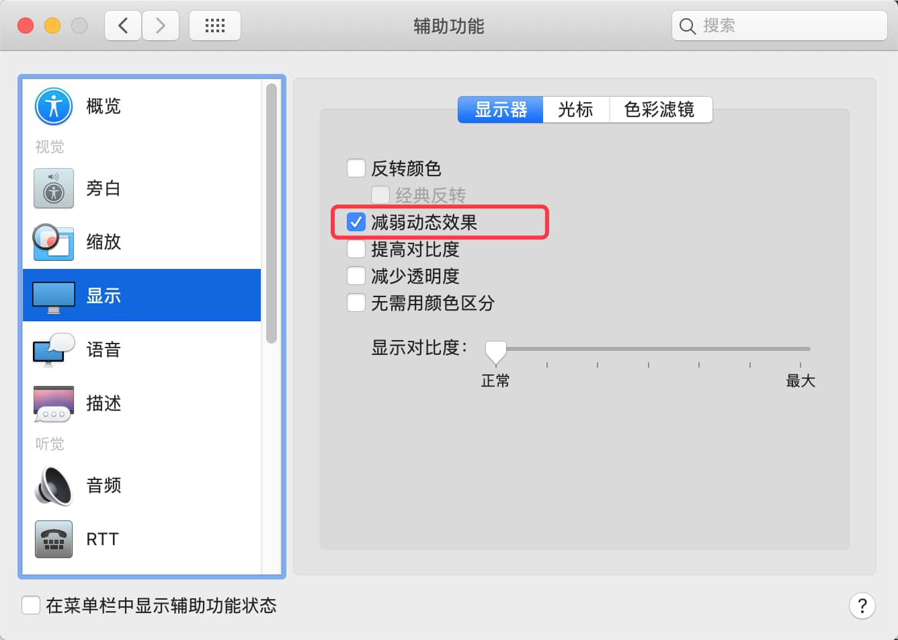
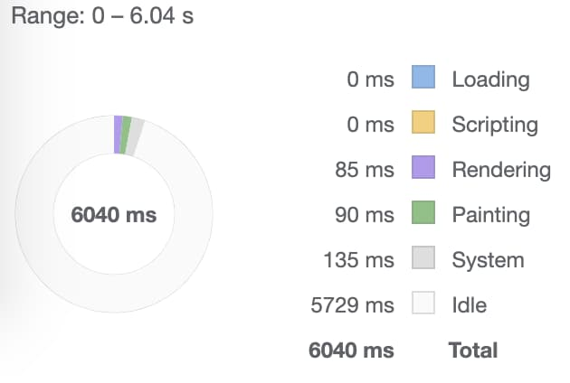

# Web 动画

## 总述

现代浏览器中，`transform` 和 `opacity` 拥有良好的动画性能，而处理其它动画时则需要保证 60 FPS 才能得到平滑的用户体验。

### 动画性能及帧频

在 Web 上展示动画的理想帧频是 60 FPS ，该帧频下动画会显得更加平滑。 Web 上的一帧是指更新并重新绘制屏幕时要做的所有任务的时间总合。如若每一帧不能够在 16.7ms (1000ms / 60 ≈ 16.7) 内完成，用户便会觉察到延迟的存在。

### 渲染管线

浏览器在网页中显示某些内容时，须依次经过以下步骤：

1. **计算样式( Style )**: 计算应用到元素上的样式。
2. **重排( Layout )**: 产生各个元素的形状和位置。
3. **重绘( Paint )**: 填充各元素的像素至图层( layer )中。
4. **合成( Composite )**: 将各图层绘制在屏幕上。

> Layout 在此场景下有时也译作“回流”；Composite 也译作“混合”。

这四个步骤被称为浏览器的 **渲染管线** 。当已经加载过的页面内容产生动画时，以上步骤会 **依次** 进行。例如，如果动画改变了重排，重绘及合成会继而执行。正因此，改变重排的代价比改变合成的代价更为昂贵。

**Layout**

重排时需要计算此次变更影响到的所有元素的位置和大小。例如改变 `<html>` 元素，则其所有子元素都会受影响。受到元素溢出的影响，改变下游树节点时，也可能导致从头开始进行重排计算。由可见元素所构成的树结构越大，重排计算的耗时越久。

**Paint**

[重绘](https://developers.google.com/web/updates/2018/09/inside-browser-part3#paint)
通常在渲染管线中最为耗时，它决定了元素按什么顺序绘制到屏幕上。现代浏览中的绘制工作大多在[软件光栅器](https://software.intel.com/content/www/us/en/develop/articles/software-vs-gpu-rasterization-in-chromium.html)中完成。

**Composite**

[合成](https://developers.google.com/web/updates/2018/09/inside-browser-part3#what_is_compositing)过程将页面分离出不同的图层，将页面外观相关的信息转化成像素(光栅化)，再将所有的层合成页面。

`opacity` 属性拥有独立的图层，改变其值可在合成阶段由 GPU 完成，因此基于它的动画消耗相对廉价。基于 Chromium 的浏览器和 WebKit 为所有设置了 CSS transition 和 `opacity` 的元素创建了独立的层。


> 深入了解：[GPU Animation: Doing It Right](https://www.smashingmagazine.com/2016/12/gpu-animation-doing-it-right/)

### 何为图层？

类似 Photoshop 的图层，浏览器将一些会受动画等影响的可变因素放置在独立的图层中，这样一来重新绘制时只需绘制该层而不再需要绘制所有内容，从而提升性能。

通常情况下浏览器已提供了良好的分层策略，如若不满足仍然可以自行创建图层。但自行创建图层会消耗更多的内存，如若设备资源紧张，这样做反而会加剧性能问题。另外，各层纹理需要加载至 GPU ，因此还要考虑 CPU 和 GPU 的带宽限制。

> 深入了解：[Layers and how to force them](https://dassur.ma/things/forcing-layers/).

### CSS 与 JavaScript 性能对比

不同于浏览器的主线程——可以进行样式计算、重排、重绘和 JavaScript 的执行——基于 CSS 的动画以及 [Web Animations](https://developer.mozilla.org/zh-CN/docs/Web/API/Web_Animations_API) 一般会在 *复合线程( compositor thread )* 中处理。这意味着如果主线程正在执行耗时任务，并不会打断这类动画的执行。

多数场景下，transform 和 opacity 的改变也在复合线程中进行。

任何触发了重绘或重排或二者的动画，都需要主线程参与完成。而不管是 CSS 还是 JavaScript 动画，与重绘或重排相比，其执行开销都微乎其微。


## CSS 动画

CSS 动画使元素逐渐从一种样式变为另一种样式。它由两个组件、一个描述动画的样式和一些关键帧组成，关键帧包含了元素在起止状态、中间状态所拥有的样式。

相对于传统脚本驱动的动画，CSS 动画有三个优势：

1. 易上手。处理简单动画场景时，甚至不需要会 JavaScript。
2. 运行效果更佳。可以利用跳帧等技术使动画表现的更平滑。
3. 性能更好。浏览器拥有更多动画序列的控制权，可以更好地优化性能，如降低不可见 Tab 中的动画更新频率。

### 设置动画

创建 CSS 动画时，使用 `animation` 属性或其子属性设置相应元素的样式。它只设置动画的时间、持续时长等，但不设置具体样式。具体样式在关键帧 `@keyframes` 中定义。

`animation` 的子属性包括：

* `animation-name` 指定相应的 @keyframes 名
* `animation-duration` 设定一个动画周期的时长
* `animation-timing-function` 设置动画在一个周期内的步进方式
* `animation-delay` 设置元素加载完成到动画开始前的延迟时间
* `animation-iteration-count` 设置动画的重复次数，可以设置为 `infinite` 表示无限循环
* `animation-direction` 设置动画方向，或是每次执行完改变方向
* `animation-fill-mode` 设置动画执行前后要应用的值
* `animation-play-state` 用于暂停或启动动画

### 关键帧

使用 @keyframes 定义动画展现过程。每一帧描述了动画序列中特定时间点元素所拥有的样式。关键帧使用 [百分比](../css_summary_2022/#百分比) 来指定动画发生的时间点。`0%` 表示动画的第一时刻（别名 `from`），`100%` 表示动画的最终时刻（别名 `to`）。

<div class="wraper">
	<p class="demo-1">这是一个示例</p>
</div>

```css{8,11,16}
.animation {
	position: absolute;
	animation-duration: 3s;
  	animation-name: keyframes_demo;
  	animation-iteration-count: infinite;
}
@keyframes keyframes_demo {
  from {
    left: 10px;
  }
  25% {
    left: 200px;
    color: red;
    font-size: 1.5rem;
  }
  to {
  	left: 10px;
  }
}
```

可以使用 `animation-direction: alternate` 使动画来回反复移动：

<div class="wraper">
	<p class="demo demo-2">这是一个示例</p>
</div>

可以指定多个动画：

<div class="wraper">
	<div class="demo-3"></div>
</div>

```css
.animation {
	animation-name: changeColor, moveRight;
	animation-duration: 4s;
	animation-iteration-count: infinite;
}
```

### 动画事件

需要先绑定监听事件，再通过增加 class 来触发动画。标准代码格式：

```js
var element = document.getElementById('animatedEl')
element.addEventListener('animationstart', listener, false)
element.addEventListener('animationend', listener, false)
element.addEventListener('animationiteration', listener, false)

element.className = 'moveRight'
```

<div class="wraper">
	<div id="animatedEl" class="demo-event"></div>
</div>
<div style="height:150px;padding:10px;background-color:#EEE;">
	<button :style="isButtonHidden?'display:none':''" @click="startEvent">开始执行动画</button>
	<div v-for="i in msg">{{ i }}</div>
</div>

其中，动画设置为：

```css
.moveRight {
	animation-name: moveRight;
	animation-duration: 4s;
	animation-iteration-count: 4;
}
```

> 动画相关各属性更详细的介绍可以轻易从网络获得，此处不再做总结。


### 动画减弱

使用媒体查询特性 `prefers-reduced-motion` 可以检测用户的系统是否开启了动画减弱功能。

```css
.animation {
  animation: vibrate 0.3s linear infinite both;
}

@media (prefers-reduced-motion: reduce) {
  .animation {
    animation: none;
  }
}
```

此功能从 Chrome 74 开始支持。以 MOC OS 为例，开启动画减弱功能：



此时本页中的 3D 球体示例将不再有缩放闪动的动画效果。

## 高性能 CSS 动画

以下是目前具有良好浏览器兼容性的 CSS 动画属性：

* [`transform`](https://developer.mozilla.org/docs/Web/CSS/transform#Browser_compatibility)
* [`opacity`](https://developer.mozilla.org/docs/Web/CSS/opacity#Browser_compatibility)
* [`will-change`](https://developer.mozilla.org/docs/Web/CSS/will-change#Browser_compatibility)

### 移动元素

如若要移动元素，可以设置 `transform` 属性的值为关键字 `translate` 或 `rotation`，例如：

```css
.animate {
  animation: slide-in 0.7s both;
}

@keyframes slide-in {
  0% {
    transform: translateY(-1000px);
  }
  100% {
    transform: translateY(0);
  }
}
```

或者是设置元素的旋转动画：

```css
.animate {
  animation: rotate 0.7s ease-in-out both;
}

@keyframes rotate {
  0% {
    transform: rotate(0);
  }
  100% {
    transform: rotate(360deg);
  }
}
```

### 改变元素大小

如若要改变元素的大小，可以设置 `transform` 属性的值为关键字 `scale`，例如：

```css
.animate {
  animation: scale 1.5s both;
}

@keyframes scale {
  50% {
    transform: scale(0.5);
  }
  100% {
    transform: scale(1);
  }
}
```

### 改变元素可见性

如若要显示或隐藏元素，使用 `opacity` 属性：

```css
.animate {
  animation: opacity 2.5s both;
}

@keyframes opacity {
  0% {
    opacity: 1;
  }
  50% {
    opacity: 0;
  }
  100% {
    opacity: 1;
  }
}
```

> 一个有趣的链接：[Animista](https://animista.net/)

### 其它属性

当使用 `transform` 和 `opacity` 以外的其它 CSS 属性作为动画时，可通过 [CSS Triggers](https://csstriggers.com/) 查阅各属性在 *渲染管线* 中产生的影响，如非必要，要避免使用触发重排或重绘的属性。

> 注意：使用触发重排或重绘的属性，通常会导致动画不再平滑或高性能。

### 创建独立的图层

前文已提及，独立的图层可以减少多余的重绘操作，可以使用 [`will-change`](https://developer.mozilla.org/docs/Web/CSS/will-change) 属性创建独立的图层。它是改善动画性能的最后保障手段，性能问题不到糟糕透顶的程度一般不要使用。

该属性可被用在任意 CSS 选择器中：

```css
body > .sidebar {
  will-change: transform;
}
```

在 IE 等不支持该属性的浏览器中，可以使用 `transform: translateZ(0)` 开启独立的图层。其原理是使用 3D 渲染，强制开启 GPU 硬件加速。

> 深入了解：[Everything You Need To Know About The CSS `will-change` Property](https://dev.opera.com/articles/css-will-change-property/).


### 调试

可以使用 Chrome 开发者工具针对性能较差的动画进行调试。

#### 1. 检查动画是否触发了重排

使用 `transform` 以外的方式移动元素时，可能导致动画性能较差。下面的例子比较了使用 `top` 和 `left` 与使用 `transform` 做移动之间的区别：

<CodeGroup>
<CodeGroupItem title="使用 top 和 left" active>

```css{10-11}
.box {
  position: absolute;
  top: 10px;
  left: 10px;
  animation: move 3s ease infinite;
}

@keyframes move {
  50% {
     top: calc(90vh - 160px);
     left: calc(90vw - 200px);
  }
}
```

</CodeGroupItem>
<CodeGroupItem title="使用 translate">

```css{10}
.box {
  position: absolute;
  top: 10px;
  left: 10px;
  animation: move 3s ease infinite;
}

@keyframes move {
  50% {
     transform: translate(calc(90vw - 200px), calc(90vh - 160px));
  }
}
```

</CodeGroupItem>
</CodeGroup>

* [使用 top 和 left](https://animation-with-top-left.glitch.me/).
* [使用 translate](https://animation-with-transform.glitch.me/).

使用 Chrome 开发者工具：

1. 打开 **Performance** 面板。
2. 记录动画运行时的性能。
1. 查看 **Summary** 页签。

**Summary** 页签中的  **Rendering** 若为非零的值，说明动画导致了重排。




#### 2. 检查动画是否丢帧

使用 Chrome 开发者工具：

1. 打开 **Rendering** 页签。
2. 勾选：


3. 观察动画的运行：


#### 3. 检查动画是否触发了重绘

重绘过程通常很耗性能，而且不容易通过 CSS 属性直观地看出来。使用 Chrome 开发者工具检测哪些区域产生了重绘：

1. 打开 **Rendering** 页签。
2. 选择 **Paint Flashing**：


3. 观察屏幕中产生重绘的高亮区域。

如若需要深入追踪是否某个属性引起了性能问题，可通过 paint profiler 面板进行。

## CSS 动画示例


### 男巫

[示例：使用 CSS 绘制的男巫](https://zhangqiang.work/worship/web-demo/css3/wizard)

我捕获了大约 10s 的动画过程，可以看到，该动画不会触发任何重排及重绘操作：


以其中的三角形物体为例，首先通过 `::after` 伪元素绘制其形状：

```css
.triangle {
    position: absolute;
    bottom: -62px;
    left: -10px;
    width: 110px;
    height: 110px;
    border-radius: 50%;
}

.triangle::after {
    content: "";
    position: absolute;
    top: 0;
    right: -10px;
    width: 0;
    height: 0;
    border-style: solid;
    border-width: 0 28px 48px 28px;
    border-color: transparent transparent #89beb3 transparent;
}
```

然后增加动画：

```css
animation: path_triangle 10s ease-in-out infinite;
```

在 Chome 开发者工具的 Styles 面板中可以看到其动画的关键帧，它们是使用 `transform` 产生的动画，该属性不会产生重排和重绘。

```css
@keyframes path_triangle {
  0% {
    transform: translateY(0);
  }
  10% {
    transform: translateY(-172px) translatex(10px) rotate(-10deg);
  }
  55% {
    transform: translateY(-172px) translatex(10px) rotate(-365deg);
  }
  58% {
    transform: translateY(-172px) translatex(10px) rotate(-365deg);
  }
  63% {
    transform: rotate(-360deg);
  }
}
```

其它部分也是用了类似的动画技术，因而很平滑。

### 闪动的圆

该动画可以在网页中作为“注意”点来使用：

<div class="wraper circle">
	<div class="pulsating-circle"></div>
</div>

首先使用样式名为 `pulsating-circle` 的 `<div>` 来标记该圆的位置（但并不真正画圆），此示例使其 [水平垂直居中](../centering_in_css/README.md) ：

```css
.pulsating-circle {
    position: absolute;
    left: 50%;
    top: 50%;
    transform: translateX(-50%) translateY(-50%);
    width: 30px;
    height: 30px;
}
```

真正的圆和相应动画使用 `::before` 及 `::after` 实现。 `::before` 元素绘制了外层的圆，并使用动画 `pulse-ring` ，该动画改变了 `transform: scale` 和 `opacity` ：

```css{18,21}
.pulsating-circle::before {
    content: '';
    position: relative;
    display: block;
    width: 300%;
    height: 300%;
    box-sizing: border-box;
    margin-left: -100%;
    margin-top: -100%;
    border-radius: 45px;
    background-color: #01a4e9;
    /* animation-timing-function 使用的是 cubic-bezier 函数 */
    animation: pulse-ring 1.25s cubic-bezier(0.215, 0.61, 0.355, 1) infinite;
}

@keyframes pulse-ring {
  0% {
    transform: scale(0.33);
  }
  80%, 100% {
    opacity: 0;
  }
}
```

内层白色的圆使用 `::after` 伪元素创建，	动画 `pulse-dot` 同样使用 `transform: scale` 实现其闪动效果：

```css
.pulsating-circle::after {
  content: '';
  position: absolute;
  left: 0;
  top: 0;
  display: block;
  width: 100%;
  height: 100%;
  background-color: white;
  border-radius: 15px;
  box-shadow: 0 0 8px rgba(0, 0, 0, 0.3);
  animation: pulse-dot 1.25s cubic-bezier(0.455, 0.03, 0.515, 0.955) -0.4s infinite;
}

@keyframes pulse-dot {
  0% {
    transform: scale(0.8);
  }
  50% {
    transform: scale(1);
  }
  100% {
    transform: scale(0.8);
  }
}
```

### 3D 球形

一个看似复杂，原理却很简单的例子：

<div class="wraper">
	<div class="sphere">
		<div v-for="i in 12" class="plane" 
			:style="`transform: rotateY(${i*15}deg)`">
			<div v-for="k in 36" class="spoke"
				:style="`transform: rotateZ(${k}0deg);`">
				<div class="dot"></div>
			</div>
		</div>
	</div>
</div>

它只是用到了大量的元素组合成了该效果。首先是包裹元素，使用了 3D 旋转效果 `transform: rotate3d` ：

```css
.sphere-wrapper {
  transform-style: preserve-3d;
  width: 300px;
  height: 300px;
  position: relative;
  animation: rotate3d 10s linear infinite;
}

@keyframes rotate3d {
  0% {
    transform: rotate3d(1, 1, 1, 0deg);
  }
  25% {
    transform: rotate3d(1, 1, 1, 90deg);
  }
  50% {
    transform: rotate3d(1, 1, 1, 180deg);
  }
  75% {
    transform: rotate3d(1, 1, 1, 270deg);
  }
  100% {
    transform: rotate3d(1, 1, 1, 360deg);
  }
}
```

<div class="wraper">
	<div class="sphere" style="background-color: var(--c-brand)"></div>
</div>

内部的所有点，通过 `plane` 和 `spoke` 元素，排列在不同的平面上，然后再对它们设置旋转动画：

```css
.dot {
  animation: pulsate 0.5s infinite 0.83333333s alternate both;
  background-color: #55ffee;
}

@keyframes pulsate {
  0% {
    transform: rotateX(90deg) scale(0.3) translateZ(20px);
  }
  100% {
    transform: rotateX(90deg) scale(1) translateZ(0px);
  }
}
```


## Web Animations API

Web Animations API 使用 JavaScript 访问浏览器动画引擎，是 CSS Animations 和 CSS Transitions 的底层实现。使用它可以避免直接往元素中增加 CSS 属性等重 DOM 技术。

### 编写动画

以此 CSS 动画为例：

```css
.web-animations {
  animation: tumbling infinite 3s linear;
}

@keyframes tumbling {
  0% {
    color: #000;
    transform: rotate(0);
  }
  30% {
    color: red;
  }
  100% {
    color: #000;
    transform: rotate(360deg);
  }
}
```

<div class="wraper">
  <div class="web-animations">Web Animations API</div>
</div>

使用 Web Animations API 首先要创建 [Keyframe 对象](https://developer.mozilla.org/en-US/docs/Web/API/Web_Animations_API/Keyframe_Formats) :


```javascript
let tumbling = [
  { transform: 'rotate(0)', color: '#000' },
  { color: 'red', offset: 0.3 },
  { transform: 'rotate(360deg)', color: '#000' }
];
```

不同于 CSS 的是，Web Animations API 并不需要指定每个关键帧的百分比。该 API 默认自动均分动画中的各关键帧（ 例如三个关键帧，则中间那个即为 50% ）。也可通过 `offset` 手动指定。目前该 API 要求至少包含两个关键帧。

之后便要创建动画时间相关的属性：

```js
let timing = {
  duration: 3000,
  iterations: Infinity
}
````

Web Animations API 和 CSS 动画在技术细节上存在很多差异，如时间 3000 表示的是毫秒数，使用 `iterations` 而不是 `iteration-count`，使用 JavaScript 关键字 `Infinity` 而不是字符串 `'infinite'` 。默认的 timing-function 是 `linear` 而 CSS 中是 `ease` 。

最后就是将其综合起来：

```js
document.getElementById('someEl').animate(
  tumbling,
  timing
)
````

若只指定动画持续时间，可以：

```js
document.getElementById('someEl').animate(
  [
    ...
  ], 3000)
````

### 操控动画

只是设计动画效果的话，就和 CSS 动画没区别了。Web Animations API 的更大价值在于操控动画。

使用 `Element.animate()` 创建完动画后便会立即执行，为了阻止这种行为，可以先将其暂停：

```js
someAnimation.pause();
```

之后再在需要的时候启动动画：

```js
someAnimation.play();
```

另外还有：

* `Animation.finish()` 直接结束当前动画
* `Animation.cancel()` 结束当前动画并取消所有动画效果
* `Animation.reverse()` 反转动画播放方向

先看 `playbackRate`， 将其设为负值可导致动画反向播放：

```js
someAnimation.playbackRate = -1
someAnimation.play();
```

<div class="wraper">
  <div id="web-playback1" class="web-playback">playbackRate = 1</div>
  <div id="web-playback2" class="web-playback">playbackRate = 2</div>
  <div id="web-playback3" class="web-playback">playbackRate = -1</div>
</div>

<button @click="startWebAPI">play( )</button>

使用 `updatePlaybackRate()` 可改变其值：

```js
var goFaster = function () {
  someAnimation.updatePlaybackRate(someAnimation.playbackRate * 1.1);
}
````


<script>
export default {
  data() {
    return {
    	msg: [],
    	isButtonHidden: false
    }
  },
  mounted () {
  	let el1 = document.getElementById('web-playback1')
    this.animation1 = el1.animate([
        {transform: 'translateX(300px)'}
      ], 3000)
    this.animation1.pause()

    let el2 = document.getElementById('web-playback2')
    this.animation2 = el2.animate([
        {transform: 'translateX(300px)'}
      ], 3000)
    this.animation2.playbackRate = 2
    this.animation2.pause()

    let el3 = document.getElementById('web-playback3')
    this.animation3 = el3.animate([
        {transform: 'translateX(300px)'}
      ], 3000)
    this.animation3.playbackRate = -1
    this.animation3.pause()
    
  },
  methods: {
  	listener (event) {
  		console.log(event)
  		this.msg.push('当前事件：' + event.type + ' , 累计耗时：' + event.elapsedTime + 's')
  	},
  	startEvent () {
  		this.isButtonHidden = true
			var element = document.getElementById('animatedEl')
			element.addEventListener('animationstart', this.listener, false)
			element.addEventListener('animationend', this.listener, false)
			element.addEventListener('animationiteration', this.listener, false)
			element.className = 'demo-event moveRight'
  	},
    startWebAPI () {
      this.animation1.play()
      this.animation2.play()
      this.animation3.play()
    }
  }
}
</script>

<style scoped>
.wraper {
	position: relative;
	min-height: 100px;
}
.demo, .demo-1 {
	position: absolute;
	animation-duration: 3s;
	animation-name: keyframes_demo;
	animation-iteration-count: infinite;
}
.demo-2 {
	animation-direction: alternate;
}
.demo-3 {
	position: absolute;
	animation-name: changeColor, moveRight;
	animation-duration: 4s;
	animation-iteration-count: infinite;
	width: 70px;
	height: 70px;
	border-radius: 50%;
}
.demo-event {
	position: absolute;
	width: 70px;
	height: 70px;
	border-radius: 50%;
	background-color: var(--c-brand);
}
.demo-event.moveRight {
	animation-name: moveRight;
	animation-duration: 4s;
	animation-iteration-count: 4;
}

@keyframes keyframes_demo {
	from {
		left: 10px;
	}
	25% {
		left: 200px;
		color: red;
		font-size: 1.5rem;
	}
	to {
		left: 400px;
	}
}
@keyframes changeColor {
	from {
    	background-color: red;
  	}
	to {
		background-color: green;
	}
}
@keyframes moveRight {
	from {
  	left: 10px;
	}
	to {
		left: 300px;
	}
}
img {
	width: 400px;
}

.wraper.circle {
	height: 120px;
}
.pulsating-circle {
    position: absolute;
    left: 50%;
    top: 50%;
    transform: translateX(-50%) translateY(-50%);
    width: 30px;
    height: 30px;
}
.pulsating-circle::before {
    content: '';
    position: relative;
    display: block;
    width: 300%;
    height: 300%;
    box-sizing: border-box;
    margin-left: -100%;
    margin-top: -100%;
    border-radius: 45px;
    background-color: var(--c-brand);
    animation: pulse-ring 1.25s cubic-bezier(0.215, 0.61, 0.355, 1) infinite;
}
@keyframes pulse-ring {
  0% {
    transform: scale(0.33);
  }
  80%, 100% {
    opacity: 0;
  }
}
.pulsating-circle::after {
  content: '';
  position: absolute;
  left: 0;
  top: 0;
  display: block;
  width: 100%;
  height: 100%;
  background-color: white;
  border-radius: 15px;
  box-shadow: 0 0 8px rgba(0, 0, 0, 0.3);
  animation: pulse-dot 1.25s cubic-bezier(0.455, 0.03, 0.515, 0.955) -0.4s infinite;
}
@keyframes pulse-dot {
  0% {
    transform: scale(0.8);
  }
  50% {
    transform: scale(1);
  }
  100% {
    transform: scale(0.8);
  }
}

.sphere {
  transform-style: preserve-3d;
  width: 300px;
  height: 300px;
  position: relative;
  animation: rotate3d 10s linear infinite;
}

@keyframes rotate3d {
  0% {
    transform: rotate3d(1, 1, 1, 0deg);
  }
  25% {
    transform: rotate3d(1, 1, 1, 90deg);
  }
  50% {
    transform: rotate3d(1, 1, 1, 180deg);
  }
  75% {
    transform: rotate3d(1, 1, 1, 270deg);
  }
  100% {
    transform: rotate3d(1, 1, 1, 360deg);
  }
}
.plane {
    position: absolute;
    transform-style: preserve-3d;
    top: 0;
    right: 0;
    bottom: 0;
    left: 0;
}
.spoke {
    transform-origin: 0 0;
    transform-style: preserve-3d;
    position: absolute;
    left: 50%;
    top: 50%;
    height: 150px;
    width: 0px;
}
.dot {
    position: absolute;
    width: 6px;
    height: 6px;
    border-radius: 50%;
    background-color: var(--c-brand);
    left: -3px;
    top: 100%;
    transform: rotateX(90deg);
  	animation: pulsate 0.5s infinite 0.83333333s alternate both;
}

@keyframes pulsate {
  0% {
    transform: rotateX(90deg) scale(0.3) translateZ(20px);
  }
  100% {
    transform: rotateX(90deg) scale(1) translateZ(0px);
  }
}
@media (prefers-reduced-motion: reduce) {
  .dot {
    animation: none;
  }
}

.web-animations {
  margin: 40px;
  display: inline-block;
  animation: tumbling infinite 3s linear;
}

@keyframes tumbling {
  0% {
    color: #000;
    transform: rotate(0);
  }
  30% {
    color: red;
  }
  100% {
    color: #000;
    transform: rotate(360deg);
  }
}

.web-playback {
  background-color: var(--c-brand);
  height: 40px;
  width: 150px;
  color: #FFF;
  margin: 10px 0;
}
</style>

