# 几幅漫画介绍 WebAssembly

（PS：本文根据网络译文作校对）

最近，WebAssembly 在 JavaScript 圈非常的火！人们都在谈论它多么多么快，怎样怎样改变 Web 开发领域。但是没有人讲他到底为什么那么快。在这篇文章里，我将会帮你了解 WebAssembly 到底为什么那么快。

第一，我们需要知道它到底是什么！WebAssembly 是一种可以使用非 JavaScript 编程语言编写代码并且能在浏览器上运行的技术方案。

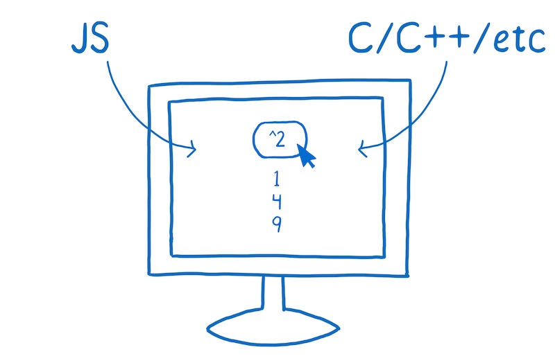

当大家谈论起 WebAssembly 时，首先想到的就是 JavaScript。现在，我没有必须在 WebAssembly 和 JavaScript 中选一个的意思。实际上，我们期待开发者在一个项目中把 WebAssembly 和 JavaScript 结合使用。但是，比较这两者是有用的，这对你了解 WebAssembly 有一定帮助。

## 一点点性能历史

1995 年 JavaScript 诞生。它的设计时间非常短，前十年发展迅速。

紧接着浏览器厂商们就开始了更多的竞争。

2008年，人们称之为浏览器性能大战的时期开始了。很多浏览器加入了即时编译器，又称之为JITs。在这种模式下，JavaScript 在运行的时候，JIT 选择模式然后基于这些模式使代码运行更快。

这些 JITs 的引入是浏览器运行代码机制的一个转折点。所有的突然之间，JavaScript 的运行速度快了10倍。

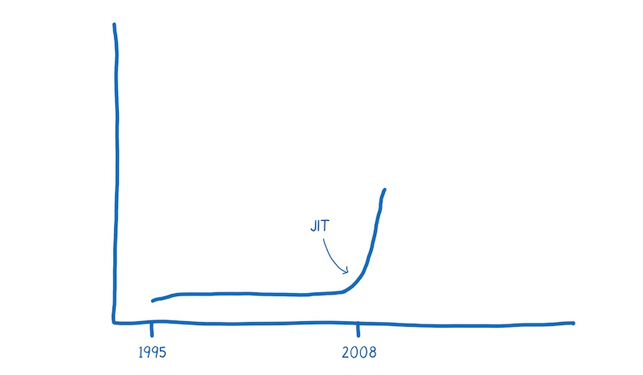

随着这种改进的性能，JavaScript 开始被用于意想不到的事情，比如使用 Node.js 和 Electron 构建应用程序。

现在 WebAssembly 可能是的另一个转折点。

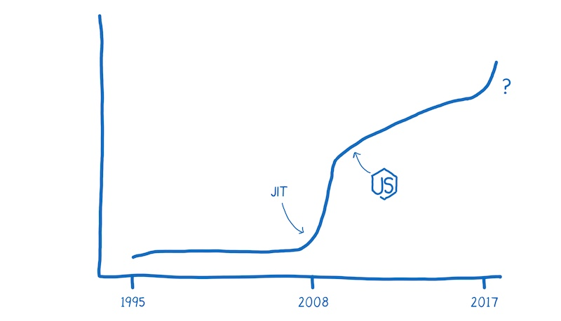

在我们没有搞清楚 JavaScript 和 WebAssembly 之间的性能差前，我们需要理解 JS 引擎所做的工作。

## JavaScript 如何在浏览器中运行

作为一个开发人员，在将 JavaScript 添加到页面时，你有一个目标并遇到了一个问题。

* **目标**：你想要告诉计算机做什么
* **问题**：你和计算机使用不通的语言。

你说的是人类的语言，计算机说的是机器语言。尽管你不认为 JavaScript 或者其他高级语言是人类语言，但事实就是这样的。它们的设计是为了让人们认知，而不是为机器设计的。

所以 JavaScript 引擎的工作就是把你的人类语言转化成机器所理解的语言。

我想到电影《Arrival》，这就像人类和外星人进行交谈。


在这部电影中，人类语言不能从逐字翻译成外星语言。他们的语言反映出两种对世界不同的认知。人类和机器也是这样。

所以，怎么进行翻译呢？

在编程中，通常有两种翻译方法将代码翻译成机器语言。你可以使用解释器或者编译器。

使用解释器时，翻译的过程基本上是一行一行及时生效的。

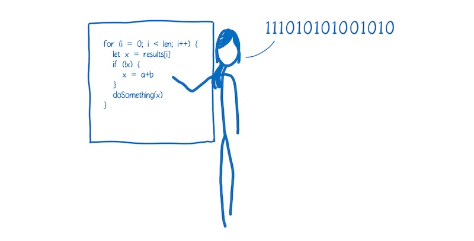

编译器则是另外一种工作方式——它在执行前先进行翻译。


### 解释器的利弊

解释器很快地获取代码并执行。不需要在可以执行代码的时候知道全部的编译步骤。因此，解释器看起来与 JavaScript 有着天然的契合。web 开发者能够立即得到反馈很重要。

这也是浏览器最开始使用 JavaScript 解释器的原因之一。

但是当运行相同代码的时候，使用解释器的弊端显现出来。比如，你执行了一个循环，然后你就会一遍又一遍地做同样的事情。

### 编译器的利弊

编译器则有相反的效果。在程序开始的时候，它可能需要稍微多一点的时间来理解整个编译的步骤。但当运行循环的时候它会更快，因为它不需要重复地去翻译每一次循环里的代码。

作为一个可以摆脱解释器低效率的方法——解释器必须在每次循环访问时不断地重新转换代码——浏览器开始将编译器引入。

不同浏览器的编译器实现稍有不同，但是基本目的是相同的。它们给 JavaScript 引擎添加了一个新的部分，称为**监视器 Monitor**（也称为**分析器 Profiler**）。监视器在 JavaScript 运行时监控代码，并记录代码片段运行的次数以及使用了那些数据类型。

如果相同的代码行运行了几次，这段代码被标记为 `warm`. 如果运行次数比较多，就被标记为 `hot`.

标记为 `warm` 的代码会被扔给基础编译器，只能提升一点点的速度。标记为 `hot` 的代码则被扔给优化编译器，提升更多的速度。

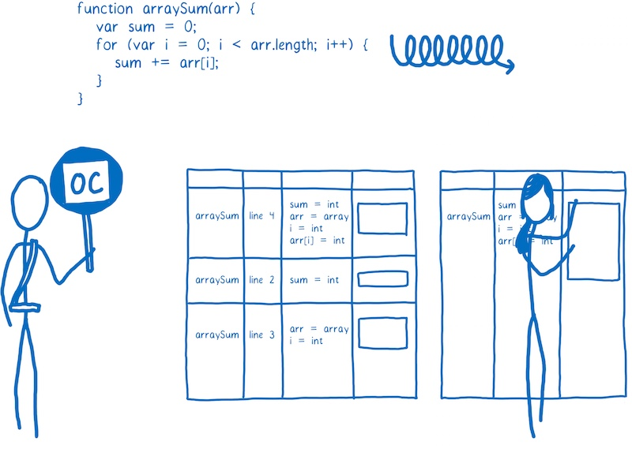

了解更多，可以读 [full article on just-in-time compiling](https://hacks.mozilla.org/2017/02/a-crash-course-in-just-in-time-jit-compilers/) .

## 耗时比较：JavaScript VS WebAssembly

这张图大致给出了现今一个程序的启动性能，目前 JIT 编译器在浏览器中很常见。

> 该图显示了 JS 引擎运行程序花费的时间。图片表明 JS 引擎做各个任务花费的时间取决于页面中的 JavaScript 正在做什么事情。该数据并不是平均值，但我们可以用它在心理构建一个大概的模型。

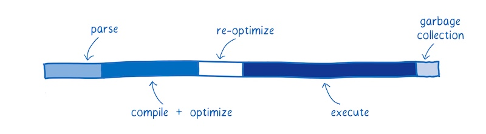


每块显示了花费在特定任务上的时间。
* Parsing - 将源码转换成解释器可以运行的东西所花的时间。
* Compiling + optimizing - 花费在基础编译和优化编译上的时间。有一些优化编译的工作不在主线程中进行，所以此处并不包括这些时间。
* Re-optimizing - 当预先编译优化的代码不能被优化的情况下，JIT 将这些代码重新优化，如果不能重新优化那么就交给基础编译去做。这个过程叫做重新优化。
* Execution - 执行代码的过程
* Garbage collection - 清理内存的时间

有件重要的事情要注意：这些任务不是在离散的块中或以特定的序列执行，相反，它们将被交叉执行。代码解析，代码执行，代码编译，又是一些代码解析，又一些代码执行，等等。

这种交叉执行对早期 JavaScript 的性能有很大的帮助，早期的 JavaScript 的执行就像下图一样：

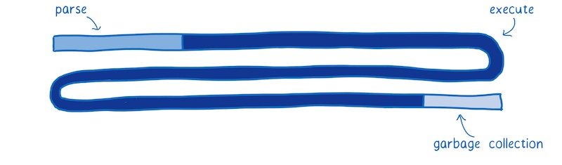

一开始，当只有一个解释器运行 JavaScript 时，执行速度相当缓慢。JITs 的引入，大大提升了执行效率。

监视和编译代码的开销是需要权衡的。如果 JavaScript 开发人员一直按照相同的方式编写 JavaScript，解析和编译时间将会很少。然而性能的提升使开发人员能够创建更大的 JavaScript 应用程序。

这意味着还有改进的余地。

下面是 WebAssembly 和经典 web 应用的比较。

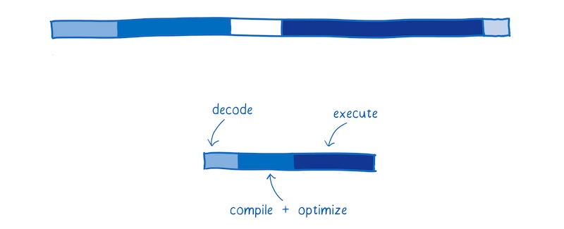

浏览器的 JS 引擎有轻微的不同。我将基于 SpiderMonkey 来讲。

### 获取资源

这部分没有展示在图上，但是从服务器获取文件是会消耗时间的。

下载与 JavaScript 等效的 WebAssembly 文件需要更少的时间，因为它的体积更小。WebAssembly 被设计为更小的体积，并可以以二进制形式表示。

即使使用 gzip 压缩的 JavaScript 文件很小，但 WebAssembly 中的等效代码可能更小。

所以说，下载资源的时间会更少。在网速慢的情况下更能显示出效果来。

### 解析

JavaScript 源码一旦被下载到浏览器，源代码将被解析为抽象语法树（AST）。

通常浏览器解析源码的过程是惰性的，浏览器首先会解析他们真正需要的东西，没有被即时调用的函数只会被创建成存根。

在这个过程中，AST被转换为该 JS 引擎的中间表示（称为字节码）。

相反，WebAssembly 不需要被转换，因为它已经是字节码了。它仅仅需要被解码并确定没有任何错误。

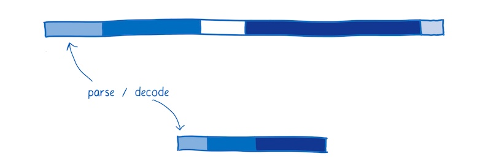

### 编译 + 优化

如前所述，JavaScript 是在执行代码期间编译的。因为 JavaScript 是动态类型语言，同一份代码在多次执行中有可能因为代码里含有不同类型的数据而被重新编译。这会消耗时间。

相反，WebAssembly 与机器代码更接近。例如，类型是程序的一部分。以下是其速度更快的一些原因：
* 在编译经过优化后的代码时，编译器不再需要花费时间去运行代码并观察代码中的数据类型。
* 编译器不再需要为同一份代码的不同数据类型而编译不同版本

更多的优化在 LLVM 最前面就已经完成了。所以编译和优化的工作很少。


### 重新优化

有时 JIT 会抛弃一份已优化的代码，然后重新优化。

JIT 基于运行代码的假设不正确时，会发生这种情况。例如，当进入循环的变量与先前的迭代不同时，或者在原型链中插入新函数时，会发生重新优化。

在 WebAssembly 中，类型是明确的，因此 JIT 不需要根据运行时收集的数据对类型进行假设。这意味着它不必经过重新优化的周期。


### 执行

尽可能编写执行性能更好的 JavaScript. 为此，你可能需要知道 JIT 是如何做优化的。

然而，大多数开发者并不知道 JIT 的内部原理。即使是那些了解 JIT 内部原理的开发人员，也很难写出最佳实现。很多时候，人们为了使代码更易于阅读（例如：将常见任务抽象为跨类型工作的函数）会阻碍编译器优化它们。

正因如此，执行 WebAssembly 代码通常更快。有些必须用在 JavaScript 上的优化不需要用在 WebAssembly 上。

另外，WebAssembly 是为编译器设计的。意思是，它是专门给编译器来阅读，而不是当做编程语言让程序员去写的。

由于程序员不需要直接编程，WebAssembly 提供了一组更适合机器的指令。根据代码所做的工作不同，这些指令的运行速度可能在 10％ 到 800％ 之间。

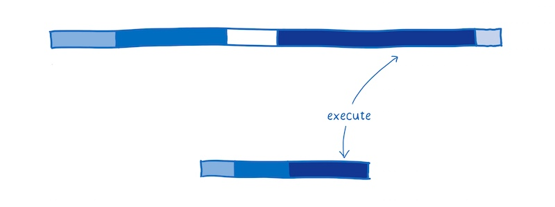

### 垃圾回收

在 JavaScript 中，开发者不需要担心内存中无用变量的回收问题。JS 引擎使用垃圾回收器来自动进行垃圾回收处理。

这对于控制性能可能并不是一件好事，因为你不能控制垃圾回收时机，垃圾回收器可能在非常重要的时间去工作，从而影响性能。

现在，WebAssembly 根本不支持垃圾回收。内存是手动管理的（就像 C/C++）。虽然这可能让开发者编程更困难，但它的确提升了性能。

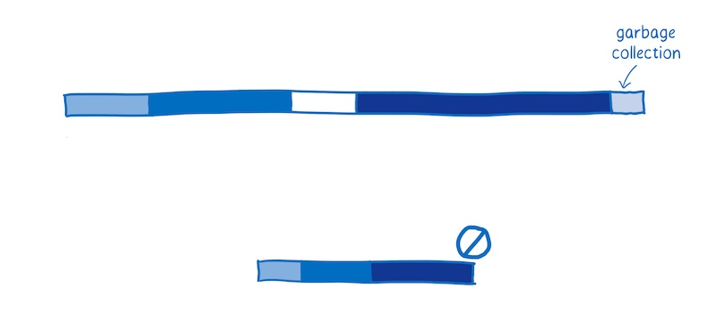

总的来说，以上是大多情况下执行相同任务时 WebAssembly 胜过 JavaScript 的原因。

在某些情况下，WebAssembly 不能像预期的那样执行，另外还有一些使其更快的变更。我在另一篇文章中更深入地介绍了这些[未来的功能](https://hacks.mozilla.org/2017/02/where-is-webassembly-now-and-whats-next/)。

## WebAssembly 是如何工作的

现在，您了解了开发人员为什么对 WebAssembly 感到兴奋，让我们来看看它是如何工作的。

当我谈到上面的 JIT 时，我谈到了与机器的沟通像与外星人沟通。


我现在想看看这个外星人的大脑如何工作 —— 机器的大脑如何解析和理解交流内容。

该大脑一部分专注于思考，例如算术和逻辑，另一部分提供短期记忆，还有一部分提供长期记忆。

这些不同的部分都有名字：
* 负责思考的部分是**算术逻辑单元**（ALU）。
* 短期储存由**寄存器**（Registers）提供。
* 长期储存由**随机存储器**（或RAM）提供。

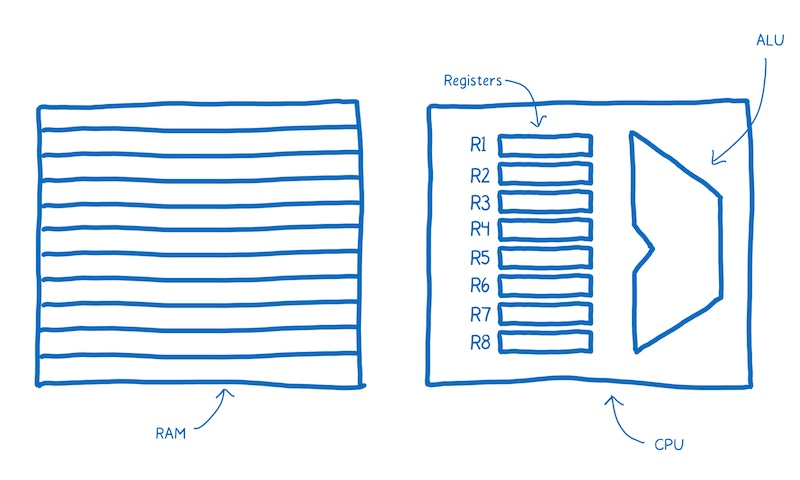

机器码中的语句被称为指令。

当一条指令进入大脑时会发生什么？它被拆分成了多个部分以表示不同含义。

被拆分成的多个部分分别进入不同的大脑单元进行处理，这也正是拆分指令所依赖的方式。

例如，大脑从机器码中取出 4-10 位，并将它们发送到 ALU。ALU 进行计算，它根据 0 和 1 的位置来确定是否需要将两个数相加。

这个块被称为“操作码”，因为它告诉 ALU 执行什么操作。

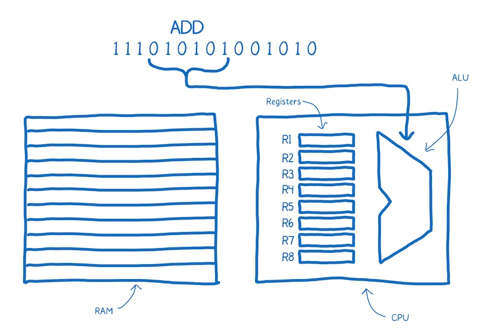

然后大脑会拿后面的两个块来确定它所要操作的数。这两个块对应的是寄存器的地址。

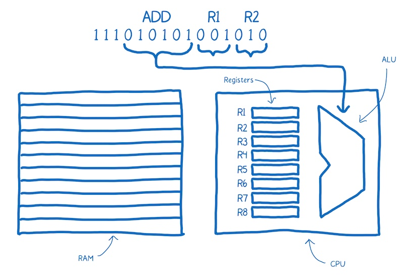

请注意添加在机器码上面的标注（ADD R1 R2），这使我们更容易了解发生了什么。这就是汇编，它被称为符号机器码，为的是人类也能看懂机器码的含义。

可以看到，汇编和机器码之间有着非常密切的关系。每种机器的内部结构不同，所以每种机器都有自己独有的汇编语言。

所以我们并不是只有一个翻译的目标。

相反，我们的目标是不同类型的机器码。就像人类说不同的语言一样，机器也有不同的语言。

你肯定希望能够将任何一种高级编程语言转换为任何一种汇编语言。一个可行的方法是创建一大堆不同的翻译器，它可以将任一种语言转换成任对应的汇编语言。

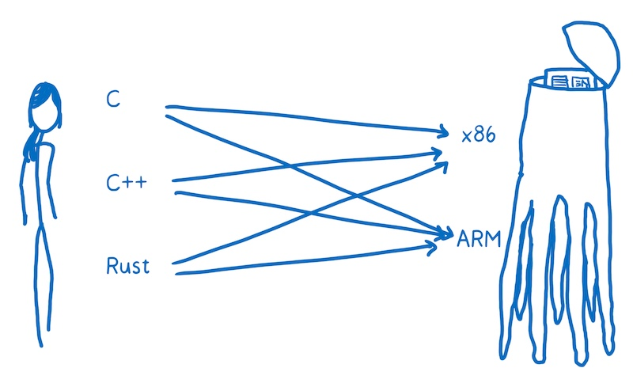

这样做的效率非常低。为了解决这个问题，大多数编译器会在高级语言和汇编语言之间多加一层。编译器将把高级语言翻译成一种更低级的语言，但比机器码的等级高。这就是中间代码（IR）。

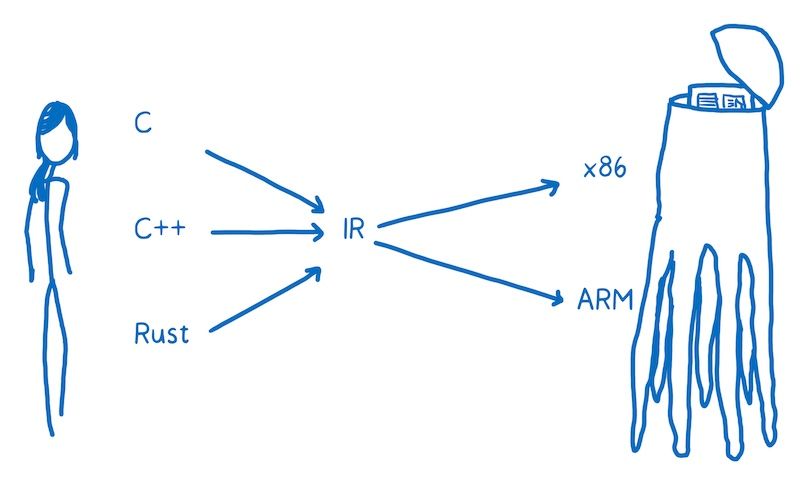

意思就是编译器可以将任何一种高级语言转换成一种中间语言。然后，编译器的另外的部分将中间语言编译成目标机器的汇编代码。

编译器的“前端”(front-end)将高级编程语言转换为 IR。编译器的“后端”(back-end)将 IR 转换成目标机器的汇编代码。

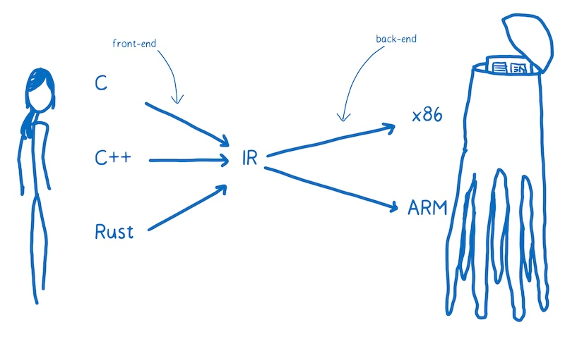

### WebAssembly 适合在哪里使用

你可以把 WebAssembly 看作是另外一种目标汇编语言，除了这些语言（x86，ARM等）中的每一种都对应于特定的机器架构。

当代码运行在用户机器的 web 平台上的时候，你并不知道代码所运行的机器结构。所以 WebAssembly 和别的汇编语言有一些不同。它是一个概念机上的机器语言，不是在一个真正存在的物理机上运行的机器语言。

正因如此，WebAssembly 指令有时候被称为**虚拟指令**。它比 JavaScript 代码更快更直接的转换成机器代码，但它们不直接和特定硬件的特定机器代码对应。

浏览器下载 WebAssembly ，然后迅速将 WebAssembly 转换成目标机器的汇编代码。

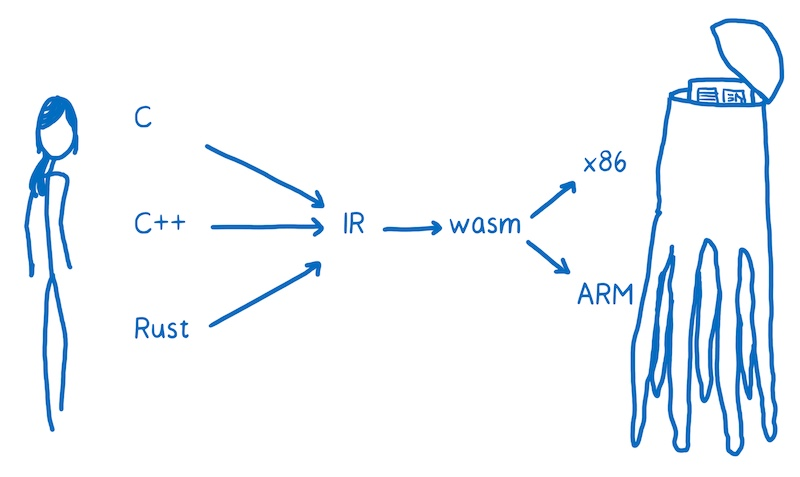

想在 web 页面中使用 WebAssembly，需要将代码编译成 .wasm 文件。

## 编译 .wasm 文件

当前对 WebAssembly 支持最好的编译器工具链称为 **LLVM**。它有许多不同的“前端”和“后端”插件。

_注意:_ 大多数 WebAssembly 模块开发者使用 C 和 Rust 编写代码，然后编译成 WebAssembly，但是这里有其他创建 WebAssembly 模块的途径。比如，有一个实验性工具，它可以帮你[使用 TypeScript 创建 WebAssembly 模块](https://github.com/rsms/wasm-util)，或者你也可以在[这里](https://developer.mozilla.org/en-US/docs/WebAssembly/Understanding_the_text_format)直接编辑 WebAssembly。

假设我们想通过 C 来创建 WebAssembly，可以使用 clang “前端” 从 C 编译成 LLVM 中间代码。当它变成 LLVM 的中间代码（IR）以后，LLVM 便可以理解它，进而 LLVM 可以对代码做一些优化。

如果想让 LLVM 的 IR 变成 WebAssembly，我们需要一个 “后端”。目前 LLVM 项目中有一个“后端”正在开发中的。它很重要，应该很快就会完成，只可惜现在还不能用。

另外有一个用起来比较简单的工具叫做 Emscripten。它提供了一些可选的实用库，比如基于文件系统的 IndexDB.

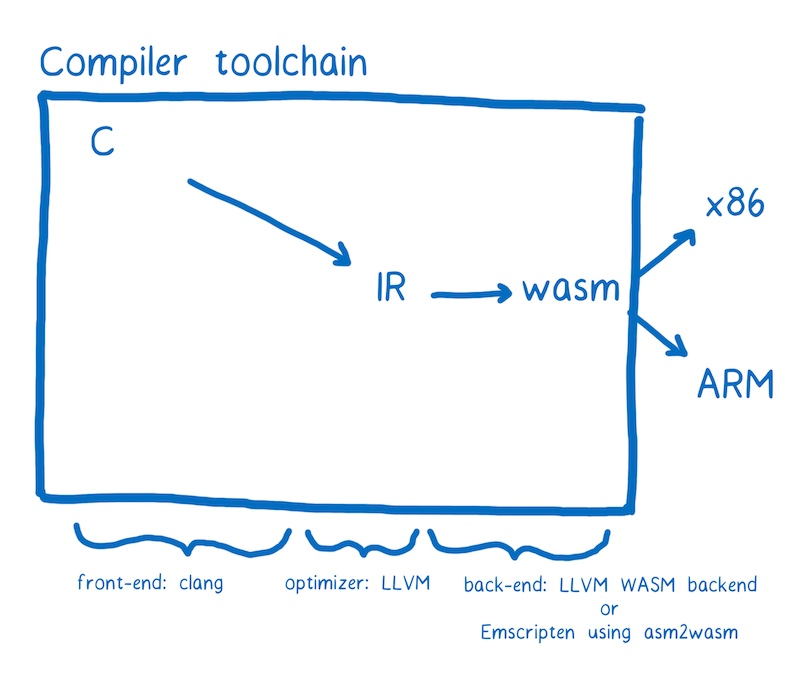

不管使用什么工具链，最终都会得到以 .wasm 结尾的文件。来让我们看一下如何将它用在 web 页面中。

## 在 JavaScript 中加载 .wasm 模块

.wasm 文件就是 WebAssembly 模块，它可以被 JavaScript 加载。目前阶段，加载过程还有点复杂。

```js
function fetchAndInstantiate(url, importObject) {
  return fetch(url).then(response =>
    response.arrayBuffer()
  ).then(bytes =>
    WebAssembly.instantiate(bytes, importObject)
  ).then(results =>
    results.instance
  );
}
```

可以通过[文档](https://developer.mozilla.org/en-US/docs/WebAssembly)更深入地了解。

我们正在努力使加载过程更容易。我们期望对工具链进行改进，并与现有的模块管理工具（如 Webpack）或加载器（如 SystemJS）相结合。我相信，加载 WebAssembly 模块会越来越简单，就像加载 JavaScript 一样。

但是，WebAssembly 模块和 JS 模块之间存在重大差异。目前，WebAssembly 中的函数只能使用 WebAssembly 类型（整数或浮点数）作为参数或返回值。

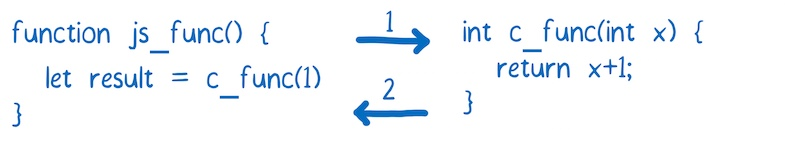

对于任何更复杂的数据类型（如字符串），必须使用 WebAssembly 模块的内存。

如果你之前主要使用 JavaScript，可能并不熟悉直接访问内存。C、C ++ 和 Rust 等性能更高的语言往往具有手动内存管理功能。WebAssembly 模块的内存模拟了这些语言中的堆。

为此，它使用 JavaScript 中的 ArrayBuffer。ArrayBuffer 是一个字节数组，通过数组的索引可以访问内存地址。

如果要在 JavaScript 和 WebAssembly 之间传递一个字符串，需要将所有字符转换为等效的字符编码。然后将它们写入内存数组。由于索引是整数，所以可以将索引传递给 WebAssembly 函数。因此，字符串的第一个字符的索引可以当作指针。

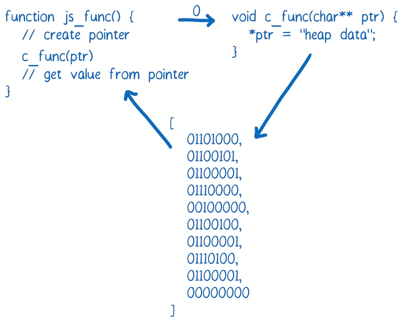

任何开发 WebAssembly 模块的人都倾向于为 Web 开发人员创建一个该模块的包装类。这样，Web 开发人员就可以作为用户来使用这个模块，而不用去考虑内存管理的事情。

我已经在另一篇文章中解释了更多关于[使用 WebAssembly 模块](https://hacks.mozilla.org/2017/02/creating-and-working-with-webassembly-modules/)的内容。

## WebAssembly 现状

2 月 28 日（PS: 文章发布于 2017 年），四大浏览器宣布达成共识，即 WebAssembly 的 MVP （最小化可行产品）已经完成。大约一周后，Firefox 会默认开启 WebAssembly 支持，而 Chrome 则在第二周开始。它也可用于预览版本的 Edge 和 Safari。

这是浏览器开始支持的初始版本。


内核中并不包含社区组织计划的所有功能。即便在初始版本中，WebAssembly 也很快，通过不断修复问题和增加新功能，以后肯定会更快。我在[另一篇文章中](https://hacks.mozilla.org/2017/02/where-is-webassembly-now-and-whats-next/)详细介绍了这些功能。

## 总结

使用 WebAssembly，可以更快地在 web 应用上运行代码。这里有几个 WebAssembly 代码运行速度比 JavaScript 高效的原因:
* 文件加载 - WebAssembly 文件体积更小，所以下载速度更快。
* 解析 - 解码 WebAssembly 比解析 JavaScript 要快
* 编译和优化 - 编译和优化所需的时间较少，因为在将文件推送到服务器之前已经进行了更多优化，而 JavaScript 需要为动态类型多次编译代码
* 重新优化 - WebAssembly 代码不需要重新优化，因为编译器有足够的信息可以在第一次运行时获得正确的代码
* 执行 - 执行可以更快，WebAssembly 指令更接近机器码
* 垃圾回收 - 目前 WebAssembly 不直接支持垃圾回收，垃圾回收都是手动控制的，所以比自动垃圾回收效率更高。

目前浏览器中的 MVP（最小化可行产品） 已经很快了。在接下来的几年里，随着浏览器的发展和新功能的增加，它将在未来几年内变得更快。没有人确切知道这些性能改进可以用来实现什么样的应用。但若过去有任何迹象，我们便可以期待惊奇。


---
[原文地址](https://www.smashingmagazine.com/2017/05/abridged-cartoon-introduction-webassembly/)
Lin, An engineer on the Mozilla Developer Relations team
2017-05-17