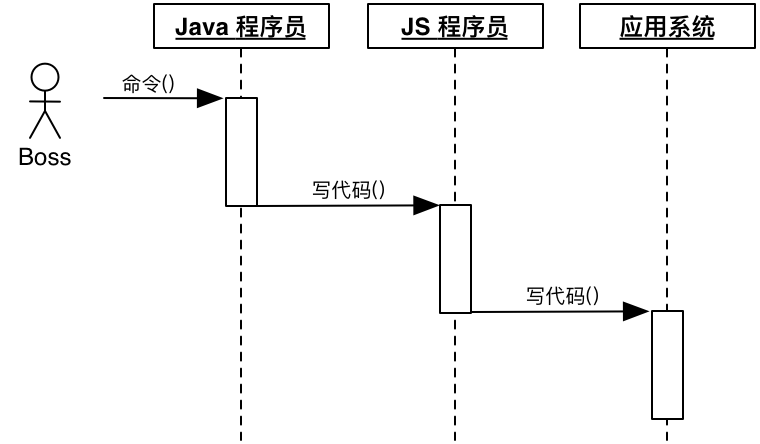
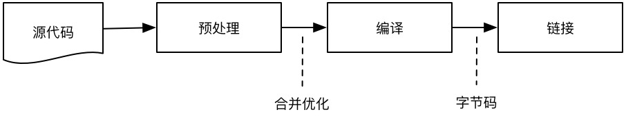

# 函数式编程 vs 面向对象编程

不论哪一种编程思想，本质都是**将大程序拆分成小程序**，从而降低每次处理问题的复杂度。当我们在思考结构性问题及调用关系时，就不需要去太过关注方法实现细节，反之亦是如此。

函数式编程与面向对象编程，以我愚见，本质上仅仅是拆分问题的思路不同，有时两者可替换使用，有时其中某一种方式则显得更为便利。

面向对象编程是以“对象”为分组依据，大对象通过小对象组合而来，它是一种基于“名词”的拆分思路：

函数式编程是以“函数”为分组依据，大函数通过小函数组合而来，它是一种基于“动词”的拆分思路：

面向对象通过**方法调用**进行对象间的交互，它在对象内部隐藏数据细节，暴露出来的是行为方法：

函数式通过**数据传递**进行函数间的交互，它在函数内部隐藏数据处理细节，暴露输入、输出的数据：

