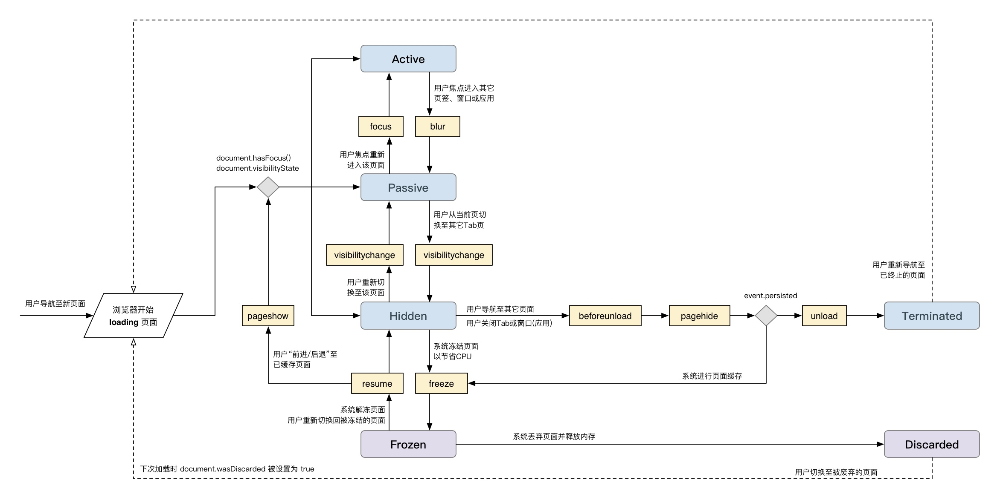

# 页面生命周期 API

（PS：本文为本人自己翻译，如有纰漏欢迎指正。）

当系统资源受限时，现代浏览器会挂起甚至丢弃整个页面。今后，浏览器期望能够更加积极主动地处理此事以便更省电、省内存。**页面生命周期API**——由 Chrome 68 提供——可以使页面通过生命周期钩子安全地介入此类浏览器行为，而不会影响到用户体验。来看一眼这些 API ，看看你的应用是否需要此特性。

# 背景

**应用生命周期**是现代操作系统管理资源的关键方式。在 Android、iOS 及最近几版 Windows 中，操作系统可以随时启停应用，从而精简或重新分配系统资源，使其更好地服务用户。

由于历史原因，web 中并没有应用生命周期的概念，因而 web 应用可以无限期的存活。当 web 页面运行地越来越多，它们会占用掉一些至关重要的系统资源，如内存、CPU、电池及网络，这将给最终用户带来糟糕的体验。

Web 平台拥有一些和生命周期状态相关的事件——比如 `load` 、`unload` 、或 `visibilitychange` ——开发者通过这些事件仅能应付由用户发起的生命周期状态变化，若想在低配设备上从容应对（抑或在所有平台上合理使用资源），浏览器需要更加主动的方式来重新获取或重新分配系统资源。

事实上，现在的浏览器已经采取了积极的措施来节省后台运行的标签页所占用的资源，许多浏览器（尤其是 Chrome）希望做得更多——用以减少总体的资源占用。

问题是开发者无法干预由系统发起的行为，他们甚至不清楚系统发起了哪些行为。这意味着浏览器必需采取保守策略，否则就有可能破坏网页。

页面生命周期 API 尝试通过以下方面解决该问题：
* 引入 web 页面生命周期状态的概念并将其标准化；
* 定义新的、由系统初始化的状态，允许浏览器限制那些隐藏或非激活的页签，防止它们耗尽资源；
* 提供新的 API 和事件，允许 web 开发者响应这些由系统初始化的状态到其它状态的变化。

该解决方案为 web 开发人员提供了针对系统行为的可预见性，使他们能够为此创建更具弹性的应用，与此同时，它允许浏览器更积极地优化系统资源，最终使所有 web 用户受益。

本文剩余部分将介绍 Chrome 68 新提供的**页面生命周期**特性，并探讨它们与所有现有的 Web 平台中状态及事件的关系。同时，针对每个生命周期状态，给出开发者开发时应该（或不应该）遵守的建议和最佳实践。

# 生命周期状态及事件概览

所有的**页面生命周期状态**都是互斥的，这意味着一个页面在某一时刻只能处于一种状态。通常，大多数页面生命周期状态的变化都是通过 DOM 事件来监听的（关于异常情况，请参见 _针对各状态的开发者建议_ ）。

要解释页面各生命周期状态，以及导致状态间变化的事件，最简洁的办法大概是画张图：




## 状态

下表详细解释了每个状态的含义，同时列出了每个状态转换前后相关的状态及开发者可监听的相应事件（译注：这一点从上图中可以非常明显地看出，故不再在表格中列出了）。


|   状态   |  说明 |
| ------   | ----  |
| Active   | 页面可见并获取焦点时处于 active 状态。 |
| Passive  | 页面可见并失去焦点时处于 passive 状态。 |
| Hidden   | 页面不可见而且未被冻结(frozen)时处于 hidden 状态 |
| Frozen   | 处于 frozen 状态时，浏览器会挂起任务队列中的可冻结任务的执行，直到页面解冻。在此期间 JavaScript 定时器及 fetch 回调不会运行。已经运行的任务有可能运行完毕，但其处理能力及运行时长可能会受限。<br/>浏览器冻结页面的做法，一方面可以保护 CPU、电池或数据的使用，与此同时又可以加速“前进/后退”导航（不必重新加载整个页面）。 |
| Terminated | 页面开始进入 unload 并被浏览器回收内存时，便处于 terminated 状态。该状态下不再有新任务启动，进行中的任务如果运行时间过长也会被杀死。 |
| Discarded  | 浏览器已将页面卸载(unload)以节省资源。该状态下任何任务都不会运行，甚至回调、或 JavaScript 都不会运行。discarded 状态通常在资源受限时发生，此时已不可启动新进程。<br/>处于 discarded 状态时，即便页面已经没了，Tab 页(包括标题和 favicon)一般对用户仍可见。 |


## 事件

浏览器会派发大量事件，其中一小部分和页面生命周期有关，如下表：

|   状态   |  说明 |
| ------   | ----  |
| focus | 任一 DOM 元素获得焦点。<br/>_**注意**：focus 事件并非总会造成页面状态的变化，只有当页面之前未处于 focus 时才会造成变化。_ |
| blur | 任一 DOM 元素失去焦点。<br/>_**注意**：blur 事件并非总会造成页面状态的变化，只有当页面不再处于 focus 时才会造成变化（而不仅是焦点从一个 DOM 元素到另一个）。_ |
| visibilitychange | 当 document 的 visibilityState 值变化时。该值在下列情况会变化：用户导航至新页面、切换 Tab 页、关闭 Tab 页、最小化或关闭浏览器，或者在移动端切换 app 时。|
| freeze | 页面被冻结时。任何任务队列中的可冻结任务都将不会启动。 |
| resume | 浏览器恢复被冻结的页面。 |
| pageshow | 页面显示时。<br/>这既可以是加载全新的页面，也可以是从页面导航缓存中取出页面，若是后者，该事件的 persisted 属性为 true ，否则为 false .|
| pagehide | 页面隐藏时。<br/>当用户导航至其它页面，而且浏览器能够将当前页面放入页面导航缓存中以重用，该事件的 persisted 属性为 true . 为 true 时，页面将进行 frozen 状态，否则进行 terminated 状态。|
| beforeunload | window、document 及其资源即将被卸载时，此时 document 仍可见，该事件可被取消。<br/>_**警告**：beforeunload 事件仅应当用于提示用户页面存在未保存的变化。一旦页面变化被保存了，该事件应被删除。不应该一般给页面绑定该事件，因为这样做有可以造成性能问题。具体参见之后的章节。_|
| unload | 页面被卸载时。<br/>_**警告**：不建议使用 unload 事件，因为它并不可靠且可能损害性能。具体参见之后的章节。_|


## Chrome 68 的新特性

图中有两种状态是系统发起而非用户发起的：`frozen` 和 `discarded` 。 正如前文所提及，浏览器偶尔会冻结或丢弃被隐藏的页面，但开发者却无从得知此事。

从 Chrome 68 起，开发者可以监听 document  的 freeze 和 resume 事件来捕获页面冻结或解冻行为：

```js
document.addEventListener('freeze', (event) => {
  // 页面被冻结
});

document.addEventListener('resume', (event) => {
  // 页面已解冻
});
```

从 Chrome 68 起，document 对象包含一个叫作 `wasDiscarded` 的属性，你可以在页面加载时（注意：被丢弃的页面必须被重新加载 ）检测它的值，并依此判断处于隐藏状态的页面是否曾被丢弃过。

```js
if (document.wasDiscarded) {
  // 处于 hidden 状态的页面之前被浏览器丢弃过
}
```

关于 freeze 和 resume 事件的建议以及如何处理被丢弃的页面，参见 _针对各状态的开发者建议_ 。

后面的章节将介绍这些新特性如何在现有的 web 平台中运用。

# 从代码层面检测页面生命周期状态

对于 active、passive 和 hidden 状态，可以用 JavaScript 代码调用现有的 web 平台 API  来检测页面生命周期状态。

```js
const getState = () => {
  if (document.visibilityState === 'hidden') {
    return 'hidden';
  }
  if (document.hasFocus()) {
    return 'active';
  }
  return 'passive';
};
```

而 frozen 和 terminated 状态，只能在状态变化时通过各自的事件(freeze  和 pagehide)来监测。

## 检测状态变化

基于上面定义的 `getState()` 函数，可以用下面的代码检测所有的页面生命周期状态变化：

```js
// 通过 `getState()` 函数(以前定义的)保存初始状态 .
let state = getState();

// 参数接受新的状态，如果状态变化了，在控制台打印出该变化。
// 同时更新 `state` 变量的值
const logStateChange = (nextState) => {
  const prevState = state;
  if (nextState !== prevState) {
    console.log(`State change: ${prevState} >>> ${nextState}`);
    state = nextState;
  }
};

// 使用相同的 listener 监听这些生命周期事件（调用 `getState()` 函数获取下一个状态）
['pageshow', 'focus', 'blur', 'visibilitychange', 'resume'].forEach((type) => {
  window.addEventListener(type, () => logStateChange(getState()), {capture: true});
});

// 下面两个 listener 可以通过事件本身获知生命周期状态
window.addEventListener('freeze', () => {
  // 在 freeze 事件中, 下一个状态总是 frozen
  logStateChange('frozen');
}, {capture: true});

window.addEventListener('pagehide', (event) => {
  if (event.persisted) {
    // 如果 persisted 属性为 `true`，页面即将被放入
    // 页面导航缓存，它也是 frozen 状态
    logStateChange('frozen');
  } else {
    // 如果 persisted 属性不为 `true`，页面将会 unload 
    logStateChange('terminated');
  }
}, {capture: true});
```

以上代码做了三件事：
* 通过 getState() 函数设置初始状态；
* 定义一个函数接收下一个状态，并在状态变化时在控制台记录该变化；
* 添加所有生命周期事件监听器，调用 logStateChange() 并传入下一状态。

<div style="color:red">
警告! 这段代码在不同的浏览器中结果不同，因为事件的顺序及可靠性并未被一致地实现。阅读“处理浏览器兼容问题”一节，获知如何处理这些不一致性。
</div>

以上代码有一点值得注意：所有的监听函数都是针对 window 对象而且传入了 `{capture: true}` 参数。原因如下：
* 并非所有的生命周期事件都有相同的 target 。pagehide 和 pageshow 在 window 上触发，visibilitychange、freeze 和 resume 在 document 上触发，focus 和 blur 在相应的 DOM 元素上触发；
* 大多数这类事件都不冒泡，这就表示不能在一个常规的先代元素中增加非捕获监听器来监听所有事件；
* 捕获阶段在 target 元素或冒泡阶段之前执行，因此在该阶段增加监听可以保证这些代码优先于其它代码的执行，进而可以取消掉那些其它代码的执行。

## 处理浏览器兼容问题

文章开始的图勾勒出页面生命周期 API 的状态与事件流，但鉴于该 API 刚被提出，新的事件和 DOM API 并未被所有浏览器实现。

更糟糕的是，已经被各浏览器实现的事件却实现得并不一致，例如：
* 有些浏览器在切换 Tab 时并不会触发 blur 事件。这样一来（不同于前文中图和表格所介绍的），页面可以略过 passive 状态直接从 active 进入  hidden 状态。
* 一些浏览器实现了页面导航缓存，页面生命周期 API 通过 frozen 状态区分被缓存的页面。由于这是一个全新的 API ，还没实现 freeze 和 resume 事件的浏览器只能通过 pagehide 和 pageshow 事件来观察该状态。
* 老版本的 IE 浏览器（10及以下）没有实现 visibilitychange 事件。
* pagehide 事件和 visibilitychange 事件的委派顺序不同。以往，如果页面在 unload 时其可视状态为 visible ，浏览器会在 pagehide 之后委派 visibilitychange 事件。新版 Chrome 则在 pagehide 之前委派 visibilitychange 事件，不再区分可视状态。
● Safari 在关闭 Tab 页时不能可靠地触发 pagehide 或 visibilitychange 事件 (webkit bug: 151610 和 151234)，因此，在 Safari 中你还需要监听 beforeunload 事件来观察页面是否进入 hidden 状态，但是由于 beforeunload 事件能够被取消，你还需要等到事件传播完毕才能确认页面进入了 hidden 状态。要点：只能在 Safari 中这样使用 beforeunload 事件，否则可能造成性能损伤。详情参见 _遗留的生命周期 API_  一节。

请参照后文针对生命周期状态的建议及一些最佳实践，它们有利于简化开发者处理浏览兼容问题。我们还发布了 [PageLifecycle.js](https://github.com/GoogleChromeLabs/page-lifecycle) 库用以观察页面生命周期状态的变化。

PageLifecycle.js 消除了浏览器在委派事件顺序上的差异，因此各状态的变化总会按照本文图和表格中描述的方式进行（所有浏览器都一致如此）。

# 针对各状态的开发者建议

作为一名开发人员，不光要清楚地知道页面生命周期状态，还要掌握如何用代码检测它们，毕竟你应该做的、不应该做的工作很大程度上要依赖于页面所处的状态。

例如，很明显，不应该在页面 hidden 状态时给用户展示一条短暂的通知信息。这个例子太过明显，这里列举了一些不那么明显的情况。

<table>
  <tr style="font-weight: bold">
    <td>状态</td>
    <td>开发者建议</td>
  </tr>
  <tr>
    <td>Active</td>
    <td>active 是对于用户来说至关重要的状态，是页面响应用户输入最重要的时刻。<br/>任何会阻塞主线程的非 UI 工作都应该放入 idle 时期或转入 web worker 中处理。</td>
  </tr>
  <tr>
    <td>Passive</td>
    <td>在 passive 状态中，用户不再与页面产生交互，但仍能看到它们。这表示 UI 更新及动画仍需平滑地进行，但更新时机则不再如此至关重要。<br/>当页面从 active 变为 passive 时，是持久化那些尚未保存的应用状态的好时机。</td>
  </tr>
  <tr>
    <td>Hidden</td>
    <td>当页面从 passive 变为 hidden 状态，在它被重新加载前，用户都不会再和页面交互。<br/>页面进入 hidden 状态，是开发人员能检测到的最可靠的最后一个状态（尤其在移动端，用户可以关闭整个标签页或浏览器应用，这样一来 beforeunload、pagehide 和 unload 事件都不会触发）。<br/>这意味着 hidden 状态是可信的用户会话结束的状态，换句话说，赶快持久化尚未保存的应用状态并发送尚未发送的分析数据。<br/>在此状态时，应该停止更新 UI （毕竟用户都看不到 UI 了）及任何用户不期望运行的后台任务。</td>
  </tr>
  <tr>
    <td>Frozen</td>
    <td>在 frozen 状态时，任务队列中可冻结的任务会被挂起，直至页面解冻——也许永远等不到这一刻（比如页面被丢弃了）。<br/>也就是说，当页面从 hidden 变为 frozen 状态时，你需要停止所有定时器，还要断开那些会影响到其它正打开的同源 Tab 的连接，又及影响到浏览器将页面放入页面导航缓存的连接。<br/>
    需要指出的是:
    <ul style="margin:4px">
      <li>关闭所有的 IndexedDB 连接</li>
      <li>关闭所有的 BroadcastChannel 连接</li>
      <li>关闭激活的 WebRTC 连接</li>
      <li>停止所有网络轮询并关闭所有已打开的 Web Socket 连接</li>
      <li>释放所有 Web Locks</li>
    </ul>
还需要在 sessionStorage（或通过 commit() 提交到 IndexedDB 中）持久化所有动态视图状态（如，无限滚动加载的列表当前滚动的位置），以便页面被丢弃又重新加载后，还原到之前的视图状态。<br/>如果页面又从 hidden 回到 frozen 状态，此时可以重新打开所有关闭的连接，或是重新启动之前停掉的轮询。</td>
  </tr>
  <tr>
    <td>Terminated</td>
    <td>当页面转入 terminated 状态时，通常不需要做任何处理。<br/>由于由用户引发的页面 unload 行为在进入 terminated 前总是要经过 hidden 状态，逻辑上应把 hidden 状态当作用户会话的结束。<br/>另外，开发者一定要认识到，在诸多场景下（尤其是移动端）并不能准确地检测到 terminated 状态的变化，基于终止态事件（如，beforeunload/pagehide/unload）来开发，极有可能丢失数据。</td>
  </tr>
  <tr>
    <td>Discarded</td>
    <td>当页面被丢弃时，discarded 状态并不能被开发者监听到。这样做是出于此考虑：页面通常在系统资源受限时才会被丢弃，而此时，决大多数场景下不可能仅仅为了允许脚本响应discard 事件就把页面解冻。<br/>因此，当页面从 hidden 转为 frozen 时，你便应该着手应对它进入 discard 状态的可能性，之后可以在页面重新加载时，通过检测 document.wasDiscarded 来恢复之前被丢弃过的页面内容。</td>
  </tr>
</table>


# 遗留的生命周期 API

## unload 事件

**要点：不要在现代浏览器中使用 unload 事件。**

有许多开发者把 unload 事件用作用户会话结束的保障，在其中保存状态、发送分析数据等，但事实上这么做非常不靠谱，尤其是在移动端！在许多典型的 unload 情况下并不会触发 unload 事件，包括在移动端从页签切换功能关闭 Tab 页，或从 app 切换功能中关闭浏览器应用。

因此，最好依赖 visibilitychange 事件确定会话何时结束，并把 hidden 状态当作保存 app 和用户数据的最后时机。

此外，仅有的注册 unload 事件处理器（不论是通过 onunload 还是 addEventListener() 方法）的场景，大概就是阻止浏览器将页面放入页面导航缓存中并以此来加快“前进/后退”时页面的加载速度。

在所有的现代浏览器中（包括 IE11），建议使用 pagehide 事件来检测页面卸载行为（亦即 terminated 状态）。如果需要支持 IE10 及以下浏览器，则应先检测是否支持 pagehide 事件，并仅在不支持时使用 unload 事件：

```js
const terminationEvent = 'onpagehide' in self ? 'pagehide' : 'unload';

addEventListener(terminationEvent, (event) => {
  // 注意: 如果浏览器支持页面缓存，`event.persisted` 为 true，
  // 此时状态是 frozen 而非 terminated.
}, {capture: true});
```

更多关于页面导航缓存的信息，以及为何 unload 会破坏该机制，参见：
* [Webkit 页面缓存](https://webkit.org/blog/427/webkit-page-cache-i-the-basics/)
* [Firefox 往返缓存](https://developer.mozilla.org/en-US/docs/Mozilla/Firefox/Releases/1.5/Using_Firefox_1.5_caching)

## beforeunload 事件

**要点：不要无条件地使用 beforeunload 监听或把它作为会话结束的标志。仅用它来处理用户未保存的工作，一旦保存完毕，尽快删除该监听。**

beforeunload 事件和 unload 事件存在同样的问题，它会阻止页面导航缓存机制。不同于 unload 事件的是，beforeunload 有其合理的使用方法，比如，当用户退出页面时，你希望提示他页面中尚有未保存的内容，则可以使用该事件。

既然存在使用 beforeunload 的道理，可它又会阻止页面被放入页面导航缓存，那么建议的使用方式是：仅当用户有未保存的内容时才添加 beforeunload 监听，而一旦未保存的内容保存完毕，立马删除该监听。

换句话说，不要这样做：

```js
addEventListener('beforeunload', (event) => {
  if (pageHasUnsavedChanges()) {
    event.preventDefault();
    return event.returnValue = 'Are you sure you want to exit?';
  }
}, {capture: true});
```js

而是这样：

```js
const beforeUnloadListener = (event) => {
  event.preventDefault();
  return event.returnValue = 'Are you sure you want to exit?';
};

// 该函数在页面存在未保存内容时执行回调
onPageHasUnsavedChanges(() => {
  addEventListener('beforeunload', beforeUnloadListener, {capture: true});
});

// 该函数在页面保存完毕时执行回调
onAllChangesSaved(() => {
  removeEventListener('beforeunload', beforeUnloadListener, {capture: true});
});
```

> 提示:  PageLifecycle.js 库提供了 addUnsavedChanges() 和 removeUnsavedChanges() 方法来简化此问题，它们遵从了上文提到的所有最佳实践，它们基于一个提案——正式将 beforeunload 事件替换为明确的 API，这样在移动平台上就不容易被滥用，也更可靠。
>
> 如果想以浏览器兼容的方式正确使用 beforeunload 事件，使用 PageLifecycle.js 库是值得推荐的解决方案。


[原文地址](https://developers.google.com/web/updates/2018/07/page-lifecycle-api)


